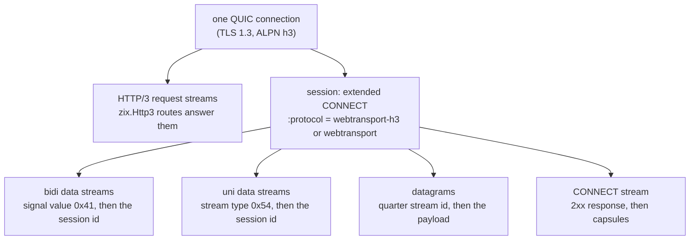
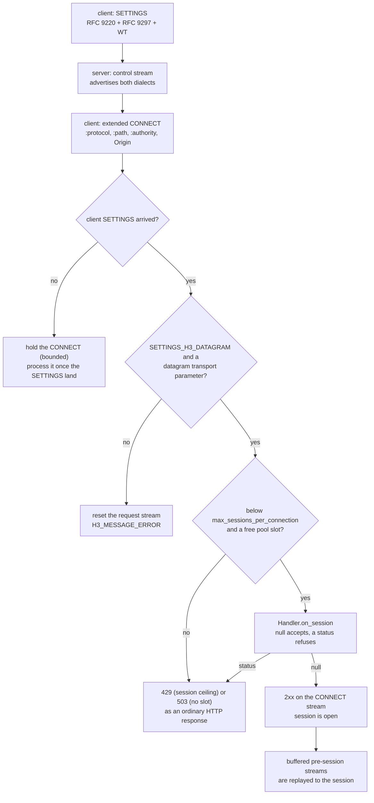
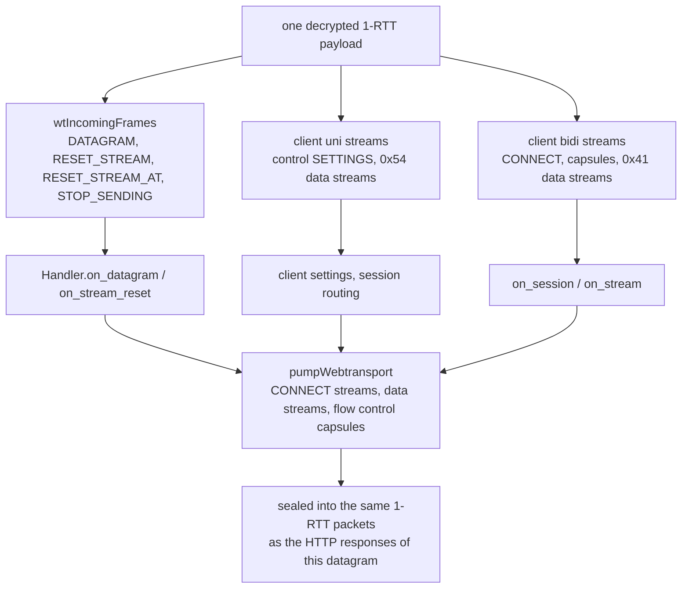

# HLD: zix.Webtransport

WebTransport over HTTP/3, served by `zix.Http3` on the QUIC connection it already owns: draft-ietf-webtrans-http3-16 as the current revision, and the deployed draft-07 dialect that browsers and aioquic still send, accepted beside it. One extended CONNECT (RFC 9220) opens a session, and everything after it (bidirectional streams, unidirectional streams, and unreliable datagrams) is multiplexed on the one QUIC connection. Pure-Zig, written from the drafts, no external library and no allocation on the receive path.

---

## Goals

- **One connection, two delivery models.** A session carries reliable, ordered byte streams and unreliable, unordered datagrams at the same time, which is the whole reason a browser asks for WebTransport instead of a WebSocket: no head-of-line blocking between streams, and a datagram can be dropped rather than queued behind one.
- **The application never sees the wire.** A `zix.Webtransport.Config` on the HTTP/3 server, five optional callbacks, and two handles (`Session`, `Stream`). Nothing in an application names a stream id, a frame, a capsule, or a varint.
- **One coherent engine family.** The binding is a feature of `zix.Http3`, not a second server: the same comptime `Router`, the same `Tls.Context`, the same `DispatchModel`, and the same "explicit over implicit" config shape as every other zix engine.
- **Both revisions on the wire.** draft-16 renamed the upgrade token and the support setting, so the server advertises both spellings at once and lets the client's `:protocol` token pick the dialect (RFC 9114 7.2.4.1: a peer ignores the setting it does not know).
- **Priced in, or free.** With `enabled = false` nothing WebTransport is advertised, allocated, or parsed: a plain HTTP/3 connection carries the empty SETTINGS and the transport parameters it carried before the feature existed.
- **Bounded by construction.** Sessions, streams, buffered bytes, pre-session streams, and datagram size are all capped by config, advertised to the peer, and enforced by the engine. The worker pool returns null instead of growing, so a peer cannot make the server allocate.

---

## Why WebTransport over HTTP/3

WebTransport is a browser-facing transport with the properties TCP cannot give: an application can open as many independent streams as it wants, and it can send a datagram that is never retransmitted. It runs inside HTTP/3 rather than beside it, so a deployment reuses the TLS certificate, the ALPN `h3` handshake, the QUIC congestion controller, and the same port as its ordinary requests.



Four consequences the engine has to live with, and each one shapes a decision in the LLD:

1. **A session is identified by its CONNECT stream id** (3.2), so streams, datagrams, and capsules all name it: a data stream carries it in its header, a datagram carries it as the RFC 9297 quarter stream id, and the CONNECT stream *is* the session's control channel.
2. **A data stream is a QUIC stream whose first bytes are not HTTP/3 frames.** The server can tell a WebTransport stream from a request stream only by reading the header (0x41 / 0x54), which means the binding's receive pass has to run before the HTTP request pass and claim the streams it recognizes.
3. **Datagrams are not retransmitted** (RFC 9221 5.2), so a datagram that does not fit the congestion window is dropped rather than parked, and a lost one is never rewound. The engine's loss ring tags them `datagram` for exactly that reason.
4. **Two limits act at once.** QUIC's own per-stream and connection flow control still applies, and draft-16 adds a session-level allowance on top of it. Neither replaces the other.

---

## The Two Dialects

Both are accepted by default (`legacy_dialect = true`). The CONNECT `:protocol` token decides which one a session speaks.

| Item | draft-ietf-webtrans-http3-16 | draft-ietf-webtrans-http3-07 (deployed) |
| :- | :- | :- |
| Upgrade token | `webtransport-h3` | `webtransport` |
| Support setting | `SETTINGS_WT_ENABLED` 0x2c7cf000 (value 1) | `SETTINGS_ENABLE_WEBTRANSPORT` 0x2b603742 (value 1, the draft-02 spelling deployed clients still send) |
| Session count setting | none (the limit rides `SETTINGS_WT_ENABLED` plus the initial stream limits) | `SETTINGS_WEBTRANSPORT_MAX_SESSIONS` 0xc671706a (written with the value 1) |
| Initial session limits | `SETTINGS_WT_INITIAL_MAX_STREAMS_UNI` 0x2b64, `SETTINGS_WT_INITIAL_MAX_STREAMS_BIDI` 0x2b65, `SETTINGS_WT_INITIAL_MAX_DATA` 0x2b61 | none: QUIC's transport parameters are the whole allowance |
| Session flow control | `WT_MAX_STREAMS` 0x190B4D3F / 0x190B4D40, `WT_STREAMS_BLOCKED` 0x190B4D43 / 0x190B4D44, `WT_MAX_DATA` 0x190B4D3D, `WT_DATA_BLOCKED` 0x190B4D41 | no flow control capsules at all |
| Data stream reset | `RESET_STREAM_AT` (0x24), reliable size at least the stream header | plain `RESET_STREAM` (0x04) |
| Stream type / signal value | 0x54 (uni) / 0x41 (bidi) | identical |
| Close / drain capsules | `WT_CLOSE_SESSION` 0x2843 / `WT_DRAIN_SESSION` 0x78ae | identical |
| Application error range | `0x52e4a40fa8db` to `0x52e5ac983162` | identical |
| Flow control error | `WT_FLOW_CONTROL_ERROR` 0x045d4487, `WT_ALPN_ERROR` 0x0817b3dd | absent (no session flow control to break) |

The server answers both, which it does by advertising both sets of settings in one control stream:

| Setting written when `enabled` | Identifier | Value |
| :- | :- | :- |
| extended CONNECT (RFC 9220) | 0x08 | 1 |
| HTTP/3 datagrams (RFC 9297 2.1.1) | 0x33 | 1 |
| WebTransport over HTTP/3 (draft-16 3.1) | 0x2c7cf000 | 1 |
| Initial unidirectional stream limit | 0x2b64 | `max_streams_uni` |
| Initial bidirectional stream limit | 0x2b65 | `max_streams_bidi` |
| Initial session data limit | 0x2b61 | `max_session_data` |
| Deployed support flag (the draft-02 spelling) | 0x2b603742 | 1 |
| Deployed session count (draft-07) | 0xc671706a | 1 |

The deployed pair goes out together and its count is written with the flag value 1: the deployed revision reads support out of that setting, so 0 would mean "the server accepts no sessions at all", and the count is not a `ServerSettings` field. The ceiling the server actually enforces is `max_sessions_per_connection`, checked in the CONNECT path.

### How a session is negotiated



Three checks happen before an application ever sees the request, and each one is a MUST from the binding rather than a policy choice:

- A WebTransport request is not processed before the client's SETTINGS arrive (7.1), because the settings are what pin the revision and the features. The request is held instead of refused, since a client sends its SETTINGS and its CONNECT in one flight and the two can arrive in either order: the stream waits in the worker's request pool (bounded by its own sizing and by a 4-entry per-connection table), and the moment the SETTINGS land the held requests are replayed through the normal accept path. Only a request that cannot be held is reset with H3_REQUEST_REJECTED ("not processed in any way", RFC 9114 8.1), so the client may retry.
- A WebTransport connection requires HTTP/3 datagrams on both sides (3.1): without the client's `SETTINGS_H3_DATAGRAM` and a `max_datagram_frame_size` transport parameter, the request is malformed and the stream is reset with H3_MESSAGE_ERROR.
- The session ceiling and the pool are both finite, and a refusal is an ordinary HTTP status on the request stream (3.2 allows any status).

---

## Handshake and Confirmation

A session rides the same QUIC connection an ordinary HTTP/3 request uses, so the binding adds nothing to
the transport handshake. One property of that handshake decides whether a session can establish at all:

- **The client's Finished is verified.** A client's Handshake packet is decrypted, its CRYPTO bytes are
  reassembled, and the Finished is checked against the client handshake-traffic secret over the transcript
  through the server Finished (RFC 8446 4.4.4). A Finished that does not verify leaves the handshake
  unconfirmed: no HANDSHAKE_DONE, no session, and the connection idles out. A peer that never proved key
  possession never reaches the request path, and a Finished split across packets is only judged once the
  reassembly stream holds it whole.
- **The confirmation is the server's to send, immediately.** `HANDSHAKE_DONE` may not go out before the
  handshake is complete (RFC 9000 17.2.1), and the moment it is complete is the moment the Finished
  verifies. The one-time prologue (HANDSHAKE_DONE, then the control stream's SETTINGS) therefore leaves in
  that same turn rather than waiting for the client's first 1-RTT packet: a client is entitled to wait for
  the confirmation before it sends any 1-RTT data, and Chromium does: it holds its SETTINGS, its CONNECT,
  and every request until the confirmation lands. aioquic and the in-tree client send 1-RTT early, which
  is why a server that only replies to 1-RTT looks correct until a browser connects to it.
- **A client that gives up says why.** A handshake failure arrives as a CONNECTION_CLOSE inside a
  Handshake packet, carrying the TLS alert code and the client's own description (a rejected certificate,
  an unacceptable parameter). The engine logs it at WARN, because the connection otherwise just goes quiet
  and nothing else names the cause.
- **Handshake packets are not acknowledged on this path.** The handshake is complete at the same moment, so
  the client discards its Handshake state with the confirmation, and a retransmitted Finished is answered
  with the same idempotent prologue.

## What the Application Sees

The application surface is one config on the existing server, five callbacks, and two handles. `Session` and `Stream` are views over engine state: they are built fresh for the callback that owns them, and copying one is legal but the copy is only usable while that callback runs.

```zig
pub const Config = struct {
    enabled: bool = false,
    max_sessions_per_connection: u16 = 4,
    max_streams_bidi: u32 = 16,
    max_streams_uni: u32 = 16,
    max_session_data: u64 = 1 << 20,
    stream_send_bytes: usize = 16 * 1024,
    pool_sessions: usize = 16,
    pool_streams: usize = 64,
    pool_orphan_streams: usize = 8,
    pool_orphan_bytes: usize = 1024,
    max_datagram_frame_size: u64 = 1200,
    legacy_dialect: bool = true,
    handler: Handler = .{},
};
```

| Config field | Effect | Bounded by |
| :- | :- | :- |
| `enabled` | offers WebTransport at all: settings, transport parameters, receive passes, pool | nothing (a bool) |
| `max_sessions_per_connection` | concurrent sessions on one QUIC connection, advertised and enforced | `connection_session_cap` (8) |
| `max_streams_bidi` / `max_streams_uni` | streams one session may open in each direction, per session | the session's own flow control limit, raised as the peer consumes it; the worker pool bounds the slots behind it |
| `max_session_data` | Stream Body bytes one session carries before the limit is extended | nothing (a u64 limit) |
| `stream_send_bytes` | write window per data stream, and the bytes a lost packet can be resent from | `max_stream_buffer_bytes` (16 KiB) |
| `pool_sessions` / `pool_streams` / `pool_orphan_streams` | worker-owned slots | `pool.maxima` (64 / 256 / 32) |
| `pool_orphan_bytes` | bytes buffered per pre-session stream | nothing (raised to at least 64) |
| `max_datagram_frame_size` | the largest DATAGRAM frame this endpoint accepts, advertised as 0x20 | the peer's own limit and the congestion window |
| `legacy_dialect` | also accept the deployed draft-07 token and settings | nothing (a bool) |

`capacityError(config)` returns the offending field name when a config outgrows the compile-time ceilings, so a server can refuse to start rather than silently truncate the feature.

### Public API

Access via `const zix = @import("zix");`

| Symbol | Type | Description |
| :- | :- | :- |
| `zix.Webtransport.Config` | struct | The feature config, carried on `Http3ServerConfig.webtransport` |
| `zix.Webtransport.Handler` | struct | The five optional callbacks |
| `zix.Webtransport.Session` | struct | The session handle: identity, state, stream and datagram operations |
| `zix.Webtransport.Stream` | struct | The data stream handle: read, write, finish, reset, stop |
| `zix.Webtransport.SessionRequest` | struct | The establishing CONNECT as the application sees it |
| `zix.Webtransport.CloseInfo` | struct | How and why a session ended |
| `zix.Webtransport.CloseReason` | enum | `peer_fin`, `peer_reset`, `peer_close`, `local_close`, `flow_control_error`, `protocol_error`, `connection_closed` |
| `zix.Webtransport.State` | enum | `open`, `draining`, `closed` |
| `zix.Webtransport.Kind` | enum | `bidi`, `uni` |
| `zix.Webtransport.Dialect` | enum | `draft16`, `draft07` |
| `zix.Webtransport.poolConfig` | fn | The pool sizing a `Config` asks for |
| `zix.Webtransport.capacityError` | fn | The field name that outgrows a ceiling, or null |
| `zix.Webtransport.connection_session_cap` | const | 8 sessions per connection |
| `zix.Webtransport.connection_stream_cap` | const | 32 data streams per connection |

### Handler callbacks

| Callback | Runs when | Returns |
| :- | :- | :- |
| `on_session(session) ?u16` | an extended CONNECT is accepted by the engine's own checks | null to accept, an HTTP status to refuse (403 for an origin the application does not allow, 404 for a path it does not serve, 429 for rate limiting) |
| `on_stream(session, stream)` | a data stream has bytes ready (once per chunk) | void: read them with `stream.read()` |
| `on_stream_reset(session, stream)` | a data stream ended without all its bytes arriving | void: `stream.resetCode()` carries the peer's application code, or null |
| `on_datagram(session, datagram)` | one datagram arrived, routing already stripped | void |
| `on_close(session)` | the session ended, for any reason | void: `session.closeInfo()` says which |

Every callback is optional. A null callback means "no interest": the session stays alive, the stream is tracked, and what would have been delivered is drained and counted.

### Session methods

| Method | Description |
| :- | :- |
| `id()` | the session id: the CONNECT stream id that identifies it on the connection |
| `dialect()` | `draft16` or `draft07`, from the CONNECT `:protocol` token |
| `state()` / `isOpen()` | the lifecycle state; a draining session is still open, a closed one is not |
| `sessionRequest()` | the CONNECT view: `path`, `authority`, `protocol`, `origin`, `dialect`, `datagram_capable` |
| `openBidi()` / `openUni()` | open a data stream, header queued; null when the session is closed, the peer's limit is reached, or no pool slot is free |
| `sendDatagram(payload) bool` | send one unreliable datagram; false when it cannot go now (never queued for later) |
| `close(code, message)` | send a close capsule, finish the CONNECT stream, reset every stream of the session |
| `drain()` | tell the peer the session is draining; the session keeps working |
| `streamsAvailable(kind)` | how many more streams of `kind` the peer allows (draft-16 sessions with flow control) |
| `closeInfo()` | `code`, `message`, and `reason` of an ended session |

Two more rules the engine enforces so an application cannot leak either: a session slot and every stream slot it holds go back to the worker pool on close, and `on_session` sees the request before the 2xx goes out, so a refusal never leaves a session behind.

### Stream methods

| Method | Description |
| :- | :- |
| `id()` / `kind()` / `initiator()` | the QUIC stream id, `uni` or `bidi`, and which endpoint opened it |
| `read()` | the chunk that just arrived, valid for this callback only |
| `finished()` | the peer ended the stream, so nothing more will arrive |
| `resetCode()` | the peer's application error code, or null when the reset carried none |
| `writable()` / `write(bytes)` | the free room in the send buffer, and how many bytes were accepted (a short count is back pressure) |
| `finish()` | send a FIN once the queued bytes are out; the receive half is unaffected |
| `reset(code)` | reset the send half with an application error code (a reliable reset on draft-16) |
| `stop(code)` | ask the peer to stop sending on this stream |

A `Stream` view also carries `chunk_offset`, the stream offset the delivered chunk starts at, so an application that reassembles offsets itself does not have to count bytes across callbacks.

### Lifetime

Every pointer handed to a callback is valid only for that callback, the same rule the rest of zix follows. `read()` slices and the `SessionRequest` slices borrow engine buffers (the decrypted packet payload, and the session's own decode scratch), so an application that needs either later copies it. A session slot is recycled after `on_close` returns.

---

## Dispatch and Concurrency

Single-threaded per connection, exactly like the HTTP/3 serve path it extends.

- A session belongs to the worker that owns its QUIC connection for its whole life. Callbacks arrive on that worker's thread, one datagram at a time, so an application handler never needs a lock and never sees two callbacks for one session at once.
- The application-facing operations call back into the engine through a driver vtable that lives in the current call's own stack frame (`WtCall`), with a context pointer that is that frame. Nothing outlives the call: a session holds no pointer into a packet path, which is what makes "one datagram at a time per worker" a fact rather than a hope.
- The pool is per worker, not per connection. A worker owns up to `max_connections` eagerly allocated connection slots, so a per-connection pool would be paid hundreds of times over for something a handful of sessions use at any moment.
- The three dispatch models are the HTTP/3 ones, unchanged: `.ASYNC` runs one single-worker recv loop (migration-safe), `.EPOLL` and `.URING` run one SO_REUSEPORT worker per core and are Linux-only. Each worker opens its own pool beside its connection table and deinits it on the way out.
- The receive order inside one datagram is fixed: datagrams and stream resets, then client unidirectional streams (control and WebTransport), then client bidirectional streams (CONNECTs and data streams). The binding's pass runs before the HTTP request pass, and every stream it recognizes is claimed so the request loop leaves it alone.



---

## Flow Control

Two layers act at once and the binding keeps them apart.

| Layer | Scope | Enforced by | Extended by |
| :- | :- | :- | :- |
| QUIC stream | one stream, each direction | the connection's flow-control state | `MAX_STREAM_DATA` when the receive window passes half its size |
| QUIC connection | every stream on the connection | `initial_max_data` and the rolling `MAX_DATA` | the engine's own `replenishMaxData` on the request path |
| Session (draft-16 only) | Stream Body bytes and stream counts, per session | `max_session_data`, `max_streams_bidi`, `max_streams_uni` from SETTINGS | `WT_MAX_DATA` / `WT_MAX_STREAMS` capsules as the peer consumes its allowance |

Four rules make the session layer behave:

- **The session data limit counts Stream Body bytes only** (5.4): the stream header (type or signal plus session id) is excluded on both sides, which is why the engine charges payload lengths and never framed lengths.
- **A reset stream is still charged for its final size** (5.4). A sender that charged bytes the receiver never saw has spent its allowance, so the receiver charges the Final Size field of the reset frame rather than what it received.
- **Capsule values in `WT_MAX_DATA` and `WT_MAX_STREAMS` must strictly increase** (5.6.2 / 5.6.4). A value at or below the last one is `WT_FLOW_CONTROL_ERROR`, and a stream count past 2^60 cannot describe any stream id, so it is rejected rather than clamped.
- **A data stream replenishes its own QUIC credit.** A WebTransport data stream has no request reassembly slot, so nothing else in the engine would raise its `MAX_STREAM_DATA`: without it a stream longer than the handshake's one-time per-stream allowance would stall with the client waiting for credit the server never grants.

Without flow control only one session at a time is legal (5.1), so the engine tracks whether both endpoints declared intent and stays at the capsule-free shape when either did not.

---

## Memory Model

| Scope | Allocator | Lifetime |
| :- | :- | :- |
| Worker pool (sessions, streams, send buffers, orphan buffers) | `config.allocator`, once at worker start | Worker lifetime, released at worker exit |
| Session slot | inside the pool | Session lifetime: recycled on close |
| Data stream slot and its send buffer | inside the pool, one contiguous allocation for every buffer | Stream lifetime: recycled when both halves are finished |
| Pre-session stream buffer | inside the pool | Until the session appears, or until the slot is refused |
| Per-connection `wt` state | inline in the connection slot | Connection lifetime, fixed size (no heap) |
| Decode scratch on the WT path | stack frames of the receive pass and the call's own `WtCall` | One datagram |

The receive path allocates nothing: sessions and streams come from the pool, and the pool returns null instead of growing. A worker's WebTransport memory cost is exactly `streams * stream_send_bytes` (one contiguous allocation) plus `orphans * pool_orphan_bytes`, paid once at worker start, independent of the connection count and of how many sessions are live.

What a config costs per connection is fixed and small: the inline `wt` state (a table of 8 session pointers, a table of 32 stream pointers, the client's decoded SETTINGS, the two `u64` transport-parameter values, an 8-entry table classifying client unidirectional streams, and a 256-byte control-stream buffer). It is sized from the two compile-time caps, so raising `connection_session_cap` costs that many pointers in every eagerly allocated connection.

---

## Security Notes

- **Origin validation belongs to the application.** The engine hands the CONNECT's `origin` field (and the path, authority, and token) to `on_session` and takes a status back; a browser always sends an Origin (3.2), and the server is the one that decides whether it is allowed. The engine does not guess a policy.
- **Every limit is advertised and enforced.** The session ceiling is checked before a session slot is taken (429 when it is reached, 503 when the pool is empty), the stream ceiling is enforced per session, and both are advertised to the peer so a well-behaved client never learns a limit by hitting it.
- **Pre-session buffering is bounded twice.** A client may open a stream before it sees its session's 2xx response (4.6), so the worker holds a bounded number of such streams with a bounded byte count. Past either bound the stream is reset with `WT_BUFFERED_STREAM_REJECTED`, which stops a peer from parking streams on a connection that will never establish their session.
- **A datagram is bounded by the peer's limit and the path.** `max_datagram_frame_size` is advertised and enforced in both directions, the payload budget subtracts both layers of framing before anything is queued, and a datagram that does not fit the congestion window is dropped rather than parked. Nothing is retransmitted.
- **Unknown capsules cannot make the engine buffer.** The reader parses a capsule header first and only then decides: a capsule this binding knows is accumulated into a fixed buffer, and any other is skipped byte by byte. A peer is free to declare a length this endpoint will never hold, and doing so costs it nothing but wire bytes.
- **A close message is bounded and validated.** The application message is truncated on a UTF-8 character boundary at 1024 bytes when sent, and must be valid UTF-8 of at most 1024 bytes when received (otherwise the CONNECT stream is reset with H3_MESSAGE_ERROR).
- **Application error codes never land on a reserved codepoint.** The mapping into the `WT_APPLICATION_ERROR` range skips the HTTP/3 grease codepoints (0x1f * N + 0x21), and a received code that is reserved inside the range reads as "reset without an application error code" rather than as a value the peer chose.
- **A handshake is confirmed only after the client proves key possession.** The server sends `HANDSHAKE_DONE` on a verified client Finished, and never on anything else: an unverified or unrecognized handshake leaves the connection unconfirmed, and the peers that matter (a browser, aioquic) then fail the session rather than reaching a handler.
- **A claimed stream is never answered as an HTTP request.** The binding's receive pass runs first and marks every stream it recognizes, so a WebTransport data stream cannot be mistaken for a request whose body happens to start with 0x41.
- **A session error is a reset of the CONNECT stream** carrying the mapped error code, followed by a full teardown: every stream of the session is reset with `WT_SESSION_GONE`, queued datagrams are dropped with it, and the application gets one `on_close`.

---

## RFC Notes

| Spec | Role | Codepoints used |
| :- | :- | :- |
| draft-ietf-webtrans-http3-16 | the normative binding: the extended CONNECT upgrade, the session, the stream types, the capsules, the error codes | token `webtransport-h3`; SETTINGS 0x2c7cf000, 0x2b64, 0x2b65, 0x2b61; uni type 0x54, bidi signal 0x41; capsules 0x2843, 0x78ae, 0x190B4D3F, 0x190B4D40, 0x190B4D3D, 0x190B4D41, 0x190B4D43, 0x190B4D44; errors 0x3994bd84, 0x170d7b68, 0x045d4487, 0x0817b3dd, 0x212c0d48; app error range 0x52e4a40fa8db to 0x52e5ac983162 |
| draft-ietf-webtrans-http3-07 | the deployed dialect browsers and aioquic still send | token `webtransport`; SETTINGS 0x2b603742 (the draft-02 spelling of the support flag, still sent) and 0xc671706a; the same stream types, capsules, and app error range; plain RESET_STREAM |
| RFC 9220 | extended CONNECT over HTTP/3: the CONNECT request with `:protocol`, `SETTINGS_ENABLE_CONNECT_PROTOCOL` | 0x08 |
| RFC 9221 | QUIC DATAGRAM frames, and the parameter that gates them | frame 0x30 (no length), 0x31 (explicit length); transport parameter `max_datagram_frame_size` 0x20 |
| RFC 9297 | HTTP datagrams and the capsule protocol: the quarter stream id on the CONNECT stream, capsules in DATA frames | `SETTINGS_H3_DATAGRAM` 0x33, `H3_DATAGRAM_ERROR` 0x33, capsule type / length / value framing |
| draft-ietf-quic-reliable-stream-reset-09 | `RESET_STREAM_AT`, so a reset still delivers the stream header and the association survives | frame 0x24; transport parameter `reset_stream_at` 0x1d |
| RFC 9114 | the HTTP/3 framing underneath: SETTINGS, the control stream, DATA frames, `H3_MESSAGE_ERROR`, `H3_REQUEST_REJECTED`, the grease codepoints | error codes 0x0100 to 0x010e and the 0x1f * N + 0x21 range |
| RFC 9000 / 9001 / 9002 | the QUIC transport, packet protection, and loss recovery the binding rides on | stream ids, flow control frames (0x10 / 0x11 / 0x12 / 0x13), `RESET_STREAM` 0x04, `STOP_SENDING` 0x05 |

---

## Not Yet Wired / Not Built

Each with a reason, so nobody re-derives the question:

| Missing | Why |
| :- | :- |
| WebTransport over HTTP/2 (the capsule-based variant) | deliberately out of scope for this pass: the binding here is the HTTP/3 one, and the HTTP/2 capsule protocol would be a second engine path with its own stream model |
| 0-RTT sessions | the engine rejects 0-RTT on the QUIC handshake (the same policy every zix engine ships), so a session is always established in 1-RTT |
| Keying-material exporters | not exposed: an application that needs the session's keying material has no surface for it today |
| Priority signalling (`PRIORITY_UPDATE` frames, RFC 9218 section 7) | not implemented: streams are served in arrival order within a datagram, and no per-session priority is carried |
| GOAWAY-initiated session drain | not implemented: a session drains on the `WT_DRAIN_SESSION` capsule (4.7), and a received HTTP/3 GOAWAY does not reach the binding's sessions |
| Sending `WT_STREAMS_BLOCKED` / `WT_DATA_BLOCKED` | the engine answers a peer's blocked report by extending its own limits, and its own sends are bounded by the peer's limit before they queue, so it never has a stall to report |
| A WebTransport client in-tree | the native client in the runner is a test harness, not part of the public surface: browsers and aioquic are the intended clients |
| A draft-16-only mode | `legacy_dialect = false` narrows the accepted tokens, but no dialect is preferred or negotiated down beyond what the client's token asks for |

---

## Examples

| Example | Port | What it shows |
| :- | :- | :- |
| `http3_webtransport` | 9089 | sessions on `/echo`: every data stream chunk echoed back (with a FIN once the whole chunk went out), every datagram echoed, one unidirectional stream per session writing a banner then a FIN, and the session lifecycle printed on stderr |
| `webtransport_live` | 9443 (TCP and UDP) | a live view a browser renders: the page over HTTPS/1.1 on TCP and the session over HTTP/3 on UDP, one port and one origin. A tick on a bidirectional stream becomes an increment event and a DOM patch, a datagram carries a note and returns its patch, a second stream uploads 64 KiB with progress while the ticks keep flowing, and reconnecting resynchronizes from the snapshot. |
| `webtransport_tasks` | 9444 QUIC · 9445 TCP | a durable action end to end: the page submits a typed form event with an idempotency key over a reliable stream, the server validates and authorizes it, one transaction writes the task and its job, a worker leases and runs the job, one completion transaction writes the task update, the job completion and an outbox row, a dispatcher publishes it, and the authorized view patches itself from committed state. `examples/durable/tasks.zig` holds the slice; `zig build test-durable` runs its seven acceptance scenarios against a real PostgreSQL, and `scripts/bench_durable_tasks.py` measures it. |

### Durable actions

`webtransport_tasks` is the shape a mutation takes when it has to survive a crash, and it is worth reading
as the reference for one:

- **The database decides idempotency.** `(tenant_id, idempotency_key)` is unique, so a retried submission
  returns the task it already created instead of a second one, and the retry inserts no second job.
- **One transaction per step.** Create commits `{task, job, outbox row}` together; complete commits
  `{task, job, outbox row}` together. There is no window where a task exists without its job.
- **A lease, not a lock.** A worker holds a job by writing `lease_until`; a worker that dies mid-job
  leaves a row whose lease expires, and the next poll takes it again with `attempts` bumped, so a crash
  loop is visible in the view rather than silent.
- **At least once, made harmless by revisions.** Every state change allocates the tenant's next revision
  in the same transaction and the outbox row carries it; the dispatcher marks a row published only after
  the feed took it, so a crash in between replays the event, and a view that already applied revision N
  drops anything <= N.
- **The view rebuilds from the database.** A subscription answers with a revisioned snapshot, which is
  also what a reconnect, a reload, a restarted server, or a cursor that fell behind the feed's ring all
  use to resynchronize.

Durable mutations ride reliable bidirectional streams. Datagrams stay what they are good for: replaceable
transient state: which the page uses for its typing hint and nothing else.

What the demo is *not*, and what a product needs instead: the identity is a dropdown the page sends with
each subscription, so authorization is a row lookup against a seeded table rather than an authenticated
principal the transport can be trusted to have established; and the schema is created on startup and the
demo's tables are truncated so a run starts clean, rather than applied by migrations with the history a real
deployment needs. Both are framework work around this path, not part of the path: the slice's own invariants
:  one transaction per step, a lease with a token, idempotency by unique key, and an outbox with revisions : 
do not depend on either.

The demo serves its page over TCP on 9445 and the session over QUIC on 9444, which is not the same shape as
the other examples on purpose. A browser told to force QUIC for an origin: what a self-signed certificate
needs: sends *every* request to that origin over QUIC, and a page served there cannot reload while the
server is being rebuilt: its reload, and the version poll that triggers it, fail with the handshake. Serving
the page on TCP keeps the reload independent of the QUIC server's lifecycle, which is exactly what the
development loop below measures, while the session still goes to the QUIC port.

### Development loop

`scripts/dev_loop_bench.py` measures the loop a developer actually lives in on this slice: a source edit until
the *browser* shows the change. It is a different measurement from the runtime benchmark above, and the
distinction is the point: a fast runtime says nothing about how long a save takes to become visible.

The stopwatch starts at the file write and ends when the browser reports back, so it includes what a
compiler-only number leaves out: the build, the server restart, the page reload, and the reconnection the
session makes afterwards. Three edits are measured, each with its own observable:

| Edit | What changes | What the browser proves |
| :- | :- | :- |
| handler | the WebTransport handler's reply, plus the build token the page renders | the token the server substituted is in the DOM, and a durable action still completes |
| render | the page's own markup and the mark it renders | the mark the page rendered is in the DOM, and a durable action still completes |
| type | the shared slice's `Task` type, which the module, the example and every consumer rebuild | the same, after a build that had to recompile the module too |

The mechanism is small and worth knowing when reading the numbers: the server serves the page with the
token substituted, exposes `/devloop/version` (a hash of exactly those bytes) and `/verified` (the browser's
report); the page: opened once with `?devloop`: polls the version, reloads itself when it changes, and then
dials, subscribes, submits a durable action, waits for the completion patch, and only reports when the change
it was built from is visible in the DOM. One Chromium instance stays open across iterations, so an iteration
pays reload and reconnection rather than browser startup, and the script restores the working tree from an
in-memory copy so a run never touches anything the developer has not committed.

### Driving the browser demo

`zig build example-webtransport_live`, then open `https://127.0.0.1:9443/`: the page is served over
HTTPS/1.1 on TCP, and the session it opens goes to the same host and port over HTTP/3 (the same route is
also served over HTTP/3, so a browser forced onto QUIC loads it too).

Chromium verifies the server certificate on the session connection and reports a failure there as a QUIC
protocol error, so the demo's self-signed certificate has to be accepted before the session can be driven:

```
# the base64 SHA-256 of the served certificate's SubjectPublicKeyInfo
openssl x509 -in examples/certs/ecdsa_p256_cert.pem -pubkey -noout \
  | openssl pkey -pubin -outform der | openssl dgst -sha256 -binary | openssl enc -base64

chrome --ignore-certificate-errors \
       --ignore-certificate-errors-spki-list=<that value> \
       --origin-to-force-quic-on=127.0.0.1:9443
```

The SPKI allowlist is the flag that matters for QUIC: `--ignore-certificate-errors` alone covers the
HTTPS/1.1 page but leaves the session failing with `certificate unknown`. `--origin-to-force-quic-on` is
what makes the browser load the page over HTTP/3 as well.

`scripts/webtransport_interop.py` is the scripted independent client: it drives the `http3_webtransport`
example with aioquic (handshake, extended CONNECT, bidirectional stream echo, datagram echo, and the
server-opened unidirectional stream) and reports one PASS/FAIL line per check. It reads the bidirectional
echo from the raw stream bytes, because aioquic's HTTP/3 layer only classifies incoming stream data as
WebTransport when the peer re-sends the 0x41 stream header: which the draft forbids on the server's
direction of a client-initiated stream (draft-ietf-webtrans-http3-16 4.3), so a conformant echo never
reaches that layer's WebTransport event.

Build it with `zig build example-http3_webtransport` (binary `zig-out/bin/zix-example-http3_webtransport-x86_64-linux-debug`), and drive it with any WebTransport over HTTP/3 client, including the deployed draft that browsers and aioquic still send. The example's handler names no stream id, no frame, and no capsule.

---

## Where the Detail Lives

[`docs/lld-webtransport-en.md`](lld-webtransport-en.md) covers the file map, the exact wire formats (stream headers, capsule framing, the six capsules, the datagram codecs, the settings and transport parameters), the session state machine and its close paths, the stream halves and the reliable reset rule, both directions of flow control, the pre-session buffering rules, and what each limit is bounded by.

See ADR-069 (`docs/adr-en.md`) for the decision to serve WebTransport as a feature of `zix.Http3`.

---

###### end of hld-webtransport

## Reaching the demo from a Windows browser (WSL2)

The demo binds `127.0.0.1`, and the session is QUIC over UDP. WSL2 in its default NAT mode forwards
**TCP** from the Windows side to the distribution, but **not UDP**. A browser on the Windows host can
therefore load the page over TCP and can never reach the HTTP/3 listener: Chrome attempts the QUIC
alternative service, gets no response, falls back to TCP, and the dial ends in `ERR_CONNECTION_RESET`
(the TCP listener there speaks HTTP/1.1 and resets an unexpected request). A browser *inside* the
distribution reaches both legs, which is why the same page and the same flags succeed there.

Two ways to close the gap:

- **Mirrored networking** (recommended): set `networkingMode=mirrored` under `[wsl2]` in
  `%UserProfile%\.wslconfig`, run `wsl --shutdown`, and reopen. The distribution then shares the host's
  interfaces, so `127.0.0.1:9444/udp` is the host's loopback and the demo works unchanged.
- **Bind beyond loopback**: serve on the distribution's address and open
  `https://<distribution-address>:9444/`. The certificate must then carry that address in its SAN, which
  the checked-in demo certificate does not.

Either way, the certificate still has to be trusted rather than click-through accepted: Chromium ignores
an `Alt-Svc` whose origin has a certificate error, and a click-through is an error, not trust. WebTransport
in an ordinary deployment never needs this step because the server presents a certificate the browser
already trusts; a local self-signed demo is the case that does.

## Opening the demo in Chrome, and why it needs two switches

Chromium applies its production certificate rules to QUIC - and so to WebTransport - even on loopback, and
the usual local-development escapes do not apply to it: a click-through, `--ignore-certificate-errors`, and
a CA trusted in the system or browser store all leave the QUIC handshake failing with `46: certificate
unknown`. The documented way to run a local WebTransport server is to name the certificate by its SPKI:

- <https://www.chromium.org/quic/playing-with-quic/>
- <https://groups.google.com/a/chromium.org/g/web-transport-dev/c/qDt0dek65ZU>

Measured here and matching that guidance: the same leaf that satisfied HTTPS was rejected for QUIC in
every store and bypass combination tried, and accepted under the pin.

```
chrome --origin-to-force-quic-on=127.0.0.1:9444 \
       --ignore-certificate-errors-spki-list=HjE8OI+7PQoOBJJ2vbhlKM5g0rdmDnZpDHaKqfXQcsM= \
       --user-data-dir=%TEMP%\zix-chrome \
       https://127.0.0.1:9444/
```

Open `https://127.0.0.1:9444/` (the literal address, matching the switch) and press *open session*. This is
what the development loop's own browser does, and it is why `scripts/dev_loop_bench.py` passes both
switches. A deployment with a publicly trusted certificate needs neither.
