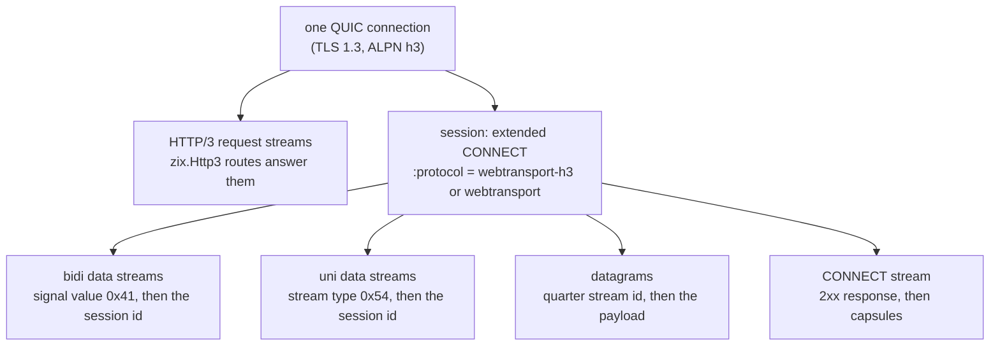
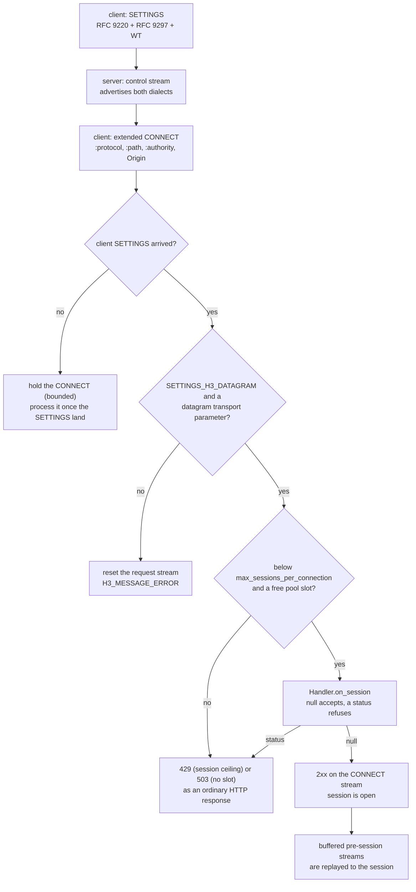
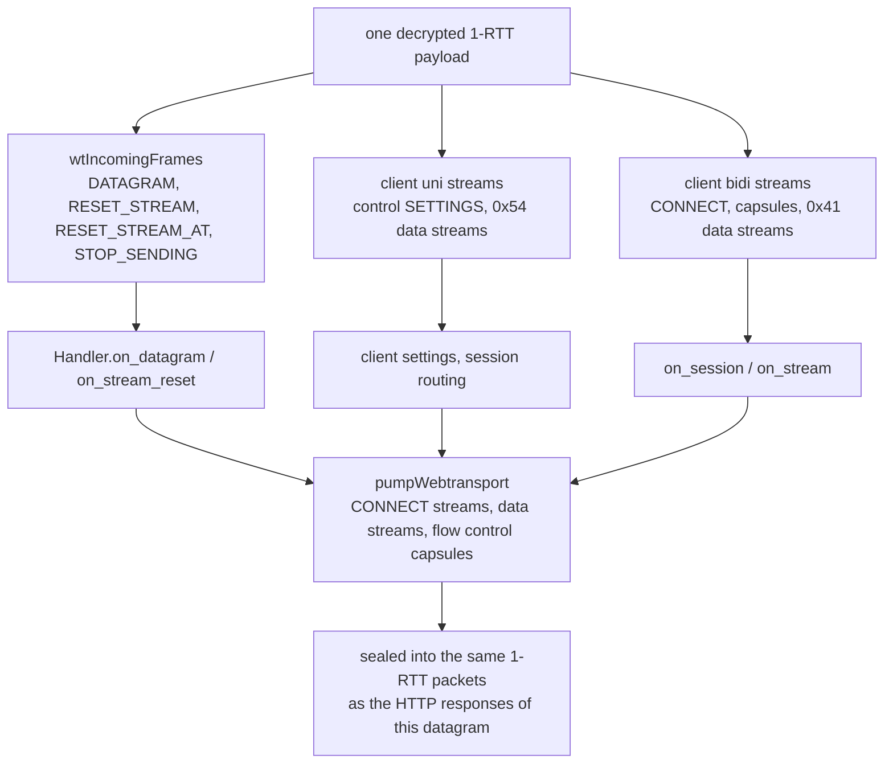

# HLD: zix.Webtransport

WebTransport over HTTP/3, dilayani oleh `zix.Http3` di atas koneksi QUIC yang sudah dimilikinya: draft-ietf-webtrans-http3-16 sebagai revisi saat ini, dan dialect draft-07 yang masih dikirim browser dan aioquic, diterima di sisinya. Satu extended CONNECT (RFC 9220) membuka sebuah session, dan semua setelahnya (stream bidirectional, stream unidirectional, dan datagram yang tidak reliabel) dimultipleks di satu koneksi QUIC. Pure-Zig, ditulis dari draft, tanpa library eksternal dan tanpa alokasi di jalur receive.

---

## Tujuan

- **Satu koneksi, dua model pengiriman.** Sebuah session membawa stream byte yang reliabel dan terurut serta datagram yang tidak reliabel dan tidak terurut pada saat yang sama, dan itulah alasan sebuah browser meminta WebTransport alih-alih WebSocket: tidak ada head-of-line blocking antar stream, dan sebuah datagram boleh dibuang daripada diantre di belakang.
- **Aplikasi tidak pernah melihat wire.** `zix.Webtransport.Config` pada server HTTP/3, lima callback opsional, dan dua handle (`Session`, `Stream`). Tidak ada apa pun di aplikasi yang menyebut stream id, frame, capsule, atau varint.
- **Satu keluarga engine yang konsisten.** Binding ini adalah fitur `zix.Http3`, bukan server kedua: `Router` comptime yang sama, `Tls.Context` yang sama, `DispatchModel` yang sama, dan bentuk konfigurasi "eksplisit bukan implisit" yang sama seperti engine zix lain.
- **Kedua revisi di wire.** draft-16 mengganti nama upgrade token dan support setting-nya, jadi server mengiklankan kedua penulisan sekaligus dan membiarkan token `:protocol` milik client memilih dialect (RFC 9114 7.2.4.1: peer mengabaikan setting yang tidak dikenalnya).
- **Dibayar, atau gratis.** Dengan `enabled = false` tidak ada WebTransport yang diiklankan, dialokasikan, atau diparse: koneksi HTTP/3 biasa membawa SETTINGS kosong dan transport parameter yang sama seperti sebelum fitur ini ada.
- **Terbatas secara konstruksi.** Session, stream, byte yang dibuffer, stream pra-session, dan ukuran datagram semuanya dibatasi konfigurasi, diiklankan ke peer, dan ditegakkan engine. Worker pool mengembalikan null alih-alih tumbuh, sehingga peer tidak bisa memaksa server mengalokasi.

---

## Mengapa WebTransport over HTTP/3

WebTransport adalah transport menghadap browser dengan sifat yang TCP tidak bisa beri: aplikasi dapat membuka sebanyak apa pun stream independen, dan ia dapat mengirim datagram yang tidak pernah diretransmisi. Ia berjalan di dalam HTTP/3, bukan di sisinya, sehingga deployment memakai ulang sertifikat TLS, handshake ALPN `h3`, congestion controller QUIC, dan port yang sama dengan request biasa.



Empat konsekuensi yang harus dihidupi engine, dan masing-masing membentuk sebuah keputusan di LLD:

1. **Session diidentifikasi oleh stream id CONNECT-nya** (3.2), sehingga stream, datagram, dan capsule semuanya menyebutnya: stream data membawanya di header-nya, datagram membawanya sebagai quarter stream id RFC 9297, dan stream CONNECT *adalah* kanal kontrol session itu.
2. **Stream data adalah stream QUIC yang byte pertamanya bukan frame HTTP/3.** Server hanya bisa membedakan stream WebTransport dari stream request dengan membaca header-nya (0x41 / 0x54), yang berarti pass receive binding harus berjalan sebelum pass request HTTP dan mengklaim stream yang dikenalnya.
3. **Datagram tidak diretransmisi** (RFC 9221 5.2), sehingga datagram yang tidak muat congestion window dibuang alih-alih ditahan, dan yang hilang tidak pernah di-rewind. Loss ring engine menandainya `datagram` tepat karena alasan itu.
4. **Dua limit bekerja sekaligus.** Flow control per-stream dan per-koneksi milik QUIC tetap berlaku, dan draft-16 menambah jatah level session di atasnya. Tidak ada yang menggantikan yang lain.

---

## Dua Dialect

Keduanya diterima secara default (`legacy_dialect = true`). Token `:protocol` pada CONNECT yang menentukan dialect sebuah session.

| Item | draft-ietf-webtrans-http3-16 | draft-ietf-webtrans-http3-07 (deployed) |
| :- | :- | :- |
| Upgrade token | `webtransport-h3` | `webtransport` |
| Support setting | `SETTINGS_WT_ENABLED` 0x2c7cf000 (nilai 1) | `SETTINGS_ENABLE_WEBTRANSPORT` 0x2b603742 (nilai 1, penulisan draft-02 yang masih dikirim client deployed) |
| Setting jumlah session | tidak ada (limitnya lewat `SETTINGS_WT_ENABLED` plus initial stream limit) | `SETTINGS_WEBTRANSPORT_MAX_SESSIONS` 0xc671706a (ditulis dengan nilai 1) |
| Initial limit session | `SETTINGS_WT_INITIAL_MAX_STREAMS_UNI` 0x2b64, `SETTINGS_WT_INITIAL_MAX_STREAMS_BIDI` 0x2b65, `SETTINGS_WT_INITIAL_MAX_DATA` 0x2b61 | tidak ada: transport parameter QUIC adalah seluruh jatahnya |
| Flow control session | `WT_MAX_STREAMS` 0x190B4D3F / 0x190B4D40, `WT_STREAMS_BLOCKED` 0x190B4D43 / 0x190B4D44, `WT_MAX_DATA` 0x190B4D3D, `WT_DATA_BLOCKED` 0x190B4D41 | tidak ada capsule flow control sama sekali |
| Reset stream data | `RESET_STREAM_AT` (0x24), reliable size minimal sebesar header stream | `RESET_STREAM` biasa (0x04) |
| Stream type / signal value | 0x54 (uni) / 0x41 (bidi) | identik |
| Capsule close / drain | `WT_CLOSE_SESSION` 0x2843 / `WT_DRAIN_SESSION` 0x78ae | identik |
| Rentang application error | `0x52e4a40fa8db` sampai `0x52e5ac983162` | identik |
| Error flow control | `WT_FLOW_CONTROL_ERROR` 0x045d4487, `WT_ALPN_ERROR` 0x0817b3dd | tidak ada (tidak ada flow control session yang dilanggar) |

Server menjawab keduanya, dan itu dilakukannya dengan mengiklankan kedua himpunan setting di satu control stream:

| Setting yang ditulis saat `enabled` | Identifier | Nilai |
| :- | :- | :- |
| extended CONNECT (RFC 9220) | 0x08 | 1 |
| HTTP/3 datagram (RFC 9297 2.1.1) | 0x33 | 1 |
| WebTransport over HTTP/3 (draft-16 3.1) | 0x2c7cf000 | 1 |
| Initial limit stream unidirectional | 0x2b64 | `max_streams_uni` |
| Initial limit stream bidirectional | 0x2b65 | `max_streams_bidi` |
| Initial limit data session | 0x2b61 | `max_session_data` |
| Support flag deployed (penulisan draft-02) | 0x2b603742 | 1 |
| Jumlah session deployed (draft-07) | 0xc671706a | 1 |

Pasangan deployed keluar bersamaan dan jumlahnya ditulis dengan nilai flag 1: revisi deployed membaca dukungan dari setting itu, jadi 0 berarti "server tidak menerima session sama sekali", dan jumlahnya bukan field `ServerSettings`. Plafon yang benar-benar ditegakkan server adalah `max_sessions_per_connection`, diperiksa di jalur CONNECT.

### Bagaimana session dinegosiasikan



Tiga pemeriksaan terjadi sebelum aplikasi pernah melihat request, dan masing-masing adalah MUST dari binding, bukan pilihan kebijakan:

- Request WebTransport tidak diproses sebelum SETTINGS milik client tiba (7.1), karena setting itulah yang memastikan revisi dan fitur yang dipakai. Request-nya ditahan alih-alih ditolak, karena client mengirim SETTINGS dan CONNECT-nya dalam satu flight dan keduanya bisa tiba dalam urutan mana pun: stream-nya menunggu di request pool milik worker (dibatasi sizing pool itu sendiri dan tabel 4 entri per koneksi), dan begitu SETTINGS tiba request yang ditahan diputar ulang lewat jalur accept normal. Hanya request yang tidak bisa ditahan yang direset dengan H3_REQUEST_REJECTED ("tidak diproses sama sekali", RFC 9114 8.1), sehingga client boleh mencoba ulang.
- Koneksi WebTransport memerlukan HTTP/3 datagram di kedua sisi (3.1): tanpa `SETTINGS_H3_DATAGRAM` milik client dan transport parameter `max_datagram_frame_size`, request itu malformed dan stream-nya direset dengan H3_MESSAGE_ERROR.
- Plafon session dan pool keduanya terbatas, dan penolakan adalah status HTTP biasa pada stream request (3.2 memperbolehkan status apa pun).

---

## Handshake dan Konfirmasi

Sebuah session menumpang koneksi QUIC yang sama dengan request HTTP/3 biasa, jadi binding tidak menambah
apa pun pada handshake transport. Satu sifat handshake itu yang menentukan apakah sebuah session bisa
berdiri:

- **Finished dari client diverifikasi.** Paket Handshake milik client didekripsi, byte CRYPTO-nya
  direassemble, lalu Finished diperiksa terhadap client handshake-traffic secret atas transcript sampai
  server Finished (RFC 8446 4.4.4). Finished yang tidak lolos verifikasi membiarkan handshake tidak
  terkonfirmasi: tidak ada HANDSHAKE_DONE, tidak ada session, dan koneksi mati oleh idle timeout. Peer yang
  tidak pernah membuktikan penguasaan kunci tidak pernah mencapai jalur request, dan Finished yang
  terbelah antar paket baru dinilai setelah stream reassembly memegangnya utuh.
- **Konfirmasi adalah kewajiban server, dan dikirim segera.** `HANDSHAKE_DONE` tidak boleh keluar sebelum
  handshake selesai (RFC 9000 17.2.1), dan momen handshake selesai adalah momen Finished terverifikasi.
  Prologue sekali pakai (HANDSHAKE_DONE lalu SETTINGS stream control) karena itu keluar pada giliran yang
  sama, bukan menunggu paket 1-RTT pertama dari client: client berhak menunggu konfirmasi sebelum mengirim
  data 1-RTT apa pun, dan Chromium memang menunggu — ia menahan SETTINGS, CONNECT, dan setiap request
  sampai konfirmasi tiba. aioquic dan client in-tree mengirim 1-RTT lebih awal, jadi server yang hanya
  membalas 1-RTT terlihat benar sampai sebuah browser menyambung ke sana.
- **Client yang menyerah menyebut alasannya.** Kegagalan handshake datang sebagai CONNECTION_CLOSE di dalam
  paket Handshake, membawa kode alert TLS dan deskripsi dari client itu sendiri (sertifikat ditolak,
  parameter tidak diterima). Engine mencatatnya pada level WARN, karena tanpa itu koneksi hanya diam dan
  tidak ada lagi yang menyebut penyebabnya.
- **Paket Handshake tidak di-ACK pada jalur ini.** Handshake selesai pada momen yang sama, jadi client
  membuang state Handshake-nya bersama konfirmasi, dan Finished yang dikirim ulang dijawab dengan prologue
  idempoten yang sama.

## Yang Dilihat Aplikasi

Permukaan aplikasi adalah satu konfigurasi pada server yang sudah ada, lima callback, dan dua handle. `Session` dan `Stream` adalah view atas state engine: keduanya dibuat baru untuk callback yang memilikinya, dan menyalinnya legal tetapi salinannya hanya bisa dipakai selama callback itu berjalan.

```zig
pub const Config = struct {
    enabled: bool = false,
    max_sessions_per_connection: u16 = 4,
    max_streams_bidi: u32 = 16,
    max_streams_uni: u32 = 16,
    max_session_data: u64 = 1 << 20,
    stream_send_bytes: usize = 16 * 1024,
    pool_sessions: usize = 16,
    pool_streams: usize = 64,
    pool_orphan_streams: usize = 8,
    pool_orphan_bytes: usize = 1024,
    max_datagram_frame_size: u64 = 1200,
    legacy_dialect: bool = true,
    handler: Handler = .{},
};
```

| Field config | Efek | Dibatasi oleh |
| :- | :- | :- |
| `enabled` | menawarkan WebTransport sama sekali: setting, transport parameter, pass receive, pool | tidak ada (sebuah bool) |
| `max_sessions_per_connection` | session bersamaan pada satu koneksi QUIC, diiklankan dan ditegakkan | `connection_session_cap` (8) |
| `max_streams_bidi` / `max_streams_uni` | stream yang boleh dibuka satu session per arah, per session | limit flow control session itu sendiri, dinaikkan saat peer menghabiskannya; worker pool membatasi slot di belakangnya |
| `max_session_data` | Stream Body byte yang dibawa satu session sebelum limitnya diperpanjang | tidak ada (sebuah limit u64) |
| `stream_send_bytes` | write window per stream data, dan byte yang masih bisa dikirim ulang dari paket yang hilang | `max_stream_buffer_bytes` (16 KiB) |
| `pool_sessions` / `pool_streams` / `pool_orphan_streams` | slot milik worker | `pool.maxima` (64 / 256 / 32) |
| `pool_orphan_bytes` | byte yang dibuffer per stream pra-session | tidak ada (dinaikkan minimal ke 64) |
| `max_datagram_frame_size` | DATAGRAM frame terbesar yang diterima endpoint ini, diiklankan sebagai 0x20 | limit peer sendiri dan congestion window |
| `legacy_dialect` | juga menerima token dan setting draft-07 yang deployed | tidak ada (sebuah bool) |

`capacityError(config)` mengembalikan nama field yang bermasalah ketika sebuah konfigurasi melewati plafon compile-time, sehingga server dapat menolak start alih-alih memotong fitur secara diam-diam.

### Public API

Akses via `const zix = @import("zix");`

| Simbol | Tipe | Deskripsi |
| :- | :- | :- |
| `zix.Webtransport.Config` | struct | Konfigurasi fitur, dibawa pada `Http3ServerConfig.webtransport` |
| `zix.Webtransport.Handler` | struct | Lima callback opsional |
| `zix.Webtransport.Session` | struct | Handle session: identitas, state, operasi stream dan datagram |
| `zix.Webtransport.Stream` | struct | Handle stream data: read, write, finish, reset, stop |
| `zix.Webtransport.SessionRequest` | struct | CONNECT yang membentuk session, seperti dilihat aplikasi |
| `zix.Webtransport.CloseInfo` | struct | Bagaimana dan mengapa sebuah session berakhir |
| `zix.Webtransport.CloseReason` | enum | `peer_fin`, `peer_reset`, `peer_close`, `local_close`, `flow_control_error`, `protocol_error`, `connection_closed` |
| `zix.Webtransport.State` | enum | `open`, `draining`, `closed` |
| `zix.Webtransport.Kind` | enum | `bidi`, `uni` |
| `zix.Webtransport.Dialect` | enum | `draft16`, `draft07` |
| `zix.Webtransport.poolConfig` | fn | Sizing pool yang diminta sebuah `Config` |
| `zix.Webtransport.capacityError` | fn | Nama field yang melewati plafon, atau null |
| `zix.Webtransport.connection_session_cap` | const | 8 session per koneksi |
| `zix.Webtransport.connection_stream_cap` | const | 32 stream data per koneksi |

### Callback handler

| Callback | Berjalan saat | Mengembalikan |
| :- | :- | :- |
| `on_session(session) ?u16` | sebuah extended CONNECT lolos pemeriksaan engine sendiri | null untuk menerima, status HTTP untuk menolak (403 untuk origin yang tidak diizinkan aplikasi, 404 untuk path yang tidak dilayaninya, 429 untuk rate limiting) |
| `on_stream(session, stream)` | sebuah stream data punya byte siap (sekali per chunk) | void: baca dengan `stream.read()` |
| `on_stream_reset(session, stream)` | sebuah stream data berakhir tanpa semua byte-nya tiba | void: `stream.resetCode()` membawa application code peer, atau null |
| `on_datagram(session, datagram)` | satu datagram tiba, routing-nya sudah dilepas | void |
| `on_close(session)` | session berakhir, dengan alasan apa pun | void: `session.closeInfo()` menyebutkan alasannya |

Setiap callback opsional. Callback null berarti "tidak berminat": session tetap hidup, stream tetap dilacak, dan yang seharusnya dikirim ke callback itu dibuang dan dihitung.

### Method Session

| Method | Deskripsi |
| :- | :- |
| `id()` | session id: stream id CONNECT yang mengidentifikasinya di koneksi |
| `dialect()` | `draft16` atau `draft07`, dari token `:protocol` pada CONNECT |
| `state()` / `isOpen()` | state lifecycle; session draining masih terbuka, yang closed tidak |
| `sessionRequest()` | view CONNECT: `path`, `authority`, `protocol`, `origin`, `dialect`, `datagram_capable` |
| `openBidi()` / `openUni()` | membuka stream data, header sudah diantre; null ketika session tertutup, limit peer tercapai, atau tidak ada slot pool bebas |
| `sendDatagram(payload) bool` | mengirim satu datagram tidak reliabel; false ketika tidak bisa dikirim sekarang (tidak pernah diantre untuk nanti) |
| `close(code, message)` | mengirim capsule close, menyelesaikan stream CONNECT, mereset setiap stream session |
| `drain()` | memberi tahu peer bahwa session sedang draining; session tetap bekerja |
| `streamsAvailable(kind)` | berapa banyak stream `kind` lagi yang diizinkan peer (session draft-16 dengan flow control) |
| `closeInfo()` | `code`, `message`, dan `reason` session yang sudah berakhir |

Dua aturan lain yang ditegakkan engine agar aplikasi tidak bisa membocorkan keduanya: slot session dan setiap slot stream yang dipegangnya kembali ke worker pool saat close, dan `on_session` melihat request sebelum 2xx keluar, sehingga penolakan tidak pernah meninggalkan session.

### Method Stream

| Method | Deskripsi |
| :- | :- |
| `id()` / `kind()` / `initiator()` | stream id QUIC, `uni` atau `bidi`, dan endpoint mana yang membukanya |
| `read()` | chunk yang baru tiba, hanya valid untuk callback ini |
| `finished()` | peer mengakhiri stream, jadi tidak ada lagi yang akan tiba |
| `resetCode()` | application error code peer, atau null ketika reset-nya tidak membawanya |
| `writable()` / `write(bytes)` | ruang bebas di send buffer, dan berapa byte yang diterima (jumlah pendek adalah back pressure) |
| `finish()` | mengirim FIN setelah byte yang diantre keluar; receive half tidak terpengaruh |
| `reset(code)` | mereset send half dengan application error code (reset reliabel pada draft-16) |
| `stop(code)` | meminta peer berhenti mengirim di stream ini |

Sebuah view `Stream` juga membawa `chunk_offset`, offset stream tempat chunk yang dikirim dimulai, sehingga aplikasi yang merakit offset sendiri tidak perlu menghitung byte antar callback.

### Lifetime

Setiap pointer yang diberikan ke callback hanya valid untuk callback itu, aturan yang sama yang diikuti seluruh zix. Slice `read()` dan slice `SessionRequest` meminjam buffer engine (payload paket yang didekripsi, dan scratch decode milik session), jadi aplikasi yang membutuhkannya nanti harus menyalinnya. Slot session didaur ulang setelah `on_close` selesai.

---

## Dispatch dan Concurrency

Single-threaded per koneksi, persis seperti jalur serve HTTP/3 yang diperluasnya.

- Sebuah session dimiliki worker yang memiliki koneksi QUIC-nya untuk seumur hidupnya. Callback tiba di thread worker itu, satu datagram pada satu waktu, sehingga handler aplikasi tidak pernah butuh lock dan tidak pernah melihat dua callback untuk satu session sekaligus.
- Operasi menghadap aplikasi memanggil balik engine melalui vtable driver yang hidup di frame stack call saat itu (`WtCall`), dengan context pointer yang menunjuk frame itu. Tidak ada yang melewati call: session tidak menyimpan pointer ke jalur paket, dan itulah yang membuat "satu datagram pada satu waktu per worker" menjadi fakta, bukan harapan.
- Pool dimiliki worker, bukan koneksi. Satu worker memiliki hingga `max_connections` slot koneksi yang dialokasikan bersemangat, jadi pool per koneksi akan dibayar ratusan kali lipat untuk sesuatu yang hanya dipakai segelintir session pada satu waktu.
- Tiga dispatch model adalah model HTTP/3, tidak berubah: `.ASYNC` menjalankan satu recv loop single-worker (migration-safe), `.EPOLL` dan `.URING` menjalankan satu worker SO_REUSEPORT per core dan hanya untuk Linux. Tiap worker membuka pool-nya sendiri di samping connection table-nya dan men-deinit-nya di jalur keluar.
- Urutan receive di dalam satu datagram tetap: datagram dan stream reset, lalu stream unidirectional client (control dan WebTransport), lalu stream bidirectional client (CONNECT dan stream data). Pass binding berjalan sebelum pass request HTTP, dan setiap stream yang dikenalnya diklaim sehingga loop request membiarkannya.



---

## Flow Control

Dua lapisan bekerja sekaligus dan binding menjaganya tetap terpisah.

| Lapisan | Cakupan | Ditegakkan oleh | Diperpanjang oleh |
| :- | :- | :- | :- |
| Stream QUIC | satu stream, tiap arah | state flow-control koneksi | `MAX_STREAM_DATA` ketika receive window melewati separuh ukurannya |
| Koneksi QUIC | setiap stream pada koneksi | `initial_max_data` dan `MAX_DATA` yang bergulir | `replenishMaxData` milik engine di jalur request |
| Session (draft-16 saja) | Stream Body byte dan jumlah stream, per session | `max_session_data`, `max_streams_bidi`, `max_streams_uni` dari SETTINGS | capsule `WT_MAX_DATA` / `WT_MAX_STREAMS` saat peer menghabiskan jatahnya |

Empat aturan membuat lapisan session berperilaku benar:

- **Limit data session hanya menghitung Stream Body byte** (5.4): header stream (type atau signal plus session id) dikecualikan di kedua sisi, itulah sebabnya engine menagih panjang payload dan tidak pernah panjang yang sudah diframe.
- **Stream yang direset tetap ditagih final size-nya** (5.4). Pengirim yang menagih byte yang tidak pernah dilihat penerima tetap menghabiskan jatahnya, jadi penerima menagih field Final Size dari frame reset, bukan apa yang diterimanya.
- **Nilai capsule pada `WT_MAX_DATA` dan `WT_MAX_STREAMS` harus naik secara ketat** (5.6.2 / 5.6.4). Nilai pada atau di bawah nilai terakhir adalah `WT_FLOW_CONTROL_ERROR`, dan jumlah stream melewati 2^60 tidak bisa menggambarkan stream id mana pun, jadi ia ditolak alih-alih dipotong.
- **Stream data memperpanjang kredit QUIC-nya sendiri.** Stream data WebTransport tidak punya slot reassembly request, jadi tidak ada hal lain di engine yang akan menaikkan `MAX_STREAM_DATA`-nya: tanpa ini stream yang lebih panjang dari jatah per-stream sekali-pakai saat handshake akan macet dengan client menunggu kredit yang tidak pernah diberikan server.

Tanpa flow control hanya satu session pada satu waktu yang legal (5.1), jadi engine melacak apakah kedua endpoint menyatakan niat dan tetap pada bentuk tanpa capsule ketika salah satunya tidak.

---

## Memory Model

| Cakupan | Allocator | Lifetime |
| :- | :- | :- |
| Worker pool (session, stream, send buffer, orphan buffer) | `config.allocator`, sekali saat worker mulai | Lifetime worker, dilepas saat worker keluar |
| Slot session | di dalam pool | Lifetime session: didaur ulang saat close |
| Slot stream data dan send buffer-nya | di dalam pool, satu alokasi terpisah untuk semua buffer | Lifetime stream: didaur ulang saat kedua half-nya selesai |
| Buffer stream pra-session | di dalam pool | Sampai session muncul, atau sampai slotnya ditolak |
| State `wt` per koneksi | inline di slot koneksi | Lifetime koneksi, ukuran tetap (tanpa heap) |
| Scratch decode di jalur WT | frame stack pass receive dan `WtCall` milik call itu | Satu datagram |

Jalur receive tidak mengalokasi apa pun: session dan stream datang dari pool, dan pool mengembalikan null alih-alih tumbuh. Biaya memori WebTransport satu worker persis `streams * stream_send_bytes` (satu alokasi terpisah) plus `orphans * pool_orphan_bytes`, dibayar sekali saat worker mulai, tidak bergantung pada jumlah koneksi maupun berapa session yang hidup.

Yang dibayar sebuah konfigurasi per koneksi tetap dan kecil: state `wt` inline (tabel 8 pointer session, tabel 32 pointer stream, SETTINGS client yang sudah didekode, dua nilai transport parameter `u64`, tabel 8 entri yang mengklasifikasi stream unidirectional client, dan buffer control stream 256 byte). Ukurannya berasal dari dua plafon compile-time, jadi menaikkan `connection_session_cap` membebani sejumlah pointer itu di setiap koneksi yang dialokasikan bersemangat.

---

## Catatan Keamanan

- **Validasi origin milik aplikasi.** Engine menyerahkan field `origin` milik CONNECT (dan path, authority, serta token) ke `on_session` dan menerima status kembali; browser selalu mengirim Origin (3.2), dan server yang memutuskan apakah ia diizinkan. Engine tidak menebak kebijakannya.
- **Setiap limit diiklankan dan ditegakkan.** Plafon session diperiksa sebelum slot session diambil (429 ketika tercapai, 503 ketika pool kosong), plafon stream ditegakkan per session, dan keduanya diiklankan ke peer sehingga client yang patuh tidak pernah mengetahui limit dengan menabraknya.
- **Buffering pra-session dibatasi dua kali.** Client boleh membuka stream sebelum melihat respons 2xx session-nya (4.6), jadi worker menahan sejumlah stream terbatas dengan jumlah byte terbatas. Melewati salah satunya membuat stream direset dengan `WT_BUFFERED_STREAM_REJECTED`, yang menghentikan peer memarkir stream di koneksi yang tidak akan pernah membentuk session-nya.
- **Datagram dibatasi limit peer dan jalurnya.** `max_datagram_frame_size` diiklankan dan ditegakkan di kedua arah, anggaran payload mengurangi kedua lapisan framing sebelum apa pun diantre, dan datagram yang tidak muat congestion window dibuang alih-alih ditahan. Tidak ada yang diretransmisi.
- **Capsule tak dikenal tidak bisa memaksa engine membuffer.** Reader memparse header capsule dulu dan baru memutuskan: capsule yang dikenal binding diakumulasi ke buffer tetap, dan yang lain dilewati byte per byte. Peer bebas mendeklarasikan panjang yang tidak akan pernah ditahan endpoint ini, dan melakukannya hanya menghabiskan byte wire-nya sendiri.
- **Pesan close dibatasi dan divalidasi.** Pesan aplikasi dipotong pada batas karakter UTF-8 di 1024 byte saat dikirim, dan harus UTF-8 valid maksimal 1024 byte saat diterima (jika tidak, stream CONNECT direset dengan H3_MESSAGE_ERROR).
- **Application error code tidak pernah jatuh di codepoint terreservasi.** Pemetaannya ke rentang `WT_APPLICATION_ERROR` melewati codepoint grease HTTP/3 (0x1f * N + 0x21), dan kode yang diterima yang terreservasi di dalam rentang terbaca sebagai "reset tanpa application error code" alih-alih sebagai nilai yang dipilih peer.
- **Handshake hanya dikonfirmasi setelah client membuktikan penguasaan kunci.** Server mengirim `HANDSHAKE_DONE` hanya pada Finished client yang terverifikasi, tidak pernah pada hal lain: handshake yang tidak terverifikasi atau tidak dikenali membiarkan koneksi tanpa konfirmasi, dan peer yang penting (browser, aioquic) lalu menggagalkan session alih-alih mencapai sebuah handler.
- **Stream yang diklaim tidak pernah dijawab sebagai request HTTP.** Pass receive binding berjalan lebih dulu dan menandai setiap stream yang dikenalnya, sehingga stream data WebTransport tidak bisa disalahartikan sebagai request yang body-nya kebetulan dimulai dengan 0x41.
- **Error session adalah reset stream CONNECT** yang membawa error code terpetakan, diikuti teardown penuh: setiap stream session direset dengan `WT_SESSION_GONE`, datagram yang mengantre dibuang bersamanya, dan aplikasi menerima satu `on_close`.

---

## Catatan RFC

| Spec | Peran | Codepoint yang dipakai |
| :- | :- | :- |
| draft-ietf-webtrans-http3-16 | binding normatif: upgrade extended CONNECT, session, stream type, capsule, error code | token `webtransport-h3`; SETTINGS 0x2c7cf000, 0x2b64, 0x2b65, 0x2b61; uni type 0x54, bidi signal 0x41; capsule 0x2843, 0x78ae, 0x190B4D3F, 0x190B4D40, 0x190B4D3D, 0x190B4D41, 0x190B4D43, 0x190B4D44; error 0x3994bd84, 0x170d7b68, 0x045d4487, 0x0817b3dd, 0x212c0d48; rentang app error 0x52e4a40fa8db sampai 0x52e5ac983162 |
| draft-ietf-webtrans-http3-07 | dialect deployed yang masih dikirim browser dan aioquic | token `webtransport`; SETTINGS 0x2b603742 (penulisan draft-02 untuk support flag, masih dikirim) dan 0xc671706a; stream type, capsule, dan rentang app error yang sama; RESET_STREAM biasa |
| RFC 9220 | extended CONNECT over HTTP/3: request CONNECT dengan `:protocol`, `SETTINGS_ENABLE_CONNECT_PROTOCOL` | 0x08 |
| RFC 9221 | QUIC DATAGRAM frame, dan parameter yang membatasinya | frame 0x30 (tanpa panjang), 0x31 (panjang eksplisit); transport parameter `max_datagram_frame_size` 0x20 |
| RFC 9297 | HTTP datagram dan capsule protocol: quarter stream id pada stream CONNECT, capsule di dalam DATA frame | `SETTINGS_H3_DATAGRAM` 0x33, `H3_DATAGRAM_ERROR` 0x33, framing capsule type / length / value |
| draft-ietf-quic-reliable-stream-reset-09 | `RESET_STREAM_AT`, sehingga reset tetap mengirimkan header stream dan asosiasinya bertahan | frame 0x24; transport parameter `reset_stream_at` 0x1d |
| RFC 9114 | framing HTTP/3 di bawahnya: SETTINGS, control stream, DATA frame, `H3_MESSAGE_ERROR`, `H3_REQUEST_REJECTED`, codepoint grease | error code 0x0100 sampai 0x010e dan rentang 0x1f * N + 0x21 |
| RFC 9000 / 9001 / 9002 | transport QUIC, packet protection, dan loss recovery yang ditumpangi binding | stream id, frame flow control (0x10 / 0x11 / 0x12 / 0x13), `RESET_STREAM` 0x04, `STOP_SENDING` 0x05 |

---

## Belum Diwire / Belum Dibuat

Masing-masing dengan alasannya, supaya tidak ada yang menurunkan ulang pertanyaannya:

| Yang belum ada | Alasan |
| :- | :- |
| WebTransport over HTTP/2 (varian berbasis capsule) | sengaja di luar cakupan pass ini: binding di sini adalah binding HTTP/3, dan capsule protocol HTTP/2 akan menjadi jalur engine kedua dengan model stream-nya sendiri |
| Session 0-RTT | engine menolak 0-RTT pada handshake QUIC (kebijakan yang sama yang dibawa setiap engine zix), jadi session selalu dibentuk pada 1-RTT |
| Keying-material exporter | tidak diekspos: aplikasi yang membutuhkan keying material session tidak punya permukaan untuk itu hari ini |
| Priority signalling (frame `PRIORITY_UPDATE`, RFC 9218 bagian 7) | tidak diimplementasikan: stream dilayani dalam urutan kedatangan di dalam satu datagram, dan tidak ada prioritas per session yang dibawa |
| Drain session yang dipicu GOAWAY | tidak diimplementasikan: session draining lewat capsule `WT_DRAIN_SESSION` (4.7), dan GOAWAY HTTP/3 yang diterima tidak sampai ke session binding |
| Mengirim `WT_STREAMS_BLOCKED` / `WT_DATA_BLOCKED` | engine menjawab laporan blocked peer dengan memperpanjang limitnya sendiri, dan kirimannya sendiri dibatasi limit peer sebelum mengantre, jadi ia tidak pernah punya kemacetan untuk dilaporkan |
| Client WebTransport in-tree | client native di runner adalah test harness, bukan bagian permukaan publik: browser dan aioquic adalah client yang dituju |
| Mode khusus draft-16 | `legacy_dialect = false` mempersempit token yang diterima, tetapi tidak ada dialect yang diutamakan atau diturunkan melebihi apa yang diminta token client |

---

## Contoh

| Contoh | Port | Yang ditunjukkan |
| :- | :- | :- |
| `http3_webtransport` | 9089 | session di `/echo`: setiap chunk stream data dipantulkan kembali (dengan FIN setelah seluruh chunk keluar), setiap datagram dipantulkan, satu stream unidirectional per session yang menulis banner lalu FIN, dan lifecycle session dicetak ke stderr |
| `webtransport_live` | 9443 (TCP dan UDP) | live view yang dirender browser: halaman lewat HTTPS/1.1 di TCP dan session lewat HTTP/3 di UDP, satu port dan satu origin. Satu tick pada stream bidirectional menjadi increment event dan patch DOM, sebuah datagram membawa note dan mengembalikan patch-nya, stream kedua mengunggah 64 KiB dengan progress sementara tick tetap mengalir, dan reconnect menyinkronkan ulang dari snapshot. |
| `webtransport_tasks` | 9444 QUIC · 9445 TCP | satu aksi durable dari ujung ke ujung: halaman mengirim typed form event dengan idempotency key lewat stream reliabel, server memvalidasi dan mengotorisasi, satu transaksi menulis task dan job-nya, worker me-lease dan menjalankan job, satu transaksi completion menulis update task, penyelesaian job, dan baris outbox, dispatcher mempublikasikannya, dan view yang terotorisasi mem-patch dirinya dari state yang sudah commit. `examples/durable/tasks.zig` memuat slice-nya; `zig build test-durable` menjalankan tujuh skenario acceptance terhadap PostgreSQL nyata, dan `scripts/bench_durable_tasks.py` mengukurnya. |

### Aksi durable

`webtransport_tasks` adalah bentuk sebuah mutasi ketika harus selamat dari crash, dan layak dibaca sebagai
rujukan untuk satu aksi:

- **Database yang menentukan idempotensi.** `(tenant_id, idempotency_key)` unik, jadi submission yang
  diulang mengembalikan task yang sudah dibuat alih-alih task kedua, dan pengulangan itu tidak menyisipkan
  job kedua.
- **Satu transaksi per langkah.** Create men-commit `{task, job, baris outbox}` bersama; complete men-commit
  `{task, job, baris outbox}` bersama. Tidak ada jendela di mana task ada tanpa job-nya.
- **Lease, bukan lock.** Worker memegang job dengan menulis `lease_until`; worker yang mati di tengah job
  meninggalkan baris yang lease-nya kedaluwarsa, dan poll berikutnya mengambilnya lagi dengan `attempts`
  bertambah, jadi crash berulang terlihat di view alih-alih senyap.
- **At-least-once, dinetralkan revisi.** Setiap perubahan state mengambil revisi berikutnya milik tenant di
  transaksi yang sama dan baris outbox membawanya; dispatcher menandai baris terpublikasi hanya setelah
  feed menerimanya, jadi crash di antaranya memutar ulang event, dan view yang sudah menerapkan revisi N
  mengabaikan apa pun ≤ N.
- **View membangun ulang dari database.** Sebuah subscription dijawab snapshot berevisi, yang juga dipakai
  reconnect, reload, server yang restart, atau cursor yang tertinggal dari ring feed untuk menyinkronkan
  ulang.

Mutasi durable menumpang stream bidirectional yang reliabel. Datagram tetap untuk apa yang memang cocok:
state transient yang boleh hilang — halaman memakainya hanya untuk typing hint.

Yang *bukan* demo ini, dan yang dibutuhkan sebuah produk sebagai gantinya: identitasnya adalah dropdown
yang dikirim halaman pada setiap subscription, jadi otorisasinya adalah pencarian baris pada tabel yang
di-seed, bukan principal terautentikasi yang bisa dipercaya telah dibangun oleh transport; dan schema dibuat
saat start serta tabel demo di-truncate agar satu run mulai bersih, bukan diterapkan lewat migrasi dengan
riwayat yang dibutuhkan deployment nyata. Keduanya adalah pekerjaan framework di sekitar jalur ini, bukan
bagian dari jalur itu: invarian slice-nya sendiri — satu transaksi per langkah, lease dengan token,
idempotensi lewat unique key, dan outbox dengan revisi — tidak bergantung pada keduanya.

Demo ini menyajikan halamannya lewat TCP di 9445 dan session lewat QUIC di 9444, dan bentuk itu berbeda dari
contoh lain dengan sengaja. Browser yang diminta memaksa QUIC untuk sebuah origin — yang dibutuhkan sertifikat
self-signed — mengirim *setiap* request ke origin itu lewat QUIC, dan halaman yang dilayani di sana tidak bisa
reload saat server sedang dibangun ulang: reload-nya, dan poll versi yang memicunya, gagal dengan handshake.
Melayani halaman lewat TCP menjaga reload tetap bebas dari siklus hidup server QUIC, yang persis itulah yang
diukur development loop di bawah, sementara session tetap menuju port QUIC.

### Development loop

`scripts/dev_loop_bench.py` mengukur loop yang benar-benar dijalani developer pada slice ini: dari suntingan
sumber sampai *browser* memperlihatkan perubahannya. Ini pengukuran yang berbeda dari benchmark runtime di
atas, dan perbedaannya justru intinya — runtime yang cepat tidak mengatakan apa pun tentang berapa lama
sebuah save menjadi terlihat.

Stopwatch mulai pada penulisan file dan berakhir saat browser melapor kembali, jadi ia mencakup hal yang
tidak ditangkap angka compiler saja: build, restart server, reload halaman, dan reconnect session setelahnya.
Tiga suntingan diukur, masing-masing dengan observabelnya sendiri:

| Suntingan | Yang berubah | Yang dibuktikan browser |
| :- | :- | :- |
| handler | balasan handler WebTransport, plus build token yang dirender halaman | token yang disubstitusi server ada di DOM, dan aksi durable tetap selesai |
| render | markup halaman itu sendiri dan mark yang direndernya | mark yang dirender halaman ada di DOM, dan aksi durable tetap selesai |
| type | tipe `Task` milik slice bersama, yang memaksa modul, contoh, dan setiap konsumennya dibangun ulang | hal yang sama, setelah build yang harus mengompilasi ulang modulnya juga |

Mekanismenya kecil dan berguna diketahui saat membaca angkanya: server menyajikan halaman dengan token
disubstitusi, mengekspos `/devloop/version` (hash dari byte yang persis disajikan) dan `/verified` (laporan
browser); halaman — dibuka sekali dengan `?devloop` — mem-poll versi, me-reload dirinya saat berubah, lalu
dial, subscribe, mengirim aksi durable, menunggu patch completion, dan baru melapor ketika perubahan yang
menjadi asal build-nya terlihat di DOM. Satu instance Chromium tetap terbuka antar iterasi, jadi satu iterasi
membayar reload dan reconnect, bukan startup browser, dan skrip memulihkan working tree dari salinan di
memori sehingga satu run tidak pernah menyentuh apa pun yang belum di-commit developer.

### Menjalankan demo browser

`zig build example-webtransport_live`, lalu buka `https://127.0.0.1:9443/`: halaman dilayani lewat
HTTPS/1.1 di TCP, dan session yang dibukanya menuju host dan port yang sama lewat HTTP/3 (route yang sama
juga dilayani lewat HTTP/3, jadi browser yang dipaksa ke QUIC tetap memuatnya).

Chromium memverifikasi sertifikat server pada koneksi session dan melaporkan kegagalannya sebagai error
protokol QUIC, jadi sertifikat self-signed milik demo harus diterima sebelum session bisa dijalankan:

```
# base64 SHA-256 dari SubjectPublicKeyInfo sertifikat yang dilayani
openssl x509 -in examples/certs/ecdsa_p256_cert.pem -pubkey -noout \
  | openssl pkey -pubin -outform der | openssl dgst -sha256 -binary | openssl enc -base64

chrome --ignore-certificate-errors \
       --ignore-certificate-errors-spki-list=<nilai itu> \
       --origin-to-force-quic-on=127.0.0.1:9443
```

Allowlist SPKI adalah flag yang menentukan untuk QUIC: `--ignore-certificate-errors` saja cukup untuk
halaman HTTPS/1.1 tetapi meninggalkan session gagal dengan `certificate unknown`.
`--origin-to-force-quic-on` yang membuat browser memuat halaman lewat HTTP/3 juga.

`scripts/webtransport_interop.py` adalah client independen berbasis skrip: ia menjalankan contoh
`http3_webtransport` dengan aioquic (handshake, extended CONNECT, echo stream bidirectional, echo
datagram, dan stream unidirectional yang dibuka server) dan melaporkan satu baris PASS/FAIL per
pemeriksaan. Echo bidirectional dibaca dari byte stream mentah, karena lapisan HTTP/3 aioquic hanya
mengklasifikasikan data stream masuk sebagai WebTransport ketika peer mengirim ulang stream header 0x41 —
yang dilarang draft pada arah server dari stream yang dibuka client (draft-ietf-webtrans-http3-16 4.3),
sehingga echo yang konforman tidak pernah sampai ke event WebTransport lapisan itu.

Build dengan `zig build example-http3_webtransport` (binary `zig-out/bin/zix-example-http3_webtransport-x86_64-linux-debug`), dan jalankan dengan client WebTransport over HTTP/3 mana pun, termasuk draft deployed yang masih dikirim browser dan aioquic. Handler contoh ini tidak menyebut satu pun stream id, frame, atau capsule.

---

## Di Mana Detailnya

[`docs/lld-webtransport-id.md`](lld-webtransport-id.md) mencakup peta file, format wire persisnya (header stream, framing capsule, keenam capsule, codec datagram, setting dan transport parameter), state machine session beserta jalur close-nya, kedua half stream dan aturan reset reliabel, flow control kedua arah, aturan buffering pra-session, dan apa yang membatasi setiap limit.

Lihat ADR-069 (`docs/adr-id.md`) untuk keputusan melayani WebTransport sebagai fitur `zix.Http3`.

---

###### end of hld-webtransport
