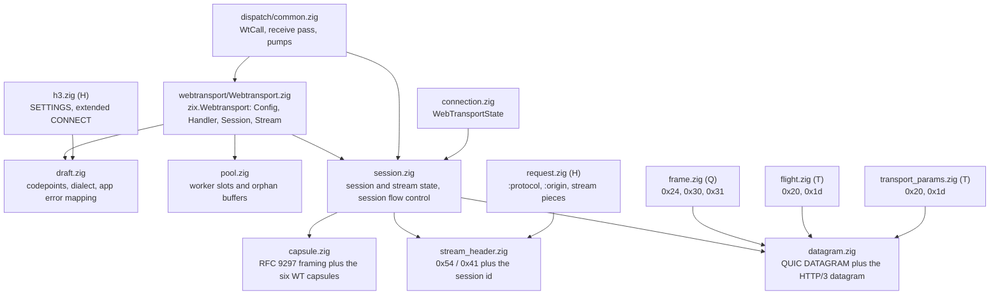
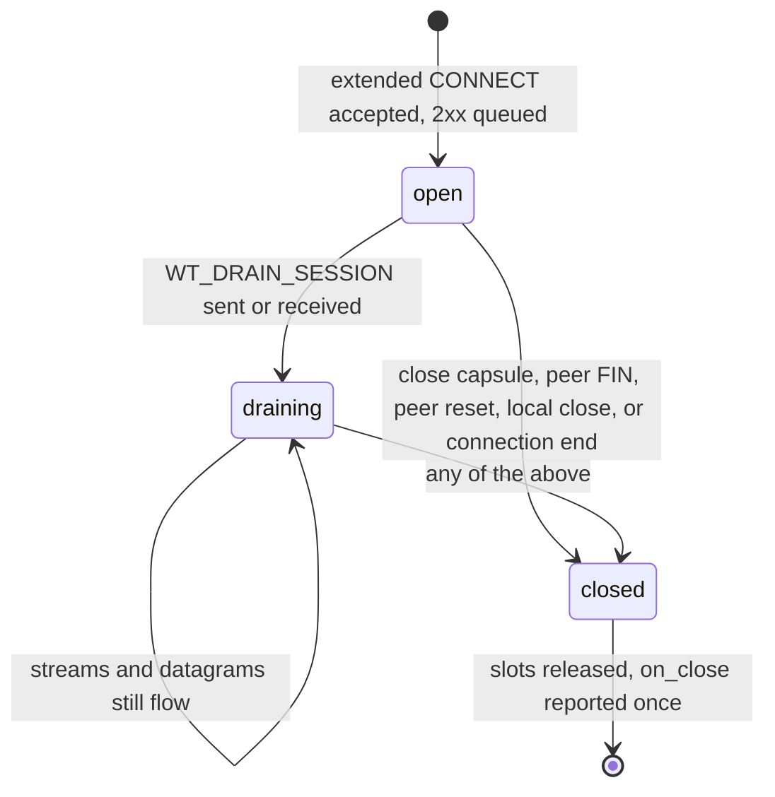

# LLD: zix.Webtransport

Internal implementation details for WebTransport over HTTP/3. For design rationale see [`docs/hld-webtransport-en.md`](hld-webtransport-en.md).

Every wire format the binding speaks is a pure function over bytes in its own file, and each one carries its proofs in-file: the draft's codepoints, the RFC layouts, and crafted byte streams. The state machines are pure state over caller-owned buffers: no io, no allocation, no clock. The engine side (the receive pass, the pumps, and the driver vtable) lives in the HTTP/3 dispatch layer, which is the only part that touches a packet.

---

## Layering

The HTTP/3 modules tag their layer in the `//!` header: C (crypto bottom), Q (QUIC transport), T (TLS-over-QUIC glue), P (QPACK), L (loss recovery), H (HTTP/3 semantics). The binding's own files carry no letter tag: each is named for the wire format it owns, and all of them sit above layer H, because a WebTransport data stream is not an HTTP/3 message at all. Where the binding touches an existing file, that file keeps its own tag.



| File | Owns | Tests |
| :- | :- | :- |
| `webtransport/Webtransport.zig` | the public namespace: `Config`, `Handler`, `Session`, `Stream`, `SessionRequest`, `CloseInfo`, and the pool/capacity helpers | 4 |
| `webtransport/draft.zig` | codepoints, `Dialect`, the token match, the settings table, the application error mapping | 7 |
| `webtransport/capsule.zig` | RFC 9297 capsule framing, the six capsules this binding uses, the streaming reader | 10 |
| `webtransport/datagram.zig` | the QUIC DATAGRAM frame and the HTTP/3 datagram that carries a WebTransport payload | 6 |
| `webtransport/stream_header.zig` | the bytes that open a data stream, and the rules that make them trustworthy | 5 |
| `webtransport/session.zig` | session and stream state, the send and receive halves, session-level flow control | 14 |
| `webtransport/pool.zig` | the worker's sessions, data streams, send buffers, and pre-session stream buffers | 6 |

Those are the 52 in-file unit tests of the binding (`grep -c '^test "'` over the seven files); every one is named `zix webtransport: <claim>`, and they run with `zig build unit-test` through `std.testing.refAllDecls` from `src/lib.zig`.

---

## webtransport/Webtransport.zig: the public surface

The namespace an application imports as `zix.Webtransport`. It re-exports the vocabulary from the modules below (`Kind` from `stream_header`, `Dialect` from `draft`, `State` / `CloseReason` / `CloseInfo` from `session`) so an application has one import.

- `Config`: `enabled`, `max_sessions_per_connection`, `max_streams_bidi`, `max_streams_uni`, `max_session_data`, `stream_send_bytes`, `pool_sessions`, `pool_streams`, `pool_orphan_streams`, `pool_orphan_bytes`, `max_datagram_frame_size`, `legacy_dialect`, `handler`. Defaults are the ones the HLD lists; `enabled = false` and `legacy_dialect = true`.
- `Handler`: five optional function pointers (`on_session`, `on_stream`, `on_stream_reset`, `on_datagram`, `on_close`).
- `Session` and `Stream` are views, not owners: `Session` is `{ inner: *session.Session, driver: ?*const Driver, request: SessionRequest }` and `Stream` is `{ inner: *session.Stream, driver: ?*const Driver, chunk: []const u8, chunk_offset: u64 }`. The engine builds one per callback, installs the driver for the duration of that callback, and lets it die with the frame. `Stream.chunk` is the chunk the view was created for and `chunk_offset` is where it starts in the stream, so a caller that reassembles offsets itself never counts bytes across callbacks.
- `SessionRequest`: `path`, `authority`, `protocol`, `origin`, `dialect`, `datagram_capable`. Filled for `on_session` only, from the expanded CONNECT fields (the engine expands a Huffman-coded value before it hands the field over, so an application never reads compressed bytes).
- Every method on the two handles is a thin forwarder: state reads go straight to `inner`, and anything that needs the wire (`openBidi`, `openUni`, `sendDatagram`, `close`, `drain`, `reset`, `stop`) goes through `inner.driver`, the vtable the dispatch layer installed. A method with a null driver is a no-op or a null return, which is what makes a handle captured past its callback harmless rather than a dangling call.
- `poolConfig(config)` maps the `Config` onto `pool.Config` (`.sessions`, `.streams`, `.stream_buffer_bytes`, `.orphans`, `.orphan_bytes`), and `capacityError(config)` returns the first field name that outgrows a compile-time ceiling: `"max_sessions_per_connection"`, `"pool_sessions"`, `"pool_streams"`, or `"pool_orphan_streams"`, else null.
- `connection_session_cap = 8` and `connection_stream_cap = 32` size the per-connection pointer tables in `connection.zig`; the pool's own ceilings are `pool.maxima` (64 sessions, 256 streams, 32 orphans).

---

## webtransport/draft.zig: the wire vocabulary

- `Dialect { draft16, draft07 }`, and `dialectForToken(protocol)` / `tokenFor(dialect)`: the token is `webtransport-h3` for draft-16 and `webtransport` for draft-07. An unknown token returns null, which the caller answers 501 (RFC 9220 3). The match is exact, so `webtransport-h3x` is not a WebTransport token (a prefix match would make the two dialects ambiguous, and the deployed token is a prefix of the new one).
- The settings table (`setting`): `enable_connect_protocol` 0x08, `h3_datagram` 0x33, `wt_enabled` 0x2c7cf000, `wt_initial_max_streams_uni` 0x2b64, `wt_initial_max_streams_bidi` 0x2b65, `wt_initial_max_data` 0x2b61, `enable_webtransport` 0x2b603742, `webtransport_max_sessions` 0xc671706a.
- The stream space: `uni_stream_type = 0x54` (a unidirectional stream opens with the type) and `wt_stream = 0x41` (a bidirectional stream opens with the signal value, which is registered as a frame type but is not a frame: it has no length, and everything after it is application bytes).
- The error vocabulary (`error_code`):

| Constant | Value | Meaning |
| :- | :- | :- |
| `wt_buffered_stream_rejected` | 0x3994bd84 | a data stream arrived with no session and no room to buffer it |
| `wt_session_gone` | 0x170d7b68 | a stream was aborted because its session ended (also what a peer resets the CONNECT stream with to say it stopped reading) |
| `wt_flow_control_error` | 0x045d4487 | a session flow control rule was broken |
| `wt_alpn_error` | 0x0817b3dd | application protocol negotiation failed |
| `wt_requirements_not_met` | 0x212c0d48 | the connection lacks a setting or transport parameter WebTransport requires |

- The capsule types (`capsule`): `close_session` 0x2843, `drain_session` 0x78ae, `max_data` 0x190B4D3D, `data_blocked` 0x190B4D41, `max_streams_bidi` 0x190B4D3F, `max_streams_uni` 0x190B4D40, `streams_blocked_bidi` 0x190B4D43, `streams_blocked_uni` 0x190B4D44.
- `isFlowControlCapsule(type)` is true for the six flow control codepoints and false for close and drain, because those two are session signals an intermediary forwards rather than consumes. `streamKindOf(type)` maps `WT_MAX_STREAMS` and `WT_STREAMS_BLOCKED` to a `StreamKind` (`bidi` / `uni`) and everything else to null.
- `max_stream_count = 1 << 60`: a larger count cannot describe any stream id, so a capsule carrying one is a session flow control error rather than a value to clamp. `max_close_message = 1024`: the application message limit (8192 bits).
- The application error mapping (4.4): `app_error_first = 0x52e4a40fa8db`, `app_error_last = 0x52e5ac983162`, and `app_error_gap = 0x1e` (30). `encodeAppError(code) = first + code + code / 30` and `decodeAppError(http) = (http - first) - (http - first) / 31`. The division is what makes the mapping skip every HTTP/3 grease codepoint (0x1f * N + 0x21) instead of landing on one, so a WebTransport application error is never confused with a reserved code. `isReservedErrorCode(code)` is `(code - 0x21) % 0x1f == 0` for codes at or above 0x21. Examples pinned in-file: `encodeAppError(0) = 0x52e4a40fa8db`, `encodeAppError(0xffffffff) = 0x52e5ac983162`, and `decodeAppError(0x0100)`, `decodeAppError(wt_session_gone)` and anything outside the range all read as null, which is the "reset with no application error code" case rather than an error.

---

## webtransport/capsule.zig: framing and the six capsules

The capsule protocol (RFC 9297 3.2): a type, a length, then that many value bytes, all QUIC variable-length integers.

| Capsule | Type | Value |
| :- | :- | :- |
| `WT_CLOSE_SESSION` (draft-07 `CLOSE_WEBTRANSPORT_SESSION`) | 0x2843 | a 4-byte big-endian application error code, then a UTF-8 application message of at most 1024 bytes |
| `WT_DRAIN_SESSION` | 0x78ae | empty |
| `WT_MAX_DATA` | 0x190B4D3D | one varint: the cumulative session data limit |
| `WT_DATA_BLOCKED` | 0x190B4D41 | one varint: the limit the sender is blocked at |
| `WT_MAX_STREAMS` (bidi / uni) | 0x190B4D3F / 0x190B4D40 | one varint: the cumulative stream count for that kind |
| `WT_STREAMS_BLOCKED` (bidi / uni) | 0x190B4D43 / 0x190B4D44 | one varint: the count the sender is blocked at |

- `parse(buf)` returns one `Parsed { capsule, consumed }` and `error.ZixTruncated` when the buffer ends inside the capsule, so the caller keeps the bytes and retries. `write(out, type, value)` returns the byte count or null when the destination cannot hold it.
- `writeMaxData` / `writeMaxStreams` / `writeStreamsBlocked` / `writeDataBlocked` encode the flow control capsules, each one varint of value.
- `parseFlowControl(value)` decodes the single varint a flow control capsule must carry and rejects a trailing byte as malformed (`ZixTruncated`), because a value with bytes after the integer is not one integer. `parseStreamCount` additionally rejects a count past `max_stream_count`.
- `parseCloseSession(value)` requires at least the 4-byte code, rejects a message past 1024 bytes, and rejects a message that is not valid UTF-8 (`ZixMessageError`), which the caller answers by resetting the CONNECT stream with H3_MESSAGE_ERROR. `writeCloseSession(out, code, message)` truncates an over-long application message with `clampUtf8`, which walks back over UTF-8 continuation bytes so a truncation never splits a character.
- The streaming `Reader` is the piece that makes a capsule stream safe to receive. Capsules arrive inside HTTP/3 DATA frames, so one capsule can straddle datagrams and several can share one, and the reader owns the partial state across calls:
  - It parses the 16-byte header first (`header_bytes_max = 2 * 8`, both varints at their longest) and only then decides. A capsule this binding knows is accumulated into `value` (`max_known_value = 4 + 1024 = 1028` bytes, the largest capsule this binding defines); any other capsule is skipped by counting bytes in `discard` and never buffered. That is what RFC 9297 3.2 requires of a receiver that must ignore unknown capsules, and it is why a peer cannot make the engine hold an arbitrary length.
  - `feed(data, visit, context)` walks the bytes and calls `visit` for every complete known capsule in arrival order with the value borrowed from the reader's buffer, valid for that call only. It returns `Outcome { delivered, skipped, refused }`: a `visit` returning false means the capsule broke a rule (a flow control violation, a malformed close), and the caller raises the matching session error.
  - `reset()` forgets a partial capsule, which the engine calls when a session ends so a half-read capsule never leaks into a later capsule stream that reuses the reader.

---

## webtransport/datagram.zig: the QUIC DATAGRAM frame and the HTTP/3 datagram

Two layers of framing, and the size arithmetic that decides whether a payload can go at all.

- The QUIC DATAGRAM frame (RFC 9221 4): type `0x30` with the data running to the end of the packet, or `0x31` with an explicit length. `parseFrame(buf)` reads either form and returns null for a truncated frame or a type this module does not model (so a caller walking a payload never invents bytes). `writeFrame(out, data)` always writes the `0x31` form: this engine seals a datagram as the only frame of its packet, so the length is redundant on the wire but keeps the frame self-describing.
- The transport parameter that gates both directions: `frame_type.transport_param = 0x20` (`max_datagram_frame_size`). `sendable(peer_max_frame_size, data_len)` is false when the peer advertised nothing (null), because an endpoint that did not advertise the parameter MUST NOT be sent DATAGRAM frames.
- `encodedSize(data_len) = 1 + varint.encodedLen(data_len) + data_len`: the limit counts the whole frame, header included.
- The HTTP/3 datagram (RFC 9297 2.1): the QUIC DATAGRAM payload starts with the Quarter Stream ID, and everything after it is the HTTP Datagram Payload. WebTransport puts its own payload there unmodified (4.5), so the session a datagram belongs to is `quarter * 4`, the CONNECT stream id.
  - `quarterStreamId(session_id)` is null unless the id is divisible by four, which is the only shape a session id may have (4.1). `sessionIdFromQuarter(quarter)` is null past `max_quarter_stream_id = (1 << 60) - 1`, which a receiver answers with H3_DATAGRAM_ERROR.
  - `parseHttp3(buf)` returns `Datagram { session_id, payload }`, with `ZixTruncated` for a payload that ends inside the quarter varint and `ZixDatagramError` for a quarter that is not actionable. `writeHttp3(out, session_id, payload)` writes the quarter then the payload.
- `maxPayloadBytes(peer_max_frame_size, session_id)` is the budget an application's payload has to fit, and it is arithmetic rather than a constant:

```text
frame  = 1 (type) + varint_len(quarter ++ payload) + quarter_len + payload_len
limit >= frame   ->   payload_len <= limit - 1 - varint_len(data) - quarter_len
```

  The length varint's own size depends on the data field it describes, so the four QUIC varint classes (1, 2, 4, 8) are tried in order and the class that describes the data field its own arithmetic produces is the answer. Zero means nothing fits (a peer whose limit is below the framing overhead), and a caller refuses the send instead of splitting: a DATAGRAM frame cannot be fragmented (RFC 9221 5). Worked example: a peer advertising 1200 with session id 0 (quarter 0, one byte) leaves `1200 - 1 - 2 - 1 = 1196` bytes of application payload, and the resulting frame is exactly `1 + 2 + 1197 = 1200` bytes.

---

## webtransport/stream_header.zig: what opens a data stream

| Stream | Wire bytes | Notes |
| :- | :- | :- |
| unidirectional, session 0 | `40 54 00` | type 0x54, then the session id |
| unidirectional, session 4 | `40 54 04` | session 4 is quarter 1 for the datagram path |
| bidirectional, session 0 | `40 41 00` | signal value 0x41, then the session id |
| bidirectional, session 64 | `40 41 40 40` | both values take the 2-byte varint form |

- The type values are past 63, so each is always a two-byte varint (RFC 9000 16), which is why `headerLen(kind, session_id) = varint.encodedLen(openValue(kind)) + varint.encodedLen(session_id)` is at least three bytes.
- `parse(kind, buf)` reads the header for a stream space the caller already decided from the stream id's low bits, and raises `ZixTruncated` while the header is still arriving, `ZixNotWebtransport` when the first value is not this kind's header (the stream belongs to another user of the QUIC stream space), and `ZixIdError` when the session id is not a client-initiated bidirectional stream id (H3_ID_ERROR, 4.1).
- `isValidSessionId(id)` is `id % 4 == 0 and id <= max_session_id`, with `max_session_id = (1 << 62) - 4`: the largest legal QUIC stream id is 2^62 - 1, and the largest one divisible by four is what a session id may be. `write` refuses an id that fails the same test, so a header the engine writes always parses back.
- `reliableResetSize(kind, session_id) = headerLen(kind, session_id)`: the offset a reset of this stream must still deliver, so the receiver can still tell which session the stream belonged to (4.4). A `RESET_STREAM_AT` with a smaller reliable size would discard the session id with the rest of the bytes.
- `idMatchesKind(kind, id)` checks only the stream space (`id & 0x02`), because a client's WebTransport bidirectional streams are client request streams the client converted with the 0x41 signal: the id alone cannot separate a data stream from a request stream, which is what makes reading the header mandatory. The server opens bidirectional ids that are 1 mod 4 and unidirectional ids that are 3 mod 4, taken from `WebTransportState.takeStreamId`.

---

## webtransport/session.zig: the state machines

### The send half (`SendSide`)

| Field | Meaning |
| :- | :- |
| `open` | the application may still write |
| `fin` | the application finished writing: FIN once everything queued is out |
| `header_sent` | the stream header went out (the header is stream offset 0, so it is part of the byte accounting rather than a separate queue) |
| `acked` | the stream offset below which every byte is acknowledged; the buffer holds the bytes from here |
| `queued` | bytes in the buffer from `acked` onward the peer has not acknowledged (sent or waiting for room) |
| `sent` | the highest offset handed to the packet pump; a loss rewinds this, which is why it is not `high_water` |
| `high_water` | the highest offset ever reached: the distinct stream offset the session data limit is charged for (5.4) |
| `limit` | the peer's per-stream limit (QUIC, raised by MAX_STREAM_DATA) |
| `reset` | a pending reliable reset, or null |
| `outstanding` / `outstanding_len` | the sent ranges still awaiting acknowledgement, in stream order, so the lowest entry is always the oldest unconfirmed byte |

- `max_outstanding_ranges = 32`: a range is one packet's worth of stream bytes, and `noteSent` merges a range contiguous with the previous one, so a steady stream waits on one entry however many packets it took. A full list stops the pump (`sendable` returns 0 while `rangeRoom` is false), which keeps the bound a fact rather than a hope: a stream whose acknowledgement never arrives stops filling its buffer instead of losing track of what the peer has.
- `max_stream_buffer_bytes = 16 * 1024`: the largest send buffer a stream slot may use. A stream frees its buffer only up to the lowest outstanding range, so a larger buffer would hold bytes the endpoint could never prove acknowledged.
- `noteAcked(offset, len)` drops every outstanding range the acknowledgement fully covers (a partially covered range stays outstanding, which postpones a free rather than freeing an unconfirmed byte) and returns how many bytes are free at the front. `advanceAcked` computes the new `acked` as the lower of the lowest outstanding range and `acked + queued`, so the free is never larger than what is actually queued.
- `write(bytes)` copies into the linear buffer right after the queued region (acknowledgement compacts, so a write never wraps), returns the accepted count, and a short count is the back-pressure contract. `openWithHeader` queues the header as the stream's first bytes and sets `open`.
- `sendable()` bounds the window by all four at once: the peer's per-stream limit, the outstanding-range room, and the end of the queued region. `finPending()` is true only when the application finished and every queued byte has been handed to the pump. `onSent(count)` notes the range and advances `sent` and `high_water`. `onAcked(offset, len)` notes the acknowledgement and compacts the confirmed prefix out of the buffer, which is what lets a long-lived stream reuse one fixed buffer. `onLost(offset)` rewinds `sent` to that offset so the pump resends, and deliberately leaves the range outstanding: a loss is not an acknowledgement.
- `resetSend(code)` sets `reliable_size = max(headerLen(kind, session_id), acked + queued)`, so the reset always covers at least the header and at most everything the application queued. `onStreamLimit(limit)` only ever raises the peer's per-stream limit.
- `replenish(window)` returns the new limit to advertise when the receive window is more than half consumed, or null. A WebTransport data stream has no request reassembly slot, so nothing else in the engine replenishes its credit, and without this a stream would stall at the handshake's one-time per-stream allowance (`flight.initial_max_stream_data`, 256 KiB) with the client waiting for credit.

### The receive half (`RecvSide`)

`fin`, `received` (the highest offset plus length seen), `limit` (what this endpoint advertised), `reset_code` (the HTTP/3 error code from the peer's reset), `final_size` (the Final Size the reset carried, which is what the session data limit charges), and `stopped` (this endpoint sent STOP_SENDING). `onReceived(offset, len, fin)` and `onResetReceived(code, final_size)` are the only writers; a reset also sets `fin`, because a reset stream is over in both senses.

### A stream's completion rule

| Predicate | True when |
| :- | :- |
| `totalBytes()` | a reset is pending: `max(reliable_size, acked)`; otherwise `acked + queued` |
| `sendFinished()` | a reset was sent and nothing is unacknowledged, or the FIN went out with nothing queued or outstanding |
| `recvFinished()` | the peer reset it, or the peer sent FIN and everything up to `final_size` arrived |
| `finished()` | `sendFinished()` and (`recvFinished()` or the receive half was stopped) |

Only a `finished()` stream's slot goes back to the pool, so a stream that still owes the peer a FIN or a reset keeps its buffer until the peer acknowledges it.

### Session-level flow control (`FlowControl`)

The limits are hop-by-hop: this endpoint enforces its own advertised limits on what the peer may send, and honours the peer's on what it may send (5.6.1).

| Group | Fields |
| :- | :- |
| intent | `enabled`, `local_declared`, `peer_declared` (flow control is only on when both sides declared a non-zero initial limit, 5.1) |
| this endpoint's allowance for the peer | `local_max_data`, `local_max_streams_bidi`, `local_max_streams_uni` |
| the peer's allowance for this endpoint | `peer_max_data`, `peer_max_streams_bidi`, `peer_max_streams_uni` |
| consumed | `data_received`, `streams_bidi_received`, `streams_uni_received` (against the local limits) |
| sent | `data_sent`, `streams_bidi_opened`, `streams_uni_opened` (against the peer's limits) |
| last value on the wire | `advertised_max_data`, `advertised_streams_bidi`, `advertised_streams_uni` (so a capsule only goes out when the limit grows), and `received_max_data`, `received_streams_bidi`, `received_streams_uni` for the monotonic rule |

- `declareLocal(max_data, streams_bidi, streams_uni)` takes this endpoint's SETTINGS values, `declarePeer` the client's, and both recompute `enabled`. Every enforcement method returns early when `enabled` is false, which is how a draft-07 session (or a session where either side declared nothing) has no session limits at all.
- `onSessionData(len)` charges Stream Body bytes and raises `ZixFlowControlError` past `local_max_data`. `onResetFinalSize(final_size)` charges a reset stream's final size, because a sender that charged bytes the receiver never saw has still spent its allowance. `onStreamOpened(kind)` charges one incoming stream and raises the same error past the matching local count.
- `canOpen(kind)` and `canSendData(len)` are the send-side checks against the peer's limits; `onOpenedStream(kind)` and `onDataSent(len)` record the spend.
- `onMaxData(value)` and `onMaxStreams(kind, value)` apply the peer's capsules and require a strictly increasing value (5.6.2 / 5.6.4); a value at or below the last one, or a stream count past `max_stream_count`, is `ZixFlowControlError`.
- `dueMaxData(window)` and `dueMaxStreams(kind, window)` are the answer side: they extend the local limit to `consumed + window`, remember the advertised value so the same limit is never sent twice, and return the new value for the caller to encode into a capsule, or null when nothing needs raising.

### The driver vtable (`Driver`)

The state machines know nothing about packets. When an application asks for something that needs the wire, the call crosses this vtable:

| Hook | What the engine does |
| :- | :- |
| `open_stream(context, session, kind)` | takes a pool slot, an id, a place in both tables, and queues the header; null when there is no slot or no room in a table |
| `send_datagram(context, session, payload)` | frames and queues one datagram; false when it cannot go now |
| `close_session(context, session)` | queues the close capsule and finishes the CONNECT stream |
| `drain_session(context, session)` | queues the drain capsule |
| `stop_receiving(context, stream, code)` | queues STOP_SENDING with the mapped application code |
| `reset_stream(context, stream)` | queues the reset (RESET_STREAM_AT when the peer advertised it) and marks it sent |

`context` is the dispatch layer's per-call state, so a session never holds a stale packet path. The layer installs the driver only for the duration of the callbacks it is servicing and clears it afterwards.

### `Session`

`Session` is the session's whole state: `id`, `dialect`, `state`, `flow`, `capsules` (the reader), `connect` (the CONNECT stream as a `Stream`, so the pump, flow control accounting, and loss recovery treat a lost capsule like any other lost byte), `connect_buf` (2048 bytes, `connect_out_bytes`: the 2xx head, a close capsule of 4 + 1024 bytes, a drain capsule, and room for the flow control capsules in between), `streams` (an intrusive list, newest first, so the pool needs no per-session array), `close` and `close_message` (the 1024-byte store the reported message borrows), `driver`, and the `rejected_streams` / `dropped_datagrams` counters.

`openConnect(head)` queues the 2xx response head, sets the CONNECT stream's send side up with an unlimited per-stream limit (its bytes are capsules, not application data), and moves the session to `open`. The FIN is deliberately not sent there: finishing the CONNECT stream is what ends the session (6).

#### Session state machine



| Event | Path | Result |
| :- | :- | :- |
| peer FIN on the CONNECT stream | `wtIncomingConnectStream` | `close_` with `reason = .peer_fin`, stream slots reset with `WT_SESSION_GONE` |
| peer reset of the CONNECT stream | `wtIncomingReset` (checked before the data-stream lookup, because the session id *is* that stream id) | `reason = .peer_reset` |
| `WT_CLOSE_SESSION` capsule | the reader's visitor | `code` and `message` from the capsule, `reason = .peer_close` |
| application `close(code, message)` | `Session.close` through the driver | capsule queued, CONNECT stream finished, `reason = .local_close` |
| session flow control violation | `wtFailSession` | CONNECT stream reset with `WT_FLOW_CONTROL_ERROR`, `reason = .flow_control_error` |
| malformed close capsule | the reader's visitor | CONNECT stream reset with H3_MESSAGE_ERROR, `reason = .protocol_error` |
| connection idle timeout or close state | `wtReleaseConnection` from the maintenance sweep | `reason = .connection_closed`, no per-stream reset (the connection is what ended) |

`close_` is the one writer of `state = .closed`: it copies the message into the session's own buffer (so `CloseInfo.message` stays valid while the slot lives) and records the code and reason. `isOpen()` is `state != .closed`, so a draining session still accepts streams and datagrams. `streamsFinished()` reports whether every stream of the session is finished and the CONNECT stream's send half is done, which is what the engine uses before recycling a slot without losing a retransmittable byte.

---

## webtransport/pool.zig: the worker's slots

| Item | Value |
| :- | :- |
| `maxima.sessions` / `.streams` / `.orphans` | 64 / 256 / 32 (compile-time ceilings) |
| `Config` defaults | `sessions` 16, `streams` 64, `stream_buffer_bytes` 16 KiB, `orphans` 8, `orphan_bytes` 1024 |
| `min_stream_buffer_bytes` / `min_orphan_buffer_bytes` | 256 / 64: a configured value below the floor is raised, so a slot always has room for a stream header (three bytes) with room left to write |
| Allocation shape | one allocation for the session slots, one for the stream slots, one contiguous block for every stream send buffer, one for the orphan slots, one for the orphan buffers |

- `init(allocator, config)` clamps each count against `maxima`, raises the two buffer sizes against their floors, and allocates. An empty pool (every count zero) is legal: every acquisition then returns null, which is what a deployment that keeps the pool but wants no sessions gets.
- `acquireSession()` / `acquireStream()` walk the occupancy flags and return a zeroed slot (a stream slot gets its send buffer from the contiguous block), or null when every slot is live: the pool refuses rather than growing, and the caller decides what a full pool means.
- `releaseSession(target)` / `releaseStream(target)` clear the slot. The caller must have detached the slot from the tables first, because a released slot's buffer is immediately reusable.
- The orphan table (4.6) holds data streams that arrived before the CONNECT establishing their session. `bufferOrphan(session_id, stream_id, kind, data, fin)` appends to the existing slot for that stream or claims a free one, and returns null when no slot is free or the bytes do not fit the slot's buffer (a claimed slot is given straight back, so a refusal never burns a slot). The caller answers null by resetting the stream with `WT_BUFFERED_STREAM_REJECTED`.
- `orphanFor(stream_id)` finds the slot for a stream, `drainOrphans(session_id, visit, context)` hands every orphan claiming that session to the visitor and releases them (used when a session is established, to replay what a client opened early), and `dropOrphans(session_id)` discards them and returns how many were dropped (used when the session ends or its connection goes away).
- `sessionCount()` and `streamCount()` are the diagnostics the sweep and the CONNECT path read.

---

## The engine hooks

### frame.zig (layer Q)

- Two frames are parsed and modelled: `datagram` (0x30 / 0x31, RFC 9221 4) and `reset_stream_at` (0x24, reliable stream reset 4: stream id, error code, final size, reliable size).
- `framePermittedIn` places both in `.zero_rtt` and `.one_rtt` only, the `__01` bit pattern the RFCs give them, so a DATAGRAM or RESET_STREAM_AT in an Initial or Handshake packet is not a frame this engine accepts.

### transport_params.zig (layer T)

- The client's `max_datagram_frame_size` (0x20) is read into `max_datagram_frame_size` (default 0, absent and explicit zero meaning the same thing: no DATAGRAM frames), and the presence of `reset_stream_at` (0x1d, an empty parameter) into `reset_stream_at`. Both are what gates the server's sends in the other direction.
- Every other parameter is still skipped, so a client that advertises nothing WebTransport-related parses cleanly and simply cannot open a session.

### flight.zig (layer T)

- `TransportExtensions { max_datagram_frame_size = 0, reset_stream_at = false }` with the two parameter ids (`max_datagram_frame_size_id = 0x20`, `reset_stream_at_id = 0x1d`), encoded into the server's `quic_transport_parameters` extension next to the parameters that were already there. An endpoint that does not advertise `max_datagram_frame_size` MUST NOT be sent DATAGRAM frames, and one that does not advertise `reset_stream_at` MUST NOT be sent RESET_STREAM_AT, so both are prerequisites rather than preferences.
- The dispatch layer fills both from the config when the feature is on (`max_datagram_frame_size` from the config, `reset_stream_at` always true), and leaves the struct empty when it is off, so a plain HTTP/3 handshake is byte-identical to what it was before the feature existed.

### h3.zig (layer H)

- `ServerSettings` and `ClientSettings` carry the WebTransport surface over the same framing the engine already had: the extended CONNECT rules that ride on `:protocol` (RFC 9220), the settings a server writes and a client's settings are read back from, and which stream types already belong to HTTP/3.
- `writeServerControlStream(out, settings)` writes the control stream type 0x00, the SETTINGS frame type 0x04, the payload length, then the payload in a fixed order: `enable_connect_protocol` 0x08, `h3_datagram` 0x33, `SETTINGS_WT_ENABLED` 0x2c7cf000, `SETTINGS_WT_INITIAL_MAX_STREAMS_UNI` 0x2b64, `..._BIDI` 0x2b65, `SETTINGS_WT_INITIAL_MAX_DATA` 0x2b61, then the deployed pair 0x2b603742 and 0xc671706a. Only settings that are on are written, and each carries the value a peer reads as its default instead of the entry, so an omitted flag and a zero limit say the same thing in fewer bytes; equal settings therefore always produce equal bytes. The widest frame is `max_server_settings * widest_setting_entry` = 8 * 16 = 128 bytes of payload, and the encoder decides on the whole length before it writes, so a caller never sees half a control stream. Example, every setting on with 100 / 100 streams and 1024 bytes: 38 bytes, `00 04 23 08 01 33 01 ac7cf000 01 6b64 4064 6b65 4064 6b61 4400 ab603742 01 c0000000c671706a 01`.
- `parseClientSettings(payload)` reduces a client's SETTINGS to what the binding reads and sets `malformed` on a MUST violation: an identifier in the reserved range 0x02..0x05, a repeated identifier, a value past 1 for `SETTINGS_H3_DATAGRAM` (RFC 9297 2.1.1), a value past 1 for `SETTINGS_WT_ENABLED` (draft-16 3.1), or a payload that ends inside a varint. A malformed payload is H3_SETTINGS_ERROR, a connection error, so the caller ends the connection rather than acting on the values beside it; the values parsed before the cut stay in place because a logging path and a resumed connection both want them.
- The extended CONNECT validation reuses the existing message rules: a CONNECT carrying `:protocol` is legal, the token must be non-empty, and the fields the message already required still hold.

### request.zig (layer H)

- `DecodedRequest` gained `protocol` / `protocol_huffman` and `origin` / `origin_huffman`. `:protocol` is the extended CONNECT signal and the token that names the protocol to run inside it; `origin` is the RFC 6454 origin the WebTransport binding hands to `on_session`. Both keep their Huffman flag, because the decode leaves a Huffman-coded value compressed and the caller expands it.
- `StreamPiece` and `UniPiece` (from `parseStreamPieces` / `parseUniPieces`) are how the binding sees what the client sent: every client bidirectional STREAM frame with its offset, FIN bit, raw bytes, and a decoded request when the bytes start the stream; and every client unidirectional stream the same way. `max_requests_per_packet = 96` bounds both walks, and the claim arrays the binding fills are sized from it.
- `skipFrame` covers the frames this binding reads past (0x24, 0x30, 0x31 among them), so a payload walk that is not the binding's own still makes progress over a DATAGRAM or a RESET_STREAM_AT.

### config.zig

`webtransport: Webtransport.Config = .{}` on `Http3ServerConfig`, documented as off by default and free when off.

### connection.zig: `WebTransportState`

The `wt` field on `Connection` is the per-connection WebTransport state, inline and fixed-size:

| Field | Meaning |
| :- | :- |
| `client_settings` / `settings_received` | the client's decoded SETTINGS, and whether they arrived (a WebTransport CONNECT is not processed before they do, 7.1) |
| `peer_datagram_frame_size` / `peer_reset_stream_at` | the client's transport parameters that gate the server's sends (RFC 9221 3, reliable stream reset 3) |
| `pool` | the worker pool the sessions came from, so a path that holds only the connection (the pump reaping a closed session) can give a slot back. Null until the first session, never cleared: the pool outlives every connection on the worker |
| `sessions` (`connection_session_cap` = 8 pointers) | live sessions, keyed by their CONNECT stream id |
| `streams` (`connection_stream_cap` = 32 pointers) | live data streams across every session of this connection |
| `next_bidi_stream` / `next_uni_stream` | the next server-initiated stream ids (1 mod 4 and 3 mod 4), taken only when the application opens a stream |
| `dropped_datagrams` / session `rejected_streams` | diagnostics for datagrams that arrived for a session this connection does not have, and streams refused for lack of a slot |
| `uni_types` / `uni_partial` (`wt_uni_stream_types_cap` = 8 each) | the type of each client unidirectional stream this connection classified, and the first bytes of a stream whose type varint is still arriving |
| `control` / `control_len` (`wt_control_stream_bytes` = 256) | the client's control stream bytes so far, accumulated until a complete SETTINGS frame can be decoded |
| `pending_connects` / `pending_len` (`wt_pending_connects_cap` = 4) | the CONNECT stream ids held while the client's SETTINGS are still on their way, so a session is not lost to a packet that is merely late |

- `findSession` / `attachSession` / `detachSession` / `sessionCount`, and `findStream` / `attachStream` / `detachStream` are linear walks over the two pointer tables: the caps are 8 and 32, so the walk is a handful of comparisons and an open-addressing table would cost more than it saved.
- `takeStreamId(kind)` advances the per-kind counter, which is how a server-opened stream gets an id of the right shape without a stream table of its own.
- `uniStreamType(stream_id, offset, data)` classifies a client unidirectional stream once, at offset 0, and remembers the answer; a type varint that straddles two frames is held in `uni_partial` until it is complete, which is the only reason that table exists.
- `feedControlStream(data)` accumulates the control stream and decodes the SETTINGS frame once it is complete, requiring SETTINGS first (RFC 9114 6.2.1): any other frame means this endpoint never learns what the client supports, which the WebTransport checks then read as "not supported".
- The acknowledgement and loss paths reach the binding through the same lookup: `onAckFrame` hands a confirmed range to `wt.findStream(entry.stream_id).onAcked(offset, length)` (freeing the confirmed prefix of a send buffer, so the application can write again) and counts a `datagram` entry as in flight without a stream to tell, and the loss paths call `onLost(offset)` to rewind instead of retransmitting a datagram. `client_max_stream_data_bidi_remote` and `client_max_stream_data_uni` are what bound a server-opened stream until the client raises them with MAX_STREAM_DATA.

### dispatch/common.zig: the serve path

Everything in this file between the markers `WebTransport over HTTP/3` is the binding's engine side, and it runs on the same worker thread as the QUIC connection.

| Piece | Job |
| :- | :- |
| `openWebtransportPool(config)` | opens the worker's pool when `enabled`, and on an allocation failure logs one error line and leaves the feature off (an HTTP/3 server without WebTransport still serves every request) |
| `webtransportSettings(config)` / `webtransportTransportExtensions(config)` | the settings and transport parameters the handshake and the control stream advertise, all empty when the feature is off |
| `buildConnectionPrologue` | writes the server control stream into a 160-byte buffer (`wt_settings_bytes`), falling back to the empty SETTINGS the engine sent before the feature existed when the widest set does not fit |
| `WtClaims` | the stream ids one payload claimed, so the HTTP request loop leaves them alone: a WebTransport data stream is a client request stream with a different meaning, and a session's CONNECT stream is not a request to answer |
| `WtCall` | the per-call context: the connection, the pool, the worker's request pool (a CONNECT that arrives before the client's SETTINGS waits there), the send batch, the fd, the peer address, the config, the monotonic time of the datagram, and the `Driver` whose `context` points back at it. It lives in the call's own frame (one per datagram, one datagram at a time per worker), so two workers never share a context pointer and a session never holds a stale packet path |
| `WtCall.openStream` / `sendDatagram` / `closeSession` / `drainSession` / `stopReceiving` / `resetStream` | the driver implementations. `openStream` takes a pool slot, an id, and a place in both tables, then queues the header; `sendDatagram` checks the peer's frame size and the payload budget, frames both layers, checks the congestion window, and queues with the `datagram` tag; `closeSession` queues the close capsule and finishes the CONNECT stream; `stopReceiving` seals a STOP_SENDING packet; `resetStream` queues the reset and marks it sent |
| `sendControlPacket` | seals one small control frame (a reset, a STOP_SENDING, a MAX_STREAM_DATA) into a packet of its own. The datagram frame is not retransmitted here: a reset is retried by the maintenance sweep while its stream is still tracked, and a STOP_SENDING rides the next stream packet, the same best-effort the engine gives its other control frames |
| `webtransportIncoming(...)` | the receive pass for one decrypted payload, in a fixed order: `wtIncomingFrames`, then client unidirectional streams, then client bidirectional streams |
| `wtIncomingFrames` | the non-STREAM frames the binding cares about: DATAGRAM (0x30 / 0x31), RESET_STREAM (0x04), RESET_STREAM_AT (0x24), STOP_SENDING (0x05), everything else left to `request.skipFrame` |
| `wtIncomingDatagram` | parses the HTTP/3 datagram, finds the session, and delivers the payload to `on_datagram`. A datagram for a session this connection does not have is counted in `dropped_datagrams` and dropped (RFC 9297 2.1 allows it, and 4.6 requires a limit rather than unbounded buffering) |
| `wtIncomingReset` | a reset of a session's CONNECT stream ends that session (`peer_reset`); a reset of a data stream charges the final size, marks the receive half, calls `on_stream_reset`, and retires the stream |
| `wtIncomingStopSending` | the peer will not read this stream, so its send half is reset with the same code and the application's writes stop being accepted |
| `queueStreamReset` | builds one reset frame: `RESET_STREAM_AT` when the peer advertised `reset_stream_at` (stream id, error code, final size, reliable size, so the header survives the discard), and a plain `RESET_STREAM` (stream id, error code, `totalBytes()`) otherwise |
| `wtIncomingUniStream` / `wtIncomingControlStream` / `wtIncomingWtUniStream` | the client unidirectional streams: the control stream's SETTINGS (which is also the moment the held CONNECTs are replayed), and the 0x54 data streams (the header is parsed, the session is looked up, the bytes are delivered) |
| `wtIncomingBidiStream` | one client bidirectional stream frame, in three cases: a live session's CONNECT stream carries capsules, a live data stream is a payload continuation, and a new stream is either a session CONNECT (extended CONNECT) or a 0x41 data stream. A stream that opens with 0x41 but names an id that is not a client-initiated bidirectional stream id is H3_ID_ERROR (4.1) |
| `wtIsWebtransportConnect` / `wtIncomingConnect` | the CONNECT path: the token picks the dialect (and a draft-07 token is refused when `legacy_dialect` is off), the SETTINGS check (a CONNECT that arrives first is fed to the worker's request pool and recorded in `pending_connects`, then replayed; only one that cannot be held is reset with H3_REQUEST_REJECTED), the datagram check, the session ceiling (429), the pool (503), the flow control declarations from both sides' settings, the `on_session` call (null accepts, a status refuses), the 2xx head on the CONNECT stream, and the replay of buffered pre-session streams |
| `wtProcessPendingConnects` / `wtProcessPendingConnect` | the replay of held CONNECTs, run when the client's SETTINGS land: each held stream id is read back out of the request pool, decoded again, and pushed through `wtIncomingConnect`, with its pool slot released afterwards |
| `wtRejectConnect` / `sendSingleResponse` / `wtResetRequestStream` | the three refusal shapes: an ordinary HTTP status on the request stream with FIN, or a reset of the request stream with H3_REQUEST_REJECTED / H3_MESSAGE_ERROR for a request that was not processed |
| `wtDeliverData` / `wtDeliverExisting` | delivery of stream payload bytes: look up or create the stream, charge the session data limit, mark the receive half, call `on_stream`, replenish the stream's QUIC credit with a MAX_STREAM_DATA when the window is more than half spent, and retire the stream when both halves are done |
| `wtIncomingConnectStream` / `wtIncomingCapsules` / `WtCapsuleVisit` | the CONNECT stream's H3 frames: DATA frames hold capsules, and the visitor applies them (close ends the session, drain marks it draining, `WT_MAX_DATA` and `WT_MAX_STREAMS` extend the peer's allowance under the monotonic rule, and the two blocked capsules are reports this endpoint answers by extending its own limits). A refused capsule fails the session with `WT_FLOW_CONTROL_ERROR`, and a malformed close capsule with H3_MESSAGE_ERROR |
| `wtBufferOrphan` / `wtReplayOrphans` / `wtReplayOrphan` | pre-session buffering: hold the first bytes of a stream whose session does not exist, or reject it with `WT_BUFFERED_STREAM_REJECTED` when there is no room; and deliver everything held for a session that has just been established |
| `wtCloseSession` | the one teardown: mark the session closed, reset every stream of it in both directions with `WT_SESSION_GONE` (a STOP_SENDING for the receive half, a reset for the send half), report it once through `on_close`, drop its orphans, and give every slot back |
| `wtFailSession` | a session error: reset the CONNECT stream with the mapped error code and then run the same teardown |
| `wtRetireIfDone` / `wtRetireStream` | give a stream's slot back only when it is provably finished, detaching it from both tables first. A client-opened bidirectional stream the application never wrote to is finished on the send side as soon as its receive side ends, because without that FIN the stream stays half-open forever |
| `pumpWebtransport` / `pumpWtStream` | the send path, run after the HTTP response pump so one packet carries both: the CONNECT stream of every session (response head, capsules, then the FIN that ends it), then every data stream with bytes to send. `pumpWtStream` bounds one shot to the smallest of the peer's per-stream limit, the session data limit (Stream Body bytes only, so a CONNECT stream's capsules are exempt), and the queued window, then frames a STREAM frame per chunk with a pending ACK / MAX_STREAMS / MAX_DATA coalesced in front of it |
| `pumpWebtransportResets` | the reset retry: a reset frame is not tracked for acknowledgement, so a Probe Timeout is its retry, and every stream whose reset went out and whose send half is not finished is reset again |
| `wtReleaseConnection` | a connection going away reports `on_close` with `reason = .connection_closed` and a null driver on every session, gives the slots back, and sends no per-stream reset: the connection itself is what the peer observes |
| `sweepMaintenance` | two WebTransport hooks: a connection with sessions is pumped on the sweep as well (an application that pushes to its client has no incoming packet to carry its bytes), and a connection that goes idle releases its sessions through `wtReleaseConnection` |

The receive pass runs before the HTTP request pass in `serveDatagram`, and the pump runs after the response pump. A stream the binding claims is skipped by the request loop, so a WebTransport stream is never answered as an HTTP request.

### server.zig, Http3.zig, lib.zig

`zix.Http3.Webtransport` and `zix.Webtransport` both name `udp/http3/webtransport/Webtransport.zig`, so the namespace is reachable from the engine import and from the top-level import. `Server.run` is unchanged: the config validation the engine already does (a non-zero port, a TLS context) is the whole gate, and a WebTransport config that outgrows a ceiling is reported by `capacityError` rather than by a new error path.

---

## The error mapping

| Session condition | Wire result |
| :- | :- |
| application `close(code, message)` | `WT_CLOSE_SESSION` capsule carrying the code and message, then the CONNECT stream's FIN |
| peer `WT_CLOSE_SESSION` | session closed with the peer's code and message, `reason = .peer_close` |
| session data or stream count past this endpoint's advertised limit | CONNECT stream reset with `WT_FLOW_CONTROL_ERROR` (0x045d4487) |
| `WT_MAX_DATA` / `WT_MAX_STREAMS` that does not strictly increase, or a stream count past 2^60 | the same `WT_FLOW_CONTROL_ERROR` |
| malformed close capsule (short, over 1024 bytes, not UTF-8) | CONNECT stream reset with H3_MESSAGE_ERROR |
| a data stream for a session that is gone or does not exist, with no room to buffer it | that stream reset with `WT_BUFFERED_STREAM_REJECTED` (0x3994bd84) |
| every stream of a session that is ending | both halves reset with `WT_SESSION_GONE` (0x170d7b68) |
| a WebTransport CONNECT before the client's SETTINGS | held in the worker's request pool and replayed once the SETTINGS arrive; reset with H3_REQUEST_REJECTED only when it cannot be held |
| a WebTransport CONNECT without datagrams negotiated | request stream reset with H3_MESSAGE_ERROR |
| an application error code on a reset or a close | mapped into the `WT_APPLICATION_ERROR` range by `encodeAppError`, and back by `decodeAppError` |
| a session ceiling reached | 429 on the request stream, as an ordinary HTTP response |
| no pool slot | 503 on the request stream |

---

## Pre-session buffering rules

A client is free to open streams and send datagrams before it sees the 2xx response that establishes its session (4.6), so the engine has to decide what to do with what arrives early. The rules, in the order they apply:

1. A data stream whose session does not exist yet is buffered in the orphan table, up to `pool_orphan_streams` streams of at most `pool_orphan_bytes` bytes each, per worker. The header is not buffered: it is re-read from the client's stream when the bytes are replayed, so the buffer holds payload only.
2. A stream that does not fit (no free slot, or bytes past the slot's buffer) is reset with `WT_BUFFERED_STREAM_REJECTED`, and a slot claimed for a stream that then did not fit is given straight back, so a refusal never costs a slot.
3. When the session is established, every orphan claiming it is delivered as if it had just arrived and its slot is freed. Orphans claiming a different session are left alone: a client may have streams in flight for a session it has not opened yet.
4. When a session ends, its orphans are dropped, and a datagram that arrived for a session this connection does not have is dropped and counted.
5. A datagram is never buffered at all: it is unreliable by definition, so an early one is dropped rather than held.

---

## What each limit is bounded by

| Limit | Value (default) | Bounded by | Enforced at |
| :- | :- | :- | :- |
| sessions per connection | 4 (`max_sessions_per_connection`) | `connection_session_cap` = 8 (a compile-time cap on the config) | the CONNECT path, 429 when reached |
| session slots per worker | 16 (`pool_sessions`) | `pool.maxima.sessions` = 64 | `acquireSession`, 503 when null |
| stream slots per worker | 64 (`pool_streams`) | `pool.maxima.streams` = 256 | `acquireStream`, a reset with `WT_BUFFERED_STREAM_REJECTED` when null |
| data streams per connection | not configurable | `connection_stream_cap` = 32 pointers | `attachStream`, a reset when null |
| streams per session (draft-16) | 16 each way (`max_streams_bidi` / `max_streams_uni`) | the pool, and the peer's own limits for server-opened streams | `FlowControl.onStreamOpened` and `canOpen` |
| session data (draft-16) | 1 MiB (`max_session_data`) | nothing above it; raised by `WT_MAX_DATA` | `FlowControl.onSessionData` and `onResetFinalSize` |
| send buffer per stream | 16 KiB (`stream_send_bytes`) | `max_stream_buffer_bytes` = 16 KiB, and `min_stream_buffer_bytes` = 256 below | `writable()` / `write()`, back pressure rather than a drop |
| outstanding sent ranges per stream | 32 | `max_outstanding_ranges` | `sendable()` returns 0 when the list is full |
| pre-session streams per worker | 8 (`pool_orphan_streams`) | `pool.maxima.orphans` = 32 | `bufferOrphan`, a reset when null |
| bytes per pre-session stream | 1024 (`pool_orphan_bytes`) | nothing above it; raised to at least 64 | `bufferOrphan`, a refusal when it does not fit |
| datagram frame size | 1200 (`max_datagram_frame_size`) | the peer's advertised `max_datagram_frame_size`, and the congestion window | `maxPayloadBytes` before queueing, dropped when it does not fit |
| close message | 1024 bytes | `max_close_message` | truncated on send, H3_MESSAGE_ERROR on receive |
| stream counts in capsules | 2^60 | `max_stream_count` | `parseStreamCount`, `WT_FLOW_CONTROL_ERROR` past it |
| client unidirectional stream types remembered | 8 per connection | `wt_uni_stream_types_cap` | `uniStreamType`, the oldest entry is replaced |
| control stream bytes held | 256 per connection | `wt_control_stream_bytes` | `feedControlStream`, a SETTINGS frame past it is never decoded |
| WebTransport CONNECTs held for the client's SETTINGS | 4 per connection | `wt_pending_connects_cap` | `notePendingConnect`, the excess is reset with H3_REQUEST_REJECTED |

---

## The in-file tests

Every module's proofs run with `zig build unit-test` (52 tests across the seven files, all named `zix webtransport: <claim>`).

| File | What its tests pin |
| :- | :- |
| `draft.zig` | the two tokens select their dialect and an unknown token selects neither, the draft-16 codepoints against the IANA registrations (settings, stream types, error codes, capsule types), the deployed draft-07 pair still accepted, the application mapping at both ends of the range and through an exhaustive sweep that no encoded value is a grease codepoint, a reserved codepoint inside the range carrying no application error, and the flow control capsule classification |
| `capsule.zig` | the RFC 9297 3.2 framing, the close capsule's code plus message with its character-boundary truncation, the flow control capsules encoding and decoding one varint, the reader handing over capsules split across datagrams, skipping an unknown capsule without buffering it, skipping an oversized known capsule, a refused capsule stopping the reader, and a huge declared length consuming exactly what it declares while buffering nothing |
| `datagram.zig` | the RFC 9221 4 frame forms (both types, empty datagrams, a length past the buffer, a truncated header), the encoded frame size the peer limit counts, the limit gating every send, the RFC 9297 2.1 quarter stream id carrying the session, the round trip through it, and the payload budget subtracting both layers of overhead |
| `stream_header.zig` | the layout for both kinds with one-byte and two-byte session ids, a stream that opens with another protocol refused, the session id rule for a client-initiated bidirectional stream, the reliable reset size covering the header, and the id space a data stream can live in |
| `session.zig` | the buffer taking what it can and reporting back pressure, a long stream reusing one buffer across acknowledgements, a loss rewinding `sent` without disturbing the queue, the reset always covering the header, the receive side replenishing credit before it runs dry, flow control only enabled when both endpoints declare it, the session data limit enforced and charged, the incoming stream count limited per kind, opening streams respecting the peer limit, the monotonic rule for `WT_MAX_DATA` and `WT_MAX_STREAMS`, the endpoint raising its own limits as the peer consumes them, a session ending with the peer's close information, streams attaching and detaching, and a session's id being its CONNECT stream id |
| `pool.zig` | slots handed out, refused past capacity, and recycled; every stream slot carrying its own send buffer; the orphan table holding a bounded set of pre-session streams; buffered streams replayed to their own session only; a tiny configured buffer raised to one that can hold a stream header; and an empty pool refusing every acquisition |
| `Webtransport.zig` | the default config offering nothing until it is enabled, a config that outgrows the connection tables refused by name, the pool sizing following the advertised limits, and the vocabulary the application sees |

Above the modules, three registered tiers cover the same surface from outside: `tests/integration/http3/webtransport_test.zig` (the request decode that recognizes a session request, the SETTINGS codec, and the transport parameters, with the bytes built by hand from the public primitives a peer uses), `tests/behaviour/http3/webtransport_test.zig` (the config, the pool sizing, the dialect a token selects, the stream write window and FIN rule, the session data limit, and the datagram framing), and `tests/edge/http3/webtransport_test.zig` (the capsule reader at and past its limit, an application error at the ends of its range, a full sent-range list, a one-slot pool, and a closed session). The end-to-end proof is `zig build test-runner-webtransport`, which spawns `examples/tls/http3_webtransport.zig` on port 9089 and drives one session with the hand-rolled HTTP/3 client.

---

###### end of lld-webtransport
