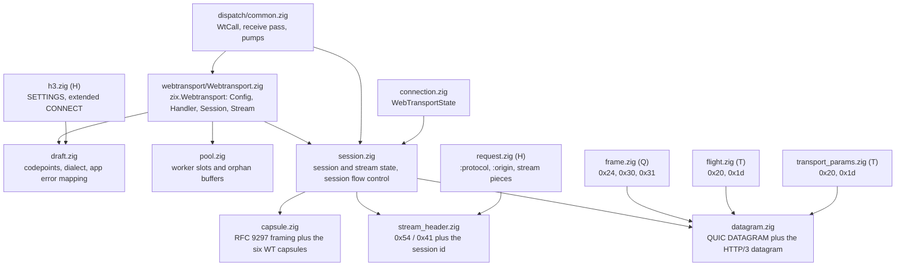
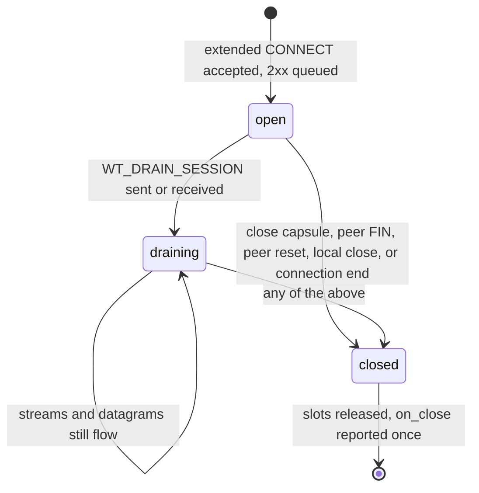

# LLD: zix.Webtransport

Detail implementasi internal untuk WebTransport over HTTP/3. Untuk rasional desain lihat [`docs/hld-webtransport-id.md`](hld-webtransport-id.md).

Setiap format wire yang dibicarakan binding adalah fungsi murni atas byte di file-nya sendiri, dan masing-masing membawa pembuktiannya in-file: codepoint dari draft, layout RFC, dan byte stream yang dibuat khusus. State machine-nya adalah state murni di atas buffer milik pemanggil: tanpa io, tanpa alokasi, tanpa clock. Sisi engine (pass receive, pump, dan vtable driver) berada di layer dispatch HTTP/3, satu-satunya bagian yang menyentuh paket.

---

## Layering

Modul HTTP/3 menandai layer-nya di header `//!`: C (dasar kripto), Q (transport QUIC), T (glue TLS-over-QUIC), P (QPACK), L (loss recovery), H (semantik HTTP/3). File milik binding tidak membawa tag huruf: masing-masing dinamai sesuai format wire yang dimilikinya, dan semuanya berada di atas layer H, karena stream data WebTransport bukan pesan HTTP/3 sama sekali. Di tempat binding menyentuh file yang sudah ada, file itu tetap memakai tag-nya sendiri.



| File | Memiliki | Test |
| :- | :- | :- |
| `webtransport/Webtransport.zig` | namespace publik: `Config`, `Handler`, `Session`, `Stream`, `SessionRequest`, `CloseInfo`, dan helper pool/capacity | 4 |
| `webtransport/draft.zig` | codepoint, `Dialect`, pencocokan token, tabel setting, pemetaan application error | 7 |
| `webtransport/capsule.zig` | framing capsule RFC 9297, keenam capsule yang dipakai binding ini, streaming reader | 10 |
| `webtransport/datagram.zig` | QUIC DATAGRAM frame dan HTTP/3 datagram yang membawa payload WebTransport | 6 |
| `webtransport/stream_header.zig` | byte yang membuka stream data, dan aturan yang membuatnya dapat dipercaya | 5 |
| `webtransport/session.zig` | state session dan stream, send half dan receive half, flow control level session | 14 |
| `webtransport/pool.zig` | session, stream data, send buffer, dan buffer stream pra-session milik worker | 6 |

Itulah 52 unit test in-file milik binding (`grep -c '^test "'` atas ketujuh file); semuanya dinamai `zix webtransport: <claim>`, dan berjalan dengan `zig build unit-test` melalui `std.testing.refAllDecls` dari `src/lib.zig`.

---

## webtransport/Webtransport.zig: permukaan publik

Namespace yang diimpor aplikasi sebagai `zix.Webtransport`. Ia meng-ekspor ulang kosakata dari modul di bawahnya (`Kind` dari `stream_header`, `Dialect` dari `draft`, `State` / `CloseReason` / `CloseInfo` dari `session`) sehingga aplikasi cukup satu import.

- `Config`: `enabled`, `max_sessions_per_connection`, `max_streams_bidi`, `max_streams_uni`, `max_session_data`, `stream_send_bytes`, `pool_sessions`, `pool_streams`, `pool_orphan_streams`, `pool_orphan_bytes`, `max_datagram_frame_size`, `legacy_dialect`, `handler`. Default-nya seperti yang didaftar HLD; `enabled = false` dan `legacy_dialect = true`.
- `Handler`: lima function pointer opsional (`on_session`, `on_stream`, `on_stream_reset`, `on_datagram`, `on_close`).
- `Session` dan `Stream` adalah view, bukan pemilik: `Session` adalah `{ inner: *session.Session, driver: ?*const Driver, request: SessionRequest }` dan `Stream` adalah `{ inner: *session.Stream, driver: ?*const Driver, chunk: []const u8, chunk_offset: u64 }`. Engine membuatnya satu per callback, memasang driver selama callback itu, dan membiarkannya mati bersama frame. `Stream.chunk` adalah chunk yang membuat view itu dibuat dan `chunk_offset` adalah posisinya di stream, sehingga pemanggil yang merakit offset sendiri tidak perlu menghitung byte antar callback.
- `SessionRequest`: `path`, `authority`, `protocol`, `origin`, `dialect`, `datagram_capable`. Diisi hanya untuk `on_session`, dari field CONNECT yang sudah diperluas (engine memperluas nilai yang Huffman-coded sebelum menyerahkan field-nya, jadi aplikasi tidak pernah membaca byte terkompresi).
- Setiap method pada kedua handle adalah penerus tipis: pembacaan state langsung ke `inner`, dan apa pun yang butuh wire (`openBidi`, `openUni`, `sendDatagram`, `close`, `drain`, `reset`, `stop`) lewat `inner.driver`, vtable yang dipasang layer dispatch. Method dengan driver null adalah no-op atau mengembalikan null, dan itulah yang membuat handle yang disimpan melewati callback-nya tidak berbahaya alih-alih memanggil pointer menggantung.
- `poolConfig(config)` memetakan `Config` ke `pool.Config` (`.sessions`, `.streams`, `.stream_buffer_bytes`, `.orphans`, `.orphan_bytes`), dan `capacityError(config)` mengembalikan nama field pertama yang melewati plafon compile-time: `"max_sessions_per_connection"`, `"pool_sessions"`, `"pool_streams"`, atau `"pool_orphan_streams"`, jika tidak null.
- `connection_session_cap = 8` dan `connection_stream_cap = 32` menentukan ukuran tabel pointer per koneksi di `connection.zig`; plafon pool sendiri adalah `pool.maxima` (64 session, 256 stream, 32 orphan).

---

## webtransport/draft.zig: kosakata wire

- `Dialect { draft16, draft07 }`, dan `dialectForToken(protocol)` / `tokenFor(dialect)`: tokennya `webtransport-h3` untuk draft-16 dan `webtransport` untuk draft-07. Token tak dikenal mengembalikan null, yang dijawab pemanggil dengan 501 (RFC 9220 3). Pencocokannya persis, jadi `webtransport-h3x` bukan token WebTransport (pencocokan prefix akan membuat kedua dialect ambigu, dan token deployed adalah prefix dari token baru).
- Tabel setting (`setting`): `enable_connect_protocol` 0x08, `h3_datagram` 0x33, `wt_enabled` 0x2c7cf000, `wt_initial_max_streams_uni` 0x2b64, `wt_initial_max_streams_bidi` 0x2b65, `wt_initial_max_data` 0x2b61, `enable_webtransport` 0x2b603742, `webtransport_max_sessions` 0xc671706a.
- Ruang stream: `uni_stream_type = 0x54` (stream unidirectional dibuka dengan type-nya) dan `wt_stream = 0x41` (stream bidirectional dibuka dengan signal value, yang terdaftar sebagai frame type tetapi bukan frame: ia tidak punya panjang, dan semua setelahnya adalah byte aplikasi).
- Kosakata error (`error_code`):

| Konstanta | Nilai | Arti |
| :- | :- | :- |
| `wt_buffered_stream_rejected` | 0x3994bd84 | stream data tiba tanpa session dan tanpa ruang untuk membuffernya |
| `wt_session_gone` | 0x170d7b68 | stream dibatalkan karena session-nya berakhir (juga yang dipakai peer untuk mereset stream CONNECT sebagai tanda berhenti membaca) |
| `wt_flow_control_error` | 0x045d4487 | aturan flow control session dilanggar |
| `wt_alpn_error` | 0x0817b3dd | negosiasi application protocol gagal |
| `wt_requirements_not_met` | 0x212c0d48 | koneksi kekurangan setting atau transport parameter yang diwajibkan WebTransport |

- Tipe capsule (`capsule`): `close_session` 0x2843, `drain_session` 0x78ae, `max_data` 0x190B4D3D, `data_blocked` 0x190B4D41, `max_streams_bidi` 0x190B4D3F, `max_streams_uni` 0x190B4D40, `streams_blocked_bidi` 0x190B4D43, `streams_blocked_uni` 0x190B4D44.
- `isFlowControlCapsule(type)` bernilai true untuk keenam codepoint flow control dan false untuk close dan drain, karena keduanya adalah sinyal session yang diteruskan intermediary alih-alih dikonsumsinya. `streamKindOf(type)` memetakan `WT_MAX_STREAMS` dan `WT_STREAMS_BLOCKED` ke sebuah `StreamKind` (`bidi` / `uni`) dan sisanya ke null.
- `max_stream_count = 1 << 60`: jumlah yang lebih besar tidak bisa menggambarkan stream id mana pun, jadi capsule yang membawanya adalah error flow control session, bukan nilai untuk dipotong. `max_close_message = 1024`: limit pesan aplikasi (8192 bit).
- Pemetaan application error (4.4): `app_error_first = 0x52e4a40fa8db`, `app_error_last = 0x52e5ac983162`, dan `app_error_gap = 0x1e` (30). `encodeAppError(code) = first + code + code / 30` dan `decodeAppError(http) = (http - first) - (http - first) / 31`. Pembagian itulah yang membuat pemetaannya melewati setiap codepoint grease HTTP/3 (0x1f * N + 0x21) alih-alih jatuh di salah satunya, sehingga application error WebTransport tidak pernah tertukar dengan kode terreservasi. `isReservedErrorCode(code)` adalah `(code - 0x21) % 0x1f == 0` untuk kode pada atau di atas 0x21. Contoh yang dipin in-file: `encodeAppError(0) = 0x52e4a40fa8db`, `encodeAppError(0xffffffff) = 0x52e5ac983162`, dan `decodeAppError(0x0100)`, `decodeAppError(wt_session_gone)` serta apa pun di luar rentang semuanya terbaca null, yaitu kasus "reset tanpa application error code", bukan error.

---

## webtransport/capsule.zig: framing dan keenam capsule

Capsule protocol (RFC 9297 3.2): sebuah type, sebuah length, lalu sejumlah byte value, semuanya QUIC variable-length integer.

| Capsule | Tipe | Value |
| :- | :- | :- |
| `WT_CLOSE_SESSION` (draft-07 `CLOSE_WEBTRANSPORT_SESSION`) | 0x2843 | application error code 4 byte big-endian, lalu pesan aplikasi UTF-8 maksimal 1024 byte |
| `WT_DRAIN_SESSION` | 0x78ae | kosong |
| `WT_MAX_DATA` | 0x190B4D3D | satu varint: limit data session kumulatif |
| `WT_DATA_BLOCKED` | 0x190B4D41 | satu varint: limit tempat pengirim terhenti |
| `WT_MAX_STREAMS` (bidi / uni) | 0x190B4D3F / 0x190B4D40 | satu varint: jumlah stream kumulatif untuk kind itu |
| `WT_STREAMS_BLOCKED` (bidi / uni) | 0x190B4D43 / 0x190B4D44 | satu varint: jumlah tempat pengirim terhenti |

- `parse(buf)` mengembalikan satu `Parsed { capsule, consumed }` dan `error.ZixTruncated` ketika buffer berakhir di tengah capsule, sehingga pemanggil menyimpan byte-nya dan mencoba lagi. `write(out, type, value)` mengembalikan jumlah byte atau null ketika tujuan tidak muat.
- `writeMaxData` / `writeMaxStreams` / `writeStreamsBlocked` / `writeDataBlocked` mengencode capsule flow control, masing-masing satu varint nilai.
- `parseFlowControl(value)` mendekode satu varint yang wajib dibawa capsule flow control dan menolak byte sisa setelahnya sebagai malformed (`ZixTruncated`), karena nilai dengan byte setelah integer-nya bukan satu integer. `parseStreamCount` juga menolak jumlah di atas `max_stream_count`.
- `parseCloseSession(value)` mensyaratkan minimal code 4 byte, menolak pesan di atas 1024 byte, dan menolak pesan yang bukan UTF-8 valid (`ZixMessageError`), yang dijawab pemanggil dengan mereset stream CONNECT memakai H3_MESSAGE_ERROR. `writeCloseSession(out, code, message)` memotong pesan aplikasi yang kepanjangan dengan `clampUtf8`, yang berjalan mundur melewati byte continuation UTF-8 sehingga pemotongan tidak pernah membelah karakter.
- `Reader` streaming adalah bagian yang membuat aliran capsule aman diterima. Capsule tiba di dalam DATA frame HTTP/3, sehingga satu capsule bisa melintang antar datagram dan beberapa bisa berbagi satu; reader memiliki state parsialnya antar pemanggilan:
  - Ia memparse header 16 byte lebih dulu (`header_bytes_max = 2 * 8`, kedua varint pada bentuk terpanjangnya) dan baru memutuskan. Capsule yang dikenal binding diakumulasi ke `value` (`max_known_value = 4 + 1024 = 1028` byte, capsule terbesar yang didefinisikan binding ini); capsule lain dilewati dengan menghitung byte di `discard` dan tidak pernah dibuffer. Itulah yang diminta RFC 9297 3.2 dari penerima yang harus mengabaikan capsule tak dikenal, dan itulah sebabnya peer tidak bisa memaksa engine menahan panjang sembarang.
  - `feed(data, visit, context)` menelusuri byte dan memanggil `visit` untuk setiap capsule dikenal yang lengkap dalam urutan kedatangan, dengan value yang dipinjam dari buffer reader dan hanya valid untuk call itu. Ia mengembalikan `Outcome { delivered, skipped, refused }`: `visit` yang mengembalikan false berarti capsule itu melanggar aturan (pelanggaran flow control, close yang malformed), dan pemanggil membangkitkan error session yang cocok.
  - `reset()` melupakan capsule parsial, yang dipanggil engine saat session berakhir supaya capsule setengah terbaca tidak bocor ke aliran capsule berikutnya yang memakai ulang reader.

---

## webtransport/datagram.zig: QUIC DATAGRAM frame dan HTTP/3 datagram

Dua lapisan framing, dan aritmetika ukuran yang memutuskan apakah sebuah payload bisa dikirim sama sekali.

- QUIC DATAGRAM frame (RFC 9221 4): tipe `0x30` dengan data sampai akhir paket, atau `0x31` dengan panjang eksplisit. `parseFrame(buf)` membaca kedua bentuk dan mengembalikan null untuk frame terpotong atau tipe yang tidak dimodelkan modul ini (sehingga pemanggil yang menelusuri payload tidak pernah mengarang byte). `writeFrame(out, data)` selalu menulis bentuk `0x31`: engine ini menyegel datagram sebagai satu-satunya frame di paketnya, jadi panjangnya berlebih di wire tetapi membuat frame-nya menjelaskan dirinya sendiri.
- Transport parameter yang membatasi kedua arah: `frame_type.transport_param = 0x20` (`max_datagram_frame_size`). `sendable(peer_max_frame_size, data_len)` bernilai false ketika peer tidak mengiklankan apa pun (null), karena endpoint yang tidak mengiklankan parameter itu TIDAK BOLEH dikirimi DATAGRAM frame.
- `encodedSize(data_len) = 1 + varint.encodedLen(data_len) + data_len`: limitnya menghitung seluruh frame, header termasuk.
- HTTP/3 datagram (RFC 9297 2.1): payload QUIC DATAGRAM diawali Quarter Stream ID, dan semua setelahnya adalah HTTP Datagram Payload. WebTransport meletakkan payload-nya di sana tanpa diubah (4.5), jadi session pemilik sebuah datagram adalah `quarter * 4`, yaitu stream id CONNECT.
  - `quarterStreamId(session_id)` bernilai null kecuali id-nya habis dibagi empat, satu-satunya bentuk yang boleh dimiliki session id (4.1). `sessionIdFromQuarter(quarter)` bernilai null di atas `max_quarter_stream_id = (1 << 60) - 1`, yang dijawab penerima dengan H3_DATAGRAM_ERROR.
  - `parseHttp3(buf)` mengembalikan `Datagram { session_id, payload }`, dengan `ZixTruncated` untuk payload yang berakhir di tengah varint quarter dan `ZixDatagramError` untuk quarter yang tidak bisa ditindak. `writeHttp3(out, session_id, payload)` menulis quarter lalu payload.
- `maxPayloadBytes(peer_max_frame_size, session_id)` adalah anggaran yang harus dipenuhi payload aplikasi, dan itu aritmetika, bukan konstanta:

```text
frame  = 1 (type) + varint_len(quarter ++ payload) + quarter_len + payload_len
limit >= frame   ->   payload_len <= limit - 1 - varint_len(data) - quarter_len
```

  Ukuran varint panjang bergantung pada field data yang dijelaskannya, jadi keempat kelas varint QUIC (1, 2, 4, 8) dicoba berurutan dan kelas yang menjelaskan field data hasil aritmetikanya sendiri adalah jawabannya. Nol berarti tidak ada yang muat (peer yang limitnya di bawah overhead framing), dan pemanggil menolak pengiriman alih-alih memecah: DATAGRAM frame tidak bisa difragmentasi (RFC 9221 5). Contoh: peer yang mengiklankan 1200 dengan session id 0 (quarter 0, satu byte) menyisakan `1200 - 1 - 2 - 1 = 1196` byte payload aplikasi, dan frame yang dihasilkan persis `1 + 2 + 1197 = 1200` byte.

---

## webtransport/stream_header.zig: apa yang membuka stream data

| Stream | Byte wire | Catatan |
| :- | :- | :- |
| unidirectional, session 0 | `40 54 00` | type 0x54, lalu session id |
| unidirectional, session 4 | `40 54 04` | session 4 adalah quarter 1 untuk jalur datagram |
| bidirectional, session 0 | `40 41 00` | signal value 0x41, lalu session id |
| bidirectional, session 64 | `40 41 40 40` | kedua nilai memakai bentuk varint 2 byte |

- Nilai type-nya di atas 63, jadi masing-masing selalu varint dua byte (RFC 9000 16), itulah sebabnya `headerLen(kind, session_id) = varint.encodedLen(openValue(kind)) + varint.encodedLen(session_id)` minimal tiga byte.
- `parse(kind, buf)` membaca header untuk ruang stream yang sudah ditentukan pemanggil dari dua bit rendah stream id, dan membangkitkan `ZixTruncated` selama header masih tiba, `ZixNotWebtransport` ketika nilai pertamanya bukan header kind itu (stream milik pengguna lain ruang stream QUIC), dan `ZixIdError` ketika session id bukan stream id bidirectional yang diinisiasi client (H3_ID_ERROR, 4.1).
- `isValidSessionId(id)` adalah `id % 4 == 0 and id <= max_session_id`, dengan `max_session_id = (1 << 62) - 4`: stream id QUIC legal terbesar adalah 2^62 - 1, dan yang terbesar habis dibagi empat adalah yang boleh menjadi session id. `write` menolak id yang gagal tes yang sama, sehingga header yang ditulis engine selalu bisa diparse kembali.
- `reliableResetSize(kind, session_id) = headerLen(kind, session_id)`: offset yang masih wajib dikirim oleh reset stream ini, supaya penerima tetap bisa tahu stream itu milik session mana (4.4). `RESET_STREAM_AT` dengan reliable size lebih kecil akan membuang session id bersama byte sisanya.
- `idMatchesKind(kind, id)` hanya memeriksa ruang stream (`id & 0x02`), karena stream bidirectional WebTransport milik client adalah stream request client yang dikonversi client dengan signal 0x41: id saja tidak bisa memisahkan stream data dari stream request, dan itulah yang membuat pembacaan header wajib. Server membuka id bidirectional 1 mod 4 dan id unidirectional 3 mod 4, diambil dari `WebTransportState.takeStreamId`.

---

## webtransport/session.zig: state machine

### Send half (`SendSide`)

| Field | Arti |
| :- | :- |
| `open` | aplikasi masih boleh menulis |
| `fin` | aplikasi selesai menulis: FIN setelah semua yang diantre keluar |
| `header_sent` | header stream sudah keluar (header adalah offset 0 pada stream, jadi ia bagian dari akuntansi byte, bukan antrean terpisah) |
| `acked` | offset stream di bawahnya semua byte sudah diakui; buffer menyimpan byte dari sini |
| `queued` | byte di buffer dari `acked` dan seterusnya yang belum diakui peer (sudah dikirim atau menunggu ruang) |
| `sent` | offset tertinggi yang diserahkan ke packet pump; loss memundurkannya, itulah sebabnya ia bukan `high_water` |
| `high_water` | offset tertinggi yang pernah dicapai: offset stream distinct yang ditagih ke limit data session (5.4) |
| `limit` | limit per-stream milik peer (QUIC, dinaikkan MAX_STREAM_DATA) |
| `reset` | reset reliabel yang tertunda, atau null |
| `outstanding` / `outstanding_len` | rentang terkirim yang masih menunggu pengakuan, dalam urutan stream, sehingga entri terendah selalu byte tertua yang belum dikonfirmasi |

- `max_outstanding_ranges = 32`: satu rentang adalah byte stream seukuran satu paket, dan `noteSent` menggabungkan rentang yang bersambung dengan sebelumnya, sehingga stream yang mengalir stabil menunggu pada satu entri berapa pun paket yang dipakainya. Daftar yang penuh menghentikan pump (`sendable` mengembalikan 0 selama `rangeRoom` false), yang menjaga batasnya sebagai fakta alih-alih harapan: stream yang pengakuannya tidak pernah tiba berhenti mengisi buffer-nya alih-alih kehilangan jejak apa yang sudah dimiliki peer.
- `max_stream_buffer_bytes = 16 * 1024`: send buffer terbesar yang boleh dipakai slot stream. Stream hanya membebaskan buffer-nya sampai rentang terendah yang masih luar biasa, jadi buffer yang lebih besar akan menahan byte yang tidak akan pernah bisa dibuktikan diakui endpoint.
- `noteAcked(offset, len)` membuang setiap rentang yang sepenuhnya dicakup pengakuan (rentang yang hanya sebagian dicakup tetap luar biasa, yang menunda pembebasan alih-alih membebaskan byte yang belum dikonfirmasi) dan mengembalikan berapa byte yang bebas di depan. `advanceAcked` menghitung `acked` baru sebagai nilai terendah antara rentang terendah yang luar biasa dan `acked + queued`, sehingga pembebasannya tidak pernah lebih besar dari yang benar-benar diantre.
- `write(bytes)` menyalin ke buffer linear tepat setelah daerah yang diantre (pengakuan memampatkan, jadi penulisan tidak pernah wrap), mengembalikan jumlah yang diterima, dan jumlah pendek adalah kontrak back pressure. `openWithHeader` mengantre header sebagai byte pertama stream dan menyet `open`.
- `sendable()` membatasi window dengan keempatnya sekaligus: limit per-stream peer, ruang rentang luar biasa, dan akhir daerah yang diantre. `finPending()` true hanya ketika aplikasi selesai dan setiap byte yang diantre sudah diserahkan ke pump. `onSent(count)` mencatat rentangnya dan memajukan `sent` serta `high_water`. `onAcked(offset, len)` mencatat pengakuan dan memampatkan prefiks yang dikonfirmasi keluar dari buffer, yang membuat stream berumur panjang memakai ulang satu buffer tetap. `onLost(offset)` memundurkan `sent` ke offset itu supaya pump mengirim ulang, dan sengaja membiarkan rentangnya luar biasa: loss bukan pengakuan.
- `resetSend(code)` menyet `reliable_size = max(headerLen(kind, session_id), acked + queued)`, sehingga reset selalu mencakup minimal header dan maksimal semua yang diantre aplikasi. `onStreamLimit(limit)` hanya menaikkan limit per-stream peer.
- `replenish(window)` mengembalikan limit baru untuk diiklankan ketika receive window sudah lebih dari separuh terpakai, atau null. Stream data WebTransport tidak punya slot reassembly request, jadi tidak ada hal lain di engine yang mengisi ulang kreditnya, dan tanpa ini stream akan macet pada jatah per-stream sekali-pakai saat handshake (`flight.initial_max_stream_data`, 256 KiB) dengan client menunggu kredit.

### Receive half (`RecvSide`)

`fin`, `received` (offset plus panjang tertinggi yang terlihat), `limit` (yang diiklankan endpoint ini), `reset_code` (HTTP/3 error code dari reset peer), `final_size` (Final Size yang dibawa reset, yang ditagih ke limit data session), dan `stopped` (endpoint ini mengirim STOP_SENDING). `onReceived(offset, len, fin)` dan `onResetReceived(code, final_size)` adalah satu-satunya penulis; reset juga menyet `fin`, karena stream yang direset sudah selesai dalam kedua arti.

### Aturan selesainya sebuah stream

| Predikat | True ketika |
| :- | :- |
| `totalBytes()` | ada reset tertunda: `max(reliable_size, acked)`; jika tidak `acked + queued` |
| `sendFinished()` | reset sudah terkirim dan tidak ada yang belum diakui, atau FIN sudah keluar tanpa yang diantre maupun yang luar biasa |
| `recvFinished()` | peer meresetnya, atau peer mengirim FIN dan semua sampai `final_size` sudah tiba |
| `finished()` | `sendFinished()` dan (`recvFinished()` atau receive half-nya dihentikan) |

Hanya slot stream yang `finished()` kembali ke pool, jadi stream yang masih berutang FIN atau reset ke peer menyimpan buffer-nya sampai peer mengakuinya.

### Flow control level session (`FlowControl`)

Limitnya hop-by-hop: endpoint ini menegakkan limit yang diiklankannya atas apa yang boleh dikirim peer, dan menghormati limit peer atas apa yang boleh dikirimnya (5.6.1).

| Kelompok | Field |
| :- | :- |
| niat | `enabled`, `local_declared`, `peer_declared` (flow control hanya hidup ketika kedua sisi mendeklarasikan initial limit bukan nol, 5.1) |
| jatah endpoint ini untuk peer | `local_max_data`, `local_max_streams_bidi`, `local_max_streams_uni` |
| jatah peer untuk endpoint ini | `peer_max_data`, `peer_max_streams_bidi`, `peer_max_streams_uni` |
| yang dikonsumsi | `data_received`, `streams_bidi_received`, `streams_uni_received` (terhadap limit lokal) |
| yang dikirim | `data_sent`, `streams_bidi_opened`, `streams_uni_opened` (terhadap limit peer) |
| nilai terakhir di wire | `advertised_max_data`, `advertised_streams_bidi`, `advertised_streams_uni` (supaya capsule hanya keluar saat limitnya tumbuh), dan `received_max_data`, `received_streams_bidi`, `received_streams_uni` untuk aturan monotonik |

- `declareLocal(max_data, streams_bidi, streams_uni)` mengambil nilai SETTINGS endpoint ini, `declarePeer` mengambil milik client, dan keduanya menghitung ulang `enabled`. Setiap method penegakan kembali lebih awal ketika `enabled` false, dan itulah cara session draft-07 (atau session yang salah satu sisinya tidak mendeklarasikan apa pun) tidak punya limit session sama sekali.
- `onSessionData(len)` menagih Stream Body byte dan membangkitkan `ZixFlowControlError` di atas `local_max_data`. `onResetFinalSize(final_size)` menagih final size stream yang direset, karena pengirim yang menagih byte yang tidak pernah dilihat penerima tetap menghabiskan jatahnya. `onStreamOpened(kind)` menagih satu stream masuk dan membangkitkan error yang sama di atas jumlah lokal yang cocok.
- `canOpen(kind)` dan `canSendData(len)` adalah pemeriksaan sisi kirim terhadap limit peer; `onOpenedStream(kind)` dan `onDataSent(len)` mencatat pemakaiannya.
- `onMaxData(value)` dan `onMaxStreams(kind, value)` menerapkan capsule peer dan mensyaratkan nilai yang naik secara ketat (5.6.2 / 5.6.4); nilai pada atau di bawah nilai terakhir, atau jumlah stream di atas `max_stream_count`, adalah `ZixFlowControlError`.
- `dueMaxData(window)` dan `dueMaxStreams(kind, window)` adalah sisi jawabannya: keduanya memperpanjang limit lokal ke `consumed + window`, mengingat nilai yang diiklankan supaya limit yang sama tidak pernah dikirim dua kali, dan mengembalikan nilai baru untuk diencode pemanggil menjadi capsule, atau null ketika tidak ada yang perlu dinaikkan.

### Vtable driver (`Driver`)

State machine tidak tahu apa pun tentang paket. Ketika aplikasi meminta sesuatu yang butuh wire, panggilannya melewati vtable ini:

| Hook | Yang dilakukan engine |
| :- | :- |
| `open_stream(context, session, kind)` | mengambil slot pool, sebuah id, tempat di kedua tabel, dan mengantre header; null ketika tidak ada slot atau tidak ada ruang di tabel |
| `send_datagram(context, session, payload)` | memframe dan mengantre satu datagram; false ketika tidak bisa dikirim sekarang |
| `close_session(context, session)` | mengantre capsule close dan menyelesaikan stream CONNECT |
| `drain_session(context, session)` | mengantre capsule drain |
| `stop_receiving(context, stream, code)` | mengantre STOP_SENDING dengan application code terpetakan |
| `reset_stream(context, stream)` | mengantre reset (RESET_STREAM_AT ketika peer mengiklankannya) dan menandainya terkirim |

`context` adalah state per-call milik layer dispatch, jadi session tidak pernah menyimpan jalur paket yang basi. Layer ini memasang driver hanya selama callback yang dilayaninya dan membersihkannya setelahnya.

### `Session`

`Session` adalah seluruh state sebuah session: `id`, `dialect`, `state`, `flow`, `capsules` (reader-nya), `connect` (stream CONNECT sebagai sebuah `Stream`, sehingga pump, akuntansi flow control, dan loss recovery memperlakukan capsule yang hilang seperti byte hilang lainnya), `connect_buf` (2048 byte, `connect_out_bytes`: head 2xx, capsule close 4 + 1024 byte, capsule drain, dan ruang untuk capsule flow control di antaranya), `streams` (list intrusive, terbaru dulu, sehingga pool tidak butuh array per session), `close` dan `close_message` (penyimpanan 1024 byte yang dipinjam pesan yang dilaporkan), `driver`, serta counter `rejected_streams` / `dropped_datagrams`.

`openConnect(head)` mengantre head respons 2xx, menyiapkan send half stream CONNECT dengan limit per-stream tak terbatas (byte-nya adalah capsule, bukan data aplikasi), dan memindahkan session ke `open`. FIN sengaja tidak dikirim di sana: menyelesaikan stream CONNECT adalah yang mengakhiri session (6).

#### State machine session



| Peristiwa | Jalur | Hasil |
| :- | :- | :- |
| FIN dari peer pada stream CONNECT | `wtIncomingConnectStream` | `close_` dengan `reason = .peer_fin`, slot stream direset dengan `WT_SESSION_GONE` |
| reset stream CONNECT oleh peer | `wtIncomingReset` (diperiksa sebelum pencarian stream data, karena session id *adalah* stream id itu) | `reason = .peer_reset` |
| capsule `WT_CLOSE_SESSION` | visitor reader | `code` dan `message` dari capsule, `reason = .peer_close` |
| aplikasi memanggil `close(code, message)` | `Session.close` lewat driver | capsule diantre, stream CONNECT diselesaikan, `reason = .local_close` |
| pelanggaran flow control session | `wtFailSession` | stream CONNECT direset dengan `WT_FLOW_CONTROL_ERROR`, `reason = .flow_control_error` |
| capsule close malformed | visitor reader | stream CONNECT direset dengan H3_MESSAGE_ERROR, `reason = .protocol_error` |
| idle timeout atau close state koneksi | `wtReleaseConnection` dari maintenance sweep | `reason = .connection_closed`, tanpa reset per-stream (koneksinya yang berakhir) |

`close_` adalah satu-satunya penulis `state = .closed`: ia menyalin pesan ke buffer milik session (sehingga `CloseInfo.message` tetap valid selama slotnya hidup) dan mencatat code serta reason. `isOpen()` adalah `state != .closed`, jadi session draining tetap menerima stream dan datagram. `streamsFinished()` melaporkan apakah setiap stream session sudah selesai dan send half stream CONNECT sudah beres, dan itulah yang dipakai engine sebelum mendaur ulang slot tanpa kehilangan byte yang bisa diretransmisi.

---

## webtransport/pool.zig: slot milik worker

| Item | Nilai |
| :- | :- |
| `maxima.sessions` / `.streams` / `.orphans` | 64 / 256 / 32 (plafon compile-time) |
| Default `Config` | `sessions` 16, `streams` 64, `stream_buffer_bytes` 16 KiB, `orphans` 8, `orphan_bytes` 1024 |
| `min_stream_buffer_bytes` / `min_orphan_buffer_bytes` | 256 / 64: nilai konfigurasi di bawah lantai dinaikkan, sehingga slot selalu punya ruang untuk header stream (tiga byte) dengan sisa ruang untuk menulis |
| Bentuk alokasi | satu alokasi untuk slot session, satu untuk slot stream, satu blok terpisah untuk semua send buffer stream, satu untuk slot orphan, satu untuk buffer orphan |

- `init(allocator, config)` memotong setiap jumlah terhadap `maxima`, menaikkan kedua ukuran buffer terhadap lantainya, lalu mengalokasi. Pool kosong (semua jumlah nol) legal: setiap akuisisi kemudian mengembalikan null, dan itulah yang didapat deployment yang menyimpan pool tetapi tidak ingin session apa pun.
- `acquireSession()` / `acquireStream()` menelusuri flag okupansi dan mengembalikan slot yang di-nolkan (slot stream mendapat send buffer-nya dari blok terpisah), atau null ketika semua slot hidup: pool menolak alih-alih tumbuh, dan pemanggil yang memutuskan arti pool penuh.
- `releaseSession(target)` / `releaseStream(target)` mengosongkan slot. Pemanggil harus sudah melepaskan slot itu dari tabel, karena buffer slot yang dilepas langsung bisa dipakai ulang.
- Tabel orphan (4.6) menahan stream data yang tiba sebelum CONNECT yang membentuk session-nya. `bufferOrphan(session_id, stream_id, kind, data, fin)` menambahkan ke slot yang ada untuk stream itu atau mengambil slot bebas, dan mengembalikan null ketika tidak ada slot bebas atau byte-nya tidak muat buffer slot (slot yang sudah diambil langsung dikembalikan, sehingga penolakan tidak pernah menghabiskan slot). Pemanggil menjawab null dengan mereset stream memakai `WT_BUFFERED_STREAM_REJECTED`.
- `orphanFor(stream_id)` menemukan slot sebuah stream, `drainOrphans(session_id, visit, context)` menyerahkan setiap orphan yang mengklaim session itu ke visitor dan melepaskannya (dipakai saat session dibentuk, untuk memutar ulang apa yang dibuka client lebih awal), dan `dropOrphans(session_id)` membuangnya serta mengembalikan berapa yang dibuang (dipakai saat session berakhir atau koneksinya hilang).
- `sessionCount()` dan `streamCount()` adalah diagnostik yang dibaca sweep dan jalur CONNECT.

---

## Hook engine

### frame.zig (layer Q)

- Dua frame diparse dan dimodelkan: `datagram` (0x30 / 0x31, RFC 9221 4) dan `reset_stream_at` (0x24, reliable stream reset 4: stream id, error code, final size, reliable size).
- `framePermittedIn` menempatkan keduanya hanya di `.zero_rtt` dan `.one_rtt`, pola bit `__01` yang diberikan kedua RFC, sehingga DATAGRAM atau RESET_STREAM_AT di paket Initial atau Handshake bukan frame yang diterima engine ini.

### transport_params.zig (layer T)

- `max_datagram_frame_size` milik client (0x20) dibaca ke `max_datagram_frame_size` (default 0, absen dan nol eksplisit berarti sama: tidak ada DATAGRAM frame), dan keberadaan `reset_stream_at` (0x1d, parameter kosong) ke `reset_stream_at`. Keduanya yang membatasi kiriman server ke arah sebaliknya.
- Parameter lain tetap dilewati, sehingga client yang tidak mengiklankan apa pun terkait WebTransport tetap bisa diparse dan hanya tidak bisa membuka session.

### flight.zig (layer T)

- `TransportExtensions { max_datagram_frame_size = 0, reset_stream_at = false }` dengan kedua parameter id (`max_datagram_frame_size_id = 0x20`, `reset_stream_at_id = 0x1d`), diencode ke ekstensi `quic_transport_parameters` milik server di samping parameter yang sudah ada. Endpoint yang tidak mengiklankan `max_datagram_frame_size` TIDAK BOLEH dikirimi DATAGRAM frame, dan yang tidak mengiklankan `reset_stream_at` TIDAK BOLEH dikirimi RESET_STREAM_AT, jadi keduanya prasyarat, bukan preferensi.
- Layer dispatch mengisi keduanya dari konfigurasi ketika fiturnya hidup (`max_datagram_frame_size` dari config, `reset_stream_at` selalu true), dan membiarkan struct-nya kosong ketika fiturnya mati, sehingga handshake HTTP/3 biasa identik byte per byte dengan sebelum fitur ini ada.

### h3.zig (layer H)

- `ServerSettings` dan `ClientSettings` membawa permukaan WebTransport di atas framing yang sudah dimiliki engine: aturan extended CONNECT yang menumpang `:protocol` (RFC 9220), setting yang ditulis server dan dibaca kembali dari client, dan stream type mana saja yang sudah menjadi milik HTTP/3.
- `writeServerControlStream(out, settings)` menulis control stream type 0x00, SETTINGS frame type 0x04, panjang payload, lalu payload dengan urutan tetap: `enable_connect_protocol` 0x08, `h3_datagram` 0x33, `SETTINGS_WT_ENABLED` 0x2c7cf000, `SETTINGS_WT_INITIAL_MAX_STREAMS_UNI` 0x2b64, `..._BIDI` 0x2b65, `SETTINGS_WT_INITIAL_MAX_DATA` 0x2b61, lalu pasangan deployed 0x2b603742 dan 0xc671706a. Hanya setting yang hidup yang ditulis, dan masing-masing membawa nilai yang dibaca peer sebagai default alih-alih entri itu, sehingga flag yang dihilangkan dan limit nol mengatakan hal yang sama dengan byte lebih sedikit; setting yang sama karena itu selalu menghasilkan byte yang sama. Frame terlebarnya adalah `max_server_settings * widest_setting_entry` = 8 * 16 = 128 byte payload, dan encoder memutuskan seluruh panjangnya sebelum menulis, sehingga pemanggil tidak pernah melihat separuh control stream. Contoh, semua setting hidup dengan 100 / 100 stream dan 1024 byte: 38 byte, `00 04 23 08 01 33 01 ac7cf000 01 6b64 4064 6b65 4064 6b61 4400 ab603742 01 c0000000c671706a 01`.
- `parseClientSettings(payload)` mereduksi SETTINGS client ke apa yang dibaca binding dan menyet `malformed` pada pelanggaran MUST: identifier di rentang terreservasi 0x02..0x05, identifier yang berulang, nilai di atas 1 untuk `SETTINGS_H3_DATAGRAM` (RFC 9297 2.1.1), nilai di atas 1 untuk `SETTINGS_WT_ENABLED` (draft-16 3.1), atau payload yang berakhir di tengah varint. Payload malformed adalah H3_SETTINGS_ERROR, error koneksi, jadi pemanggil mengakhiri koneksi alih-alih bertindak atas nilai di sisinya; nilai yang sudah diparse sebelum titik potong tetap ada karena jalur logging dan koneksi yang dilanjutkan sama-sama membutuhkannya.
- Validasi extended CONNECT memakai ulang aturan pesan yang sudah ada: CONNECT yang membawa `:protocol` legal, tokennya harus tidak kosong, dan field yang sudah diwajibkan pesan itu tetap berlaku.

### request.zig (layer H)

- `DecodedRequest` mendapat `protocol` / `protocol_huffman` dan `origin` / `origin_huffman`. `:protocol` adalah sinyal extended CONNECT dan token yang menyebut protokol yang dijalankan di dalamnya; `origin` adalah origin RFC 6454 yang diserahkan binding WebTransport ke `on_session`. Keduanya menyimpan flag Huffman-nya, karena decode membiarkan nilai yang Huffman-coded tetap terkompresi dan pemanggil yang memperluasnya.
- `StreamPiece` dan `UniPiece` (dari `parseStreamPieces` / `parseUniPieces`) adalah cara binding melihat apa yang dikirim client: setiap STREAM frame bidirectional client dengan offset, bit FIN, byte mentahnya, dan request yang didekode ketika byte-nya memulai stream; serta setiap stream unidirectional client dengan cara yang sama. `max_requests_per_packet = 96` membatasi kedua penelusuran, dan array claim yang diisi binding diukur dari situ.
- `skipFrame` mencakup frame yang dilewati binding ini (0x24, 0x30, 0x31 di antaranya), sehingga penelusuran payload yang bukan milik binding tetap berjalan melewati DATAGRAM atau RESET_STREAM_AT.

### config.zig

`webtransport: Webtransport.Config = .{}` pada `Http3ServerConfig`, didokumentasikan sebagai mati secara default dan gratis ketika mati.

### connection.zig: `WebTransportState`

Field `wt` pada `Connection` adalah state WebTransport per koneksi, inline dan berukuran tetap:

| Field | Arti |
| :- | :- |
| `client_settings` / `settings_received` | SETTINGS client yang sudah didekode, dan apakah sudah tiba (CONNECT WebTransport tidak diproses sebelum itu, 7.1) |
| `peer_datagram_frame_size` / `peer_reset_stream_at` | transport parameter client yang membatasi kiriman server (RFC 9221 3, reliable stream reset 3) |
| `pool` | worker pool asal session-sessionnya, sehingga jalur yang hanya memegang koneksi (pump yang memanen session tertutup) bisa mengembalikan slot. Null sampai session pertama, tidak pernah dibersihkan: pool hidup lebih lama dari setiap koneksi di worker itu |
| `sessions` (`connection_session_cap` = 8 pointer) | session hidup, dikunci oleh stream id CONNECT-nya |
| `streams` (`connection_stream_cap` = 32 pointer) | stream data hidup di seluruh session koneksi ini |
| `next_bidi_stream` / `next_uni_stream` | stream id berikutnya yang diinisiasi server (1 mod 4 dan 3 mod 4), diambil hanya ketika aplikasi membuka stream |
| `dropped_datagrams` / `rejected_streams` pada session | diagnostik untuk datagram yang tiba untuk session yang tidak dimiliki koneksi ini, dan stream yang ditolak karena tidak ada slot |
| `uni_types` / `uni_partial` (`wt_uni_stream_types_cap` = 8 masing-masing) | type setiap stream unidirectional client yang diklasifikasi koneksi ini, dan byte pertama stream yang varint type-nya masih tiba |
| `control` / `control_len` (`wt_control_stream_bytes` = 256) | byte control stream client sejauh ini, diakumulasi sampai SETTINGS frame yang lengkap bisa didekode |
| `pending_connects` / `pending_len` (`wt_pending_connects_cap` = 4) | stream id CONNECT yang ditahan selama SETTINGS client masih di jalan, supaya session tidak hilang karena paket yang sekadar terlambat |

- `findSession` / `attachSession` / `detachSession` / `sessionCount`, dan `findStream` / `attachStream` / `detachStream` adalah penelusuran linear atas kedua tabel pointer: plafonnya 8 dan 32, jadi penelusurannya hanya beberapa perbandingan dan open-addressing table akan lebih mahal daripada yang dihematnya.
- `takeStreamId(kind)` memajukan counter per kind, dan itulah cara stream yang dibuka server mendapat id dengan bentuk yang benar tanpa tabel stream sendiri.
- `uniStreamType(stream_id, offset, data)` mengklasifikasi stream unidirectional client sekali, di offset 0, dan mengingat jawabannya; varint type yang melintang dua frame ditahan di `uni_partial` sampai lengkap, dan itulah satu-satunya alasan tabel itu ada.
- `feedControlStream(data)` mengakumulasi control stream dan mendekode SETTINGS frame begitu lengkap, dengan syarat SETTINGS lebih dulu (RFC 9114 6.2.1): frame lain berarti endpoint ini tidak pernah tahu apa yang didukung client, yang kemudian dibaca pemeriksaan WebTransport sebagai "tidak didukung".
- Jalur pengakuan dan loss menjangkau binding lewat pencarian yang sama: `onAckFrame` menyerahkan rentang yang dikonfirmasi ke `wt.findStream(entry.stream_id).onAcked(offset, length)` (membebaskan prefiks send buffer yang dikonfirmasi, sehingga aplikasi bisa menulis lagi) dan menghitung entri `datagram` sebagai in flight tanpa stream untuk diberi tahu, dan jalur loss memanggil `onLost(offset)` untuk memundurkan alih-alih meretransmisi datagram. `client_max_stream_data_bidi_remote` dan `client_max_stream_data_uni` adalah yang membatasi stream yang dibuka server sampai client menaikkannya dengan MAX_STREAM_DATA.

### dispatch/common.zig: jalur serve

Semua di file ini di antara penanda `WebTransport over HTTP/3` adalah sisi engine binding, dan berjalan di thread worker yang sama dengan koneksi QUIC-nya.

| Bagian | Tugas |
| :- | :- |
| `openWebtransportPool(config)` | membuka pool worker ketika `enabled`, dan pada kegagalan alokasi mencatat satu baris error lalu membiarkan fiturnya mati (server HTTP/3 tanpa WebTransport tetap melayani setiap request) |
| `webtransportSettings(config)` / `webtransportTransportExtensions(config)` | setting dan transport parameter yang diiklankan handshake dan control stream, semuanya kosong ketika fiturnya mati |
| `buildConnectionPrologue` | menulis control stream server ke buffer 160 byte (`wt_settings_bytes`), dengan fallback ke SETTINGS kosong yang dikirim engine sebelum fitur ini ada ketika himpunan terlebar tidak muat |
| `WtClaims` | stream id yang diklaim satu payload, supaya loop request HTTP membiarkannya: stream data WebTransport adalah stream request client dengan arti berbeda, dan stream CONNECT sebuah session bukan request untuk dijawab |
| `WtCall` | context per-call: koneksi, pool, request pool milik worker (CONNECT yang tiba sebelum SETTINGS client menunggu di sana), send batch, fd, alamat peer, config, waktu monotonik datagram itu, dan `Driver` yang `context`-nya menunjuk balik ke dirinya. Ia hidup di frame call itu (satu per datagram, satu datagram pada satu waktu per worker), sehingga dua worker tidak pernah berbagi context pointer dan session tidak pernah menyimpan jalur paket yang basi |
| `WtCall.openStream` / `sendDatagram` / `closeSession` / `drainSession` / `stopReceiving` / `resetStream` | implementasi driver. `openStream` mengambil slot pool, sebuah id, dan tempat di kedua tabel, lalu mengantre header; `sendDatagram` memeriksa ukuran frame peer dan anggaran payload, memframe kedua lapisan, memeriksa congestion window, dan mengantre dengan tag `datagram`; `closeSession` mengantre capsule close dan menyelesaikan stream CONNECT; `stopReceiving` menyegel paket STOP_SENDING; `resetStream` mengantre reset dan menandainya terkirim |
| `sendControlPacket` | menyegel satu frame kontrol kecil (reset, STOP_SENDING, MAX_STREAM_DATA) ke paketnya sendiri. Frame-nya tidak diretransmisi di sini: reset diulang oleh maintenance sweep selama stream-nya masih dilacak, dan STOP_SENDING menumpang paket stream berikutnya, best-effort yang sama yang diberikan engine ke frame kontrol lainnya |
| `webtransportIncoming(...)` | pass receive untuk satu payload yang didekripsi, dengan urutan tetap: `wtIncomingFrames`, lalu stream unidirectional client, lalu stream bidirectional client |
| `wtIncomingFrames` | frame non-STREAM yang diperhatikan binding: DATAGRAM (0x30 / 0x31), RESET_STREAM (0x04), RESET_STREAM_AT (0x24), STOP_SENDING (0x05), sisanya diserahkan ke `request.skipFrame` |
| `wtIncomingDatagram` | memparse HTTP/3 datagram, menemukan session-nya, dan menyerahkan payload ke `on_datagram`. Datagram untuk session yang tidak dimiliki koneksi ini dihitung di `dropped_datagrams` dan dibuang (RFC 9297 2.1 mengizinkannya, dan 4.6 mensyaratkan batas alih-alih buffering tanpa batas) |
| `wtIncomingReset` | reset stream CONNECT sebuah session mengakhiri session itu (`peer_reset`); reset stream data menagih final size, menandai receive half, memanggil `on_stream_reset`, dan memensiunkan stream-nya |
| `wtIncomingStopSending` | peer tidak akan membaca stream ini, jadi send half-nya direset dengan code yang sama dan tulisan aplikasi berhenti diterima |
| `queueStreamReset` | membangun satu frame reset: `RESET_STREAM_AT` ketika peer mengiklankan `reset_stream_at` (stream id, error code, final size, reliable size, sehingga header bertahan dari pembuangan), dan `RESET_STREAM` biasa (stream id, error code, `totalBytes()`) jika tidak |
| `wtIncomingUniStream` / `wtIncomingControlStream` / `wtIncomingWtUniStream` | stream unidirectional client: SETTINGS pada control stream (yang juga menjadi saat CONNECT yang ditahan diputar ulang), dan stream data 0x54 (header-nya diparse, session-nya dicari, byte-nya dikirim) |
| `wtIncomingBidiStream` | satu frame stream bidirectional client, dalam tiga kasus: stream CONNECT sebuah session hidup membawa capsule, stream data hidup adalah lanjutan payload, dan stream baru adalah session CONNECT (extended CONNECT) atau stream data 0x41. Stream yang dibuka dengan 0x41 tetapi menyebut id yang bukan stream id bidirectional yang diinisiasi client adalah H3_ID_ERROR (4.1) |
| `wtIsWebtransportConnect` / `wtIncomingConnect` | jalur CONNECT: token memilih dialect (dan token draft-07 ditolak ketika `legacy_dialect` mati), pemeriksaan SETTINGS (CONNECT yang tiba lebih dulu dimasukkan ke request pool milik worker dan dicatat di `pending_connects`, lalu diputar ulang; hanya yang tidak bisa ditahan yang direset dengan H3_REQUEST_REJECTED), pemeriksaan datagram, plafon session (429), pool (503), deklarasi flow control dari setting kedua sisi, panggilan `on_session` (null menerima, sebuah status menolak), head 2xx pada stream CONNECT, dan pemutaran ulang stream pra-session yang dibuffer |
| `wtProcessPendingConnects` / `wtProcessPendingConnect` | pemutaran ulang CONNECT yang ditahan, dijalankan saat SETTINGS client tiba: setiap stream id yang ditahan dibaca kembali dari request pool, didekode lagi, dan dilewatkan ke `wtIncomingConnect`, dengan slot pool-nya dilepas setelahnya |
| `wtRejectConnect` / `sendSingleResponse` / `wtResetRequestStream` | ketiga bentuk penolakan: status HTTP biasa pada stream request dengan FIN, atau reset stream request dengan H3_REQUEST_REJECTED / H3_MESSAGE_ERROR untuk request yang tidak diproses |
| `wtDeliverData` / `wtDeliverExisting` | pengiriman byte payload stream: cari atau buat stream-nya, tagih limit data session, tandai receive half, panggil `on_stream`, isi ulang kredit QUIC stream dengan MAX_STREAM_DATA ketika window-nya lebih dari separuh terpakai, dan pensiunkan stream saat kedua half selesai |
| `wtIncomingConnectStream` / `wtIncomingCapsules` / `WtCapsuleVisit` | frame H3 pada stream CONNECT: DATA frame membawa capsule, dan visitor menerapkannya (close mengakhiri session, drain menandainya draining, `WT_MAX_DATA` dan `WT_MAX_STREAMS` memperpanjang jatah peer di bawah aturan monotonik, dan kedua capsule blocked adalah laporan yang dijawab endpoint ini dengan memperpanjang limitnya sendiri). Capsule yang ditolak menggagalkan session dengan `WT_FLOW_CONTROL_ERROR`, dan capsule close yang malformed dengan H3_MESSAGE_ERROR |
| `wtBufferOrphan` / `wtReplayOrphans` / `wtReplayOrphan` | buffering pra-session: tahan byte pertama stream yang session-nya belum ada, atau tolak dengan `WT_BUFFERED_STREAM_REJECTED` ketika tidak ada ruang; dan kirim semua yang ditahan untuk session yang baru saja dibentuk |
| `wtCloseSession` | satu-satunya teardown: menandai session tertutup, mereset setiap stream-nya di kedua arah dengan `WT_SESSION_GONE` (STOP_SENDING untuk receive half, reset untuk send half), melaporkannya sekali lewat `on_close`, membuang orphan-nya, dan mengembalikan setiap slot |
| `wtFailSession` | error session: reset stream CONNECT dengan error code terpetakan lalu jalankan teardown yang sama |
| `wtRetireIfDone` / `wtRetireStream` | mengembalikan slot sebuah stream hanya ketika ia terbukti selesai, dengan melepaskannya dari kedua tabel lebih dulu. Stream bidirectional yang dibuka client dan tidak pernah ditulisi aplikasi selesai di sisi kirim begitu sisi terimanya berakhir, karena tanpa FIN itu stream-nya akan setengah terbuka selamanya |
| `pumpWebtransport` / `pumpWtStream` | jalur kirim, dijalankan setelah pump respons HTTP sehingga satu paket membawa keduanya: stream CONNECT setiap session (head respons, capsule, lalu FIN yang mengakhirinya), lalu setiap stream data yang punya byte untuk dikirim. `pumpWtStream` membatasi satu tembakan ke nilai terkecil dari limit per-stream peer, limit data session (hanya Stream Body byte, jadi capsule stream CONNECT dikecualikan), dan window yang diantre, lalu memframe satu STREAM frame per chunk dengan ACK / MAX_STREAMS / MAX_DATA yang tertunda dikumpulkan di depannya |
| `pumpWebtransportResets` | pengulangan reset: frame reset tidak dilacak untuk pengakuan, jadi Probe Timeout adalah pengulangannya, dan setiap stream yang reset-nya sudah keluar dan send half-nya belum selesai direset lagi |
| `wtReleaseConnection` | koneksi yang hilang melaporkan `on_close` dengan `reason = .connection_closed` dan driver null pada setiap session, mengembalikan slot-slotnya, dan tidak mengirim reset per-stream: koneksinya sendiri yang diamati peer |
| `sweepMaintenance` | dua hook WebTransport: koneksi yang punya session juga dipump pada sweep (aplikasi yang mendorong ke client-nya tidak punya paket masuk untuk membawa byte-nya), dan koneksi yang menjadi idle melepaskan session-nya lewat `wtReleaseConnection` |

Pass receive berjalan sebelum pass request HTTP di `serveDatagram`, dan pump berjalan setelah pump respons. Stream yang diklaim binding dilewati loop request, sehingga stream WebTransport tidak pernah dijawab sebagai request HTTP.

### server.zig, Http3.zig, lib.zig

`zix.Http3.Webtransport` dan `zix.Webtransport` keduanya menamai `udp/http3/webtransport/Webtransport.zig`, sehingga namespace-nya terjangkau dari import engine dan dari import tingkat atas. `Server.run` tidak berubah: validasi konfigurasi yang sudah dilakukan engine (port bukan nol, sebuah context TLS) adalah seluruh gerbangnya, dan konfigurasi WebTransport yang melewati plafon dilaporkan oleh `capacityError` alih-alih oleh jalur error baru.

---

## Pemetaan error

| Kondisi session | Hasil di wire |
| :- | :- |
| aplikasi memanggil `close(code, message)` | capsule `WT_CLOSE_SESSION` yang membawa code dan message, lalu FIN stream CONNECT |
| peer mengirim `WT_CLOSE_SESSION` | session ditutup dengan code dan message peer, `reason = .peer_close` |
| data atau jumlah stream session melewati limit yang diiklankan endpoint ini | stream CONNECT direset dengan `WT_FLOW_CONTROL_ERROR` (0x045d4487) |
| `WT_MAX_DATA` / `WT_MAX_STREAMS` yang tidak naik secara ketat, atau jumlah stream di atas 2^60 | `WT_FLOW_CONTROL_ERROR` yang sama |
| capsule close malformed (pendek, di atas 1024 byte, bukan UTF-8) | stream CONNECT direset dengan H3_MESSAGE_ERROR |
| stream data untuk session yang sudah hilang atau tidak ada, tanpa ruang untuk membuffernya | stream itu direset dengan `WT_BUFFERED_STREAM_REJECTED` (0x3994bd84) |
| setiap stream sebuah session yang sedang berakhir | kedua half direset dengan `WT_SESSION_GONE` (0x170d7b68) |
| CONNECT WebTransport sebelum SETTINGS client | ditahan di request pool milik worker lalu diputar ulang begitu SETTINGS tiba; direset dengan H3_REQUEST_REJECTED hanya ketika tidak bisa ditahan |
| CONNECT WebTransport tanpa datagram yang dinegosiasikan | stream request direset dengan H3_MESSAGE_ERROR |
| application error code pada reset atau close | dipetakan ke rentang `WT_APPLICATION_ERROR` oleh `encodeAppError`, dan kembali oleh `decodeAppError` |
| plafon session tercapai | 429 pada stream request, sebagai respons HTTP biasa |
| tidak ada slot pool | 503 pada stream request |

---

## Aturan buffering pra-session

Client bebas membuka stream dan mengirim datagram sebelum melihat respons 2xx yang membentuk session-nya (4.6), jadi engine harus memutuskan apa yang dilakukan atas yang datang lebih awal. Aturannya, dalam urutan penerapannya:

1. Stream data yang session-nya belum ada dibuffer di tabel orphan, hingga `pool_orphan_streams` stream dengan maksimal `pool_orphan_bytes` byte masing-masing, per worker. Header-nya tidak dibuffer: ia dibaca ulang dari stream client saat byte-nya diputar kembali, sehingga buffer hanya menahan payload.
2. Stream yang tidak muat (tidak ada slot bebas, atau byte melewati buffer slot) direset dengan `WT_BUFFERED_STREAM_REJECTED`, dan slot yang sudah diambil untuk stream yang ternyata tidak muat langsung dikembalikan, sehingga penolakan tidak pernah menghabiskan slot.
3. Saat session dibentuk, setiap orphan yang mengklaimnya dikirim seolah baru tiba dan slotnya dibebaskan. Orphan yang mengklaim session lain dibiarkan: client mungkin punya stream di jalan untuk session yang belum dibukanya.
4. Saat session berakhir, orphan-nya dibuang, dan datagram yang tiba untuk session yang tidak dimiliki koneksi ini dibuang dan dihitung.
5. Datagram tidak pernah dibuffer sama sekali: ia tidak reliabel menurut definisinya, jadi yang datang lebih awal dibuang alih-alih ditahan.

---

## Apa yang membatasi setiap limit

| Limit | Nilai (default) | Dibatasi oleh | Ditegakkan di |
| :- | :- | :- | :- |
| session per koneksi | 4 (`max_sessions_per_connection`) | `connection_session_cap` = 8 (plafon compile-time atas config) | jalur CONNECT, 429 ketika tercapai |
| slot session per worker | 16 (`pool_sessions`) | `pool.maxima.sessions` = 64 | `acquireSession`, 503 ketika null |
| slot stream per worker | 64 (`pool_streams`) | `pool.maxima.streams` = 256 | `acquireStream`, reset dengan `WT_BUFFERED_STREAM_REJECTED` ketika null |
| stream data per koneksi | tidak dapat dikonfigurasi | `connection_stream_cap` = 32 pointer | `attachStream`, reset ketika null |
| stream per session (draft-16) | 16 tiap arah (`max_streams_bidi` / `max_streams_uni`) | pool, dan limit peer sendiri untuk stream yang dibuka server | `FlowControl.onStreamOpened` dan `canOpen` |
| data session (draft-16) | 1 MiB (`max_session_data`) | tidak ada di atasnya; dinaikkan oleh `WT_MAX_DATA` | `FlowControl.onSessionData` dan `onResetFinalSize` |
| send buffer per stream | 16 KiB (`stream_send_bytes`) | `max_stream_buffer_bytes` = 16 KiB, dan `min_stream_buffer_bytes` = 256 di bawahnya | `writable()` / `write()`, back pressure alih-alih drop |
| rentang terkirim luar biasa per stream | 32 | `max_outstanding_ranges` | `sendable()` mengembalikan 0 ketika daftarnya penuh |
| stream pra-session per worker | 8 (`pool_orphan_streams`) | `pool.maxima.orphans` = 32 | `bufferOrphan`, reset ketika null |
| byte per stream pra-session | 1024 (`pool_orphan_bytes`) | tidak ada di atasnya; dinaikkan minimal ke 64 | `bufferOrphan`, penolakan ketika tidak muat |
| ukuran frame datagram | 1200 (`max_datagram_frame_size`) | `max_datagram_frame_size` yang diiklankan peer, dan congestion window | `maxPayloadBytes` sebelum mengantre, dibuang ketika tidak muat |
| pesan close | 1024 byte | `max_close_message` | dipotong saat mengirim, H3_MESSAGE_ERROR saat menerima |
| jumlah stream pada capsule | 2^60 | `max_stream_count` | `parseStreamCount`, `WT_FLOW_CONTROL_ERROR` di atasnya |
| type stream unidirectional client yang diingat | 8 per koneksi | `wt_uni_stream_types_cap` | `uniStreamType`, entri terlama digantikan |
| byte control stream yang ditahan | 256 per koneksi | `wt_control_stream_bytes` | `feedControlStream`, SETTINGS frame di atasnya tidak pernah didekode |
| CONNECT WebTransport yang ditahan untuk SETTINGS client | 4 per koneksi | `wt_pending_connects_cap` | `notePendingConnect`, kelebihannya direset dengan H3_REQUEST_REJECTED |

---

## Test in-file

Pembuktian setiap modul berjalan dengan `zig build unit-test` (52 test di ketujuh file, semuanya dinamai `zix webtransport: <claim>`).

| File | Yang dipin test-nya |
| :- | :- |
| `draft.zig` | kedua token memilih dialect-nya dan token tak dikenal tidak memilih keduanya, codepoint draft-16 terhadap registrasi IANA (setting, stream type, error code, capsule type), pasangan draft-07 deployed yang masih diterima, pemetaan application error di kedua ujung rentang dan melalui sapuan menyeluruh bahwa tidak ada nilai hasil encode yang merupakan codepoint grease, codepoint terreservasi di dalam rentang yang tidak membawa application error, dan klasifikasi capsule flow control |
| `capsule.zig` | framing RFC 9297 3.2, code plus message capsule close dengan pemotongan di batas karakter, capsule flow control yang mengencode dan mendekode satu varint, reader yang menyerahkan capsule yang terbelah antar datagram, melewati capsule tak dikenal tanpa membuffernya, melewati capsule dikenal yang kebesaran, capsule yang ditolak menghentikan reader, dan panjang deklarasi raksasa yang mengonsumsi persis yang dideklarasikannya sambil membuffer apa pun nol |
| `datagram.zig` | bentuk frame RFC 9221 4 (kedua tipe, datagram kosong, panjang melewati buffer, header terpotong), ukuran frame terencode yang dihitung limit peer, limit yang membatasi setiap pengiriman, quarter stream id RFC 9297 2.1 yang membawa session, round trip melewatinya, dan anggaran payload yang mengurangi kedua lapisan overhead |
| `stream_header.zig` | layout untuk kedua kind dengan session id satu dan dua byte, stream yang dibuka dengan protokol lain ditolak, aturan session id untuk stream bidirectional yang diinisiasi client, reliable reset size yang mencakup header, dan ruang stream id tempat stream data bisa hidup |
| `session.zig` | buffer mengambil sebanyak yang bisa dan melaporkan back pressure, stream panjang memakai ulang satu buffer di seluruh pengakuan, loss memundurkan `sent` tanpa mengganggu antrean, reset yang selalu mencakup header, receive side mengisi ulang kredit sebelum kering, flow control hanya aktif ketika kedua endpoint mendeklarasikan, limit data session ditegakkan dan ditagih, jumlah stream masuk dibatasi per kind, membuka stream menghormati limit peer, aturan monotonik untuk `WT_MAX_DATA` dan `WT_MAX_STREAMS`, endpoint menaikkan limitnya sendiri saat peer menghabiskannya, session berakhir dengan informasi close peer, stream yang attach dan detach, dan session id yang merupakan stream id CONNECT-nya |
| `pool.zig` | slot dibagikan, ditolak melewati kapasitas, dan didaur ulang; setiap slot stream membawa send buffer-nya sendiri; tabel orphan menahan himpunan terbatas stream pra-session; stream yang dibuffer diputar ulang hanya ke session-nya; buffer konfigurasi yang sangat kecil dinaikkan ke ukuran yang bisa menahan header stream; dan pool kosong yang menolak setiap akuisisi |
| `Webtransport.zig` | config default yang tidak menawarkan apa pun sampai diaktifkan, config yang melewati tabel koneksi ditolak dengan namanya, sizing pool yang mengikuti limit yang diiklankan, dan kosakata yang dilihat aplikasi |

Di atas modul-modulnya, tiga tier terdaftar mencakup permukaan yang sama dari luar: `tests/integration/http3/webtransport_test.zig` (decode request yang mengenali session request, codec SETTINGS, dan transport parameter, dengan byte-nya dibangun tangan dari primitive publik yang dipakai peer), `tests/behaviour/http3/webtransport_test.zig` (config, sizing pool, dialect yang dipilih sebuah token, write window dan aturan FIN sebuah stream, limit data session, serta framing datagram), dan `tests/edge/http3/webtransport_test.zig` (reader capsule pada dan melewati limitnya, application error di kedua ujung rentangnya, daftar rentang terkirim yang penuh, pool satu slot, dan session tertutup). Pembuktian end-to-end-nya `zig build test-runner-webtransport`, yang menjalankan `examples/tls/http3_webtransport.zig` di port 9089 dan menggerakkan satu session dengan client HTTP/3 buatan sendiri.

---

###### end of lld-webtransport
